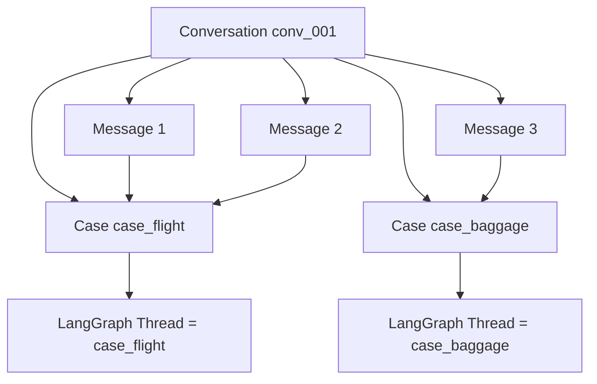
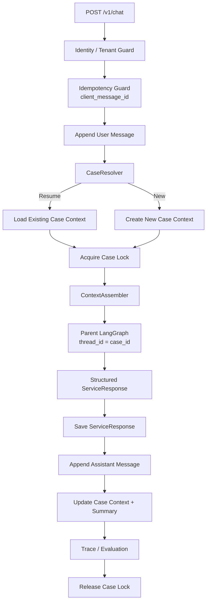
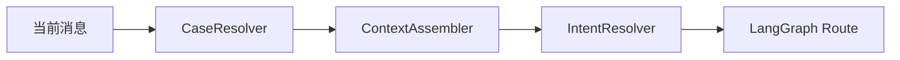
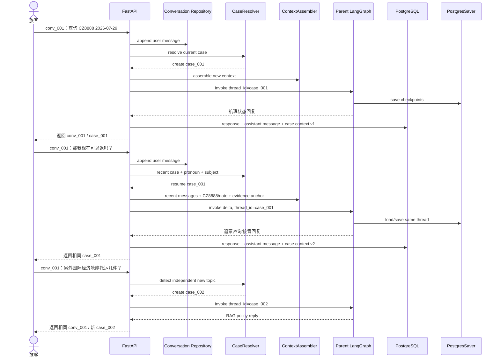

# EchoMind Airline MVP：跨请求多轮上下文与 Case 记忆设计

> 文档状态：拟实施（Proposed）
>
> 适用项目：EchoMind Airline MVP
>
> 本轮范围：只定义方案，不代表代码已经实现
>
> 核心目标：让同一旅客在多个 HTTP 请求之间自然续聊，同时避免不同业务问题、不同用户和不同 Case 的状态互相污染

## 1. 执行摘要

当前项目已经持久化 `conversation_id`、用户消息、Case、Evidence、ServiceResponse 和
LangGraph Checkpoint，但每次调用 `AirlineMVPService.chat()` 都会创建新的 `case_id`，并令
`thread_id = case_id`。Graph 输入只包含当前消息，因此重复使用同一个
`conversation_id` 只能把多个 Case 关联到同一个 Conversation，不能让模型自动理解上一轮的
“那个航班”“第二张票”“那现在可以退吗”。

目标方案保持以下稳定关系：

```text
Conversation：渠道对话容器，可以包含多个业务问题
Case：一个可独立跟踪、解决和审计的业务问题
LangGraph Thread：一个 Case 的执行与恢复状态，thread_id = case_id
Message：Conversation 中的一次用户或客服发言，可归属某个 Case
Case Context：某个 Case 的确认实体、待补字段、事实锚点和稳定摘要
```

系统新增两个平台服务，而不是新增 Agent：

1. `CaseResolver`：判断当前消息应续接哪个 Case，还是创建新 Case；
2. `ContextAssembler`：只装配与当前请求相关、可验证、受 Token 预算约束的上下文。

同一 Case 续聊时复用相同 `thread_id` 并提交增量 State；新主题创建新的 Case 和 Thread。
PostgreSQL 是业务事实与 Transcript 的长期真相源，LangGraph Checkpoint 负责单个 Case 的
Graph 恢复，两者职责不同。

MVP 不需要向量化客户记忆或 Memory Agent。先完成最近消息、Case Anchor、Pending Slots、
完整 Transcript、身份隔离、幂等和并发保护，就能形成一套主流且可评测的跨请求多轮方案。

## 2. 当前代码现状

### 2.1 已存在的数据和能力

当前项目已经具备：

- `ChatRequest.conversation_id`；
- PostgreSQL/SQLite `conversations`、`messages` 和 `cases` 表；
- `service_responses`、`tool_calls`、`evidence_items`、`trace_events`；
- 每个 Case 独立的 LangGraph Checkpoint；
- `CaseRepository.start_case()` 对 Conversation 和用户消息进行持久化；
- Case Summary 字段；
- Evidence、Tool Call 和 Handoff 的 Case 归属；
- API 返回 `conversation_id` 和 `case_id`。

代码证据：

- [`AirlineMVPService.chat`](../src/airline_mvp/service.py)
- [`ChatRequest`](../src/airline_mvp/models.py)
- [`CaseRepository`](../src/airline_mvp/persistence.py)
- [`AirlineMVPState`](../src/airline_mvp/state.py)
- [`build_parent_graph`](../src/airline_mvp/parent_graph.py)
- [`scripts/postgres/01_schema.sql`](../scripts/postgres/01_schema.sql)

### 2.2 当前一次请求的实际行为

```text
收到 POST /v1/chat
→ 生成新 request_id
→ 复用或生成 conversation_id
→ 无条件生成新 case_id
→ thread_id = 新 case_id
→ messages = [当前 HumanMessage]
→ 从 START 执行完整 Parent Graph
→ 保存本 Case 的结果
```

因此下面两个请求不会形成真正的多轮上下文：

```json
{
  "conversation_id": "conv_demo",
  "message": "查询 CZ8888 在 2026-07-29 的状态"
}
```

```json
{
  "conversation_id": "conv_demo",
  "message": "那我现在可以退吗？"
}
```

第二次请求会得到新的 Case 和 Thread，模型只看到“那我现在可以退吗”，看不到上一轮航班号、
日期、事实和回答。

### 2.3 已存储但尚未被利用的内容

- `messages` 只在入口写入用户消息，没有形成完整 User/Assistant Transcript；
- `service_responses` 保存结构化回复，但没有作为 Assistant Message 进入 Conversation；
- `case_summary` 当前是轻量机器摘要，没有参与下一次请求的上下文装配；
- `conversation_id` 可关联多个 Case，但没有活动 Case 查询和续接规则；
- PostgresSaver 保存 Checkpoint，但每次请求使用新 `thread_id`，无法自然读取上一 Case State；
- 没有实体冲突、过期事实、同主体检查和上下文 Token 预算策略。

## 3. 目标与非目标

### 3.1 目标

1. 同一 Conversation 支持多个 HTTP 请求和完整 User/Assistant Transcript。
2. 同一个业务问题可以跨请求续接，并复用同一个 Case/Thread。
3. 同一 Conversation 中的新业务问题创建新 Case，避免状态污染。
4. “那个航班”“第二张票”“刚才的退款”等指代可以依赖可信 Anchor 消歧。
5. 澄清问题只补充缺失字段，不重复询问已确认信息。
6. 历史业务事实带有 Evidence、来源、时间和有效性，不能被旧摘要替代。
7. 所有 Case 归属、消息选择、记忆读取和覆盖行为都有 Trace。
8. 防止跨用户、跨租户和并发请求导致的数据泄漏或状态覆盖。
9. 保持现有 Journey/Refund Worker、Function Calling、Tool Contract 和 RAG 不变。

### 3.2 非目标

- MVP 不保存未经用户明确表达的敏感属性。
- MVP 不把全部聊天记录向量化后无差别召回。
- MVP 不创建 Memory Agent。
- MVP 不自动从线上 Transcript 训练模型。
- MVP 不实现跨租户共享记忆。
- MVP 不让 LLM 单独决定 Case 归属。
- MVP 不把 LangGraph Checkpoint 当作业务审计数据库。
- MVP 不追求永久保存所有 Prompt 上下文。

## 4. 核心标识和生命周期

### 4.1 标识语义

| 标识 | 生命周期 | 作用 | 是否由模型生成 |
|---|---|---|---:|
| `request_id` | 单次 HTTP 请求 | 幂等、Trace 和调用关联 | 否 |
| `client_message_id` | 客户端的一次发送动作 | 防止网络重试重复执行 | 否 |
| `conversation_id` | 一个渠道会话 | 聚合 Transcript 和多个 Case | 否 |
| `case_id` | 一个业务问题 | 状态、Evidence、工具和人工接管边界 | 否 |
| `thread_id` | 一个 LangGraph 执行线程 | Checkpoint 恢复 | 否，固定等于 `case_id` |
| `message_id` | 一条消息 | Transcript 坐标 | 否 |
| `context_version` | Case Context 版本 | 并发控制和回放 | 否 |

### 4.2 Conversation、Case 与 Thread



一个 Conversation 可以包含多个 Case。一个 Case 在 MVP 中只对应一个 LangGraph Thread。
Case 不跨主体复用，也不允许模型改写归属。

### 4.3 Case 状态与续接

| Case 状态 | 默认是否可续接 | 说明 |
|---|---:|---|
| `new` | 是 | 尚未完成理解 |
| `understanding` | 是，但应排队 | 正有请求处理 |
| `waiting_for_information` | 是，优先 | 下一条消息通常是槽位补充 |
| `researching` | 是，但应排队 | 避免并发写 Checkpoint |
| `synthesizing` | 是，但应排队 | 等待当前 Invocation 完成 |
| `responded` | 条件续接 | 指代旧问题或同一实体时续接，否则新建 Case |
| `waiting_for_human` | 条件续接 | 附加信息进入同一接管 Case，但不能恢复 AI 写操作 |
| `failed` | 条件续接 | 允许重试或补充信息，必须记录重开原因 |

## 5. 目标总体架构



### 5.1 组件职责

| 组件 | 职责 | 是否调用 LLM |
|---|---|---:|
| Identity Guard | 主体、租户、Conversation 和 Case 归属检查 | 否 |
| Idempotency Guard | 去除客户端重试和重复消息 | 否 |
| CaseResolver | 续接或新建 Case | 默认规则；歧义时可使用受限分类信号 |
| ContextAssembler | 选择最近消息、Case Anchor、Pending Slots 和 Evidence | 否 |
| IntentResolver | 在已装配上下文上理解当前诉求 | Prompt/SFT 小模型 |
| Parent LangGraph | 路由、并行、质量和终止 | 受控调用 |
| CaseContextRepository | 版本化保存 Case 记忆 | 否 |
| Checkpointer | 保存单 Case Graph State | 否 |

## 6. CaseResolver 设计

### 6.1 输入

```python
class CaseResolutionInput(BaseModel):
    conversation_id: str
    explicit_case_id: str | None
    verified_subject_id: str
    tenant_id: str | None
    current_message: str
    recent_cases: list[CaseCandidate]
    recent_messages: list[ConversationMessage]
```

### 6.2 输出

```python
class CaseResolution(BaseModel):
    decision: Literal["resume", "create", "clarify"]
    case_id: str | None
    reason_code: str
    candidate_case_ids: list[str]
    confidence_band: Literal["high", "medium", "low"]
```

`confidence_band` 用于 Trace 和是否需要澄清，不允许直接扩大数据访问范围。

### 6.3 确定性优先级

#### 规则 1：显式 `case_id`

客户端明确传入 `case_id` 时，只有同时满足以下条件才允许 Resume：

- Case 存在；
- Case 属于当前 `conversation_id`；
- Case 属于当前 `verified_subject_id` 和租户；
- Case 状态允许续接；
- 当前请求未命中重复 `client_message_id`。

不满足时返回拒绝，不回退为“尝试读取相近 Case”。

#### 规则 2：唯一等待补充信息的 Case

如果同一 Conversation 只有一个 `waiting_for_information` Case，并且当前消息能填充其
Pending Slot，则优先 Resume。

```text
上一轮：请补充乘机日期。
当前轮：7 月 29 日。
→ Resume 原 Case
```

如果有两个等待中的 Case，不能只按更新时间选择，应要求客户端指定 Case 或向用户澄清。

#### 规则 3：明确指代最近 Case

以下信号可以支持 Resume：

- “那”“这个”“刚才”“上一张”“第二张”等指代表达；
- 当前消息复用了最近 Case 的航班号、PNR、票号、订单号或退款号；
- 当前意图是最近问题的自然追问；
- 消息距离最近 Case 很短；
- 最近 Case 尚未过续接时间窗口。

指代词不能单独构成授权；先通过主体和 Case 归属检查，再参与语义判断。

#### 规则 4：明确新主题

满足以下条件时创建新 Case：

- 用户明确说“另外”“还有一个问题”“换个问题”；
- 新消息包含与旧 Case 不同的强实体；
- 执行目标与旧 Case 无依赖；
- 最近 Case 已完成，当前问题没有指代或实体重叠；
- 当前问题属于新的风险/人工接管主题。

```text
第一轮：CZ8888 今天是否延误？
第二轮：国际经济舱可以托运几件行李？
→ 相同 Conversation，新建 Baggage Policy Case
```

#### 规则 5：歧义

如果两个 Case 都可能被“第二张票怎么样”指代，返回 `clarify`。不得让通用 LLM 静默选择
一个 Case 并加载其私人数据。

### 6.4 CaseResolver 不负责什么

- 不决定最终业务 Intent；
- 不决定调用哪些工具；
- 不查询政策知识库；
- 不修改 Case Evidence；
- 不读取其他主体的历史；
- 不创建人工接管记录。

## 7. ContextAssembler 设计

### 7.1 输出结构

```python
class RoutingContext(BaseModel):
    current_message: str
    recent_messages: list[ContextMessage]
    active_case_id: str
    case_summary: CaseSummary | None
    previous_intents: list[str]
    confirmed_entities: AirlineEntities
    pending_slots: list[str]
    verified_facts: list[FactAnchor]
    recent_actions: list[ActionAnchor]
    omitted_history: ContextTombstone | None
    context_version: int
```

### 7.2 四层上下文

#### L0：稳定规则

- Agent 身份和业务边界；
- 工具权限；
- 写操作禁止规则；
- PII、租户和 Prompt Injection 规则；
- 客服沟通原则。

L0 来自只读配置，不进入业务数据库，也不能被消息和记忆覆盖。

#### L1：Case Context

- Case 目标和当前状态；
- 当前已选 Intent；
- 已确认实体；
- Pending Slots；
- 已核验事实的 Evidence Anchor；
- 已执行的只读操作；
- Handoff 状态；
- Case Summary 版本。

#### L2：Recent Conversation Burst

- 当前消息；
- 最近 4～8 条相关 User/Assistant 消息；
- 最近一次澄清问题；
- 最近一次 Agent 回复；
- 与当前 Case 有关的消息优先。

#### L3：Retrieved Context

- 与同一强实体关联的近期 Case Summary；
- 必要的客户语言偏好；
- 需要重新确认的历史 Anchor；
- 后续才考虑的长期记忆召回。

知识库政策不在这里预先注入。确定 Intent 和知识域后再通过现有 RAG 检索，避免把无关政策
塞入意图 Prompt。

### 7.3 Token 预算建议

MVP 可以采用以下初始预算：

| 内容 | 建议预算 | 超预算处理 |
|---|---:|---|
| L0 稳定规则 | 500～900 tokens | 不裁剪安全和权限规则 |
| 当前消息 | 原文完整 | 不裁剪 |
| Case Context | 300～600 tokens | 只保留结构化 Anchor |
| Recent Burst | 600～1,200 tokens | 从最旧消息开始裁剪 |
| Retrieved Context | 0～500 tokens | 无强关联时完全不注入 |

具体数值通过真实模型 Tokenizer 和评测校准。不能只按字符数猜测。

### 7.4 裁剪顺序

超预算时依次移除：

1. 无关历史 Case；
2. 更早的原始消息；
3. 已被 Case Summary 覆盖的消息；
4. 低权威或过期 Anchor；
5. 非必要语言风格信息。

永远保留：

- 当前消息；
- 当前 Case ID 和主体；
- Pending Slots；
- 与当前请求相关的确认实体；
- 写操作和权限限制；
- 当前引用 Evidence 的来源与时间。

### 7.5 Tombstone

如果有历史被裁剪，加入结构化 Tombstone：

```json
{
  "omitted_message_count": 18,
  "covered_until_message_id": "msg_018",
  "summary_version": 3,
  "recall_available": true
}
```

Tombstone 只告诉系统历史被省略，不把“未看到”误认为“从未发生”。

## 8. 实体、事实和记忆优先级

### 8.1 实体优先级

```text
当前消息明确实体
> 当前 Case 已确认实体
> 最近 2～4 轮同 Case 实体
> 当前未结束 Case Anchor
> 更早历史 Case
```

如果当前消息说“不是 CZ8888，是 CZ3101”，必须记录实体纠正事件，不能继续同时使用两个
航班号。

### 8.2 事实时效

不同事实采用不同策略：

| 事实 | 是否可直接复用 | 策略 |
|---|---:|---|
| PNR 归属 | 条件复用 | 每次敏感查询仍做主体授权 |
| 航班状态 | 不长期复用 | 超过新鲜度窗口重新调用工具 |
| 退款状态 | 不长期复用 | 新追问重新查询 System of Record |
| 票号/订单号 | 可作为 Anchor | 仍需验证主体与格式 |
| 政策条款 | 按版本复用 | 检查 `as_of`、有效期和 superseded |
| 用户语言偏好 | 可复用 | 用户可以修改和删除 |

### 8.3 摘要不是最终事实

Case Summary 用于上下文压缩。最终向旅客确认航班、退款、支付或政策结论时，必须回到：

- 当前有效的业务工具结果；
- 原始 Evidence；
- 当前版本政策条款。

不能只凭旧 Summary 声称“航班仍然正常”或“退款已经到账”。

## 9. Case Context 数据模型

### 9.1 `CaseContext`

```python
class CaseContext(BaseModel):
    case_id: str
    context_version: int
    selected_intents: list[str]
    confirmed_entities: AirlineEntities
    pending_slots: list[str]
    verified_fact_refs: list[str]
    recent_action_refs: list[str]
    previous_intent: str | None
    summary: CaseSummary
    covered_until_message_id: str | None
    updated_at: datetime
```

### 9.2 `FactAnchor`

```python
class FactAnchor(BaseModel):
    statement: str
    evidence_id: str
    source_type: str
    observed_at: datetime
    valid_until: datetime | None
    authority: str
```

### 9.3 `ActionAnchor`

```python
class ActionAnchor(BaseModel):
    action_type: str
    execution_status: Literal[
        "not_executed",
        "read_succeeded",
        "read_failed",
        "handoff_queued",
    ]
    tool_call_id: str | None
    handoff_id: str | None
```

当前系统无写业务工具，所以不能出现 `refund_executed`、`booking_changed` 等状态。

## 10. PostgreSQL 设计

### 10.1 扩展 `messages`

建议前向增加：

```text
case_id                 nullable FK → cases.case_id
client_message_id       nullable unique within conversation
response_id             nullable FK → service_responses.response_id
parent_message_id       nullable
metadata_json           nullable
```

用途：

- 把一条消息关联到 Case；
- 处理客户端重试；
- 保存 Assistant Message 与结构化 ServiceResponse 的关联；
- 支持消息级 Trace 和 Transcript。

### 10.2 新增 `case_contexts`

```text
case_id                  PK/FK
context_version          integer
selected_intents_json    text/jsonb
confirmed_entities_json  text/jsonb
pending_slots_json       text/jsonb
verified_fact_refs_json  text/jsonb
recent_action_refs_json  text/jsonb
previous_intent          text nullable
summary_json             text/jsonb
covered_until_message_id text nullable
created_at               timestamp
updated_at               timestamp
```

该表保存可重建 Prompt 的稳定状态，不替代 `evidence_items`、`tool_calls` 和
`service_responses`。

### 10.3 可选 `conversation_summaries`

只有长 Conversation 才需要：

```text
conversation_id
summary_version
summary_json
covered_until_message_id
created_at
```

短对话直接读取 Recent Burst。MVP 可以先不创建该表。

### 10.4 索引与约束

- `messages(conversation_id, created_at desc)`；
- `messages(case_id, created_at)`；
- `UNIQUE(conversation_id, client_message_id)`；
- `cases(conversation_id, status, updated_at desc)`；
- `case_contexts(case_id, context_version)`；
- Case、Conversation 和主体归属必须在同一事务内验证；
- 所有 Schema 变更只使用前向 `CREATE/ALTER/CREATE INDEX`，不删除现有数据。

## 11. Repository 接口

后续建议拆分或增加以下稳定接口：

```python
class ConversationRepository(Protocol):
    def append_message(...) -> ConversationMessage: ...
    def list_recent_messages(...) -> list[ConversationMessage]: ...
    def get_conversation(...) -> Conversation | None: ...


class CaseRepository(Protocol):
    def create_case(...) -> Case: ...
    def get_case(...) -> Case | None: ...
    def list_recent_cases(...) -> list[Case]: ...
    def list_resumable_cases(...) -> list[Case]: ...
    def link_message(...) -> None: ...


class CaseContextRepository(Protocol):
    def get(...) -> CaseContext | None: ...
    def compare_and_set(...) -> CaseContext: ...
```

Repository 返回结构化对象，不把数据库 Row 或 SQL 直接暴露给模型层。

## 12. API Contract 演进

### 12.1 请求

```python
class ChatRequest(BaseModel):
    message: str
    conversation_id: str | None = None
    case_id: str | None = None
    client_message_id: str | None = None
    verified_subject_id: str
    locale: str = "zh-CN"
```

说明：

- `conversation_id`：不传则创建新 Conversation；
- `case_id`：可选，适合前端明确续接某个 Case；
- `client_message_id`：推荐由客户端生成，用于幂等；
- `verified_subject_id`：仍由可信渠道注入，不能从用户文本提取。

### 12.2 响应

```python
class ChatResult(BaseModel):
    request_id: str
    conversation_id: str
    case_id: str
    case_resolution: str
    status: CaseStatus
    response: ServiceResponse | None
    handoff: HandoffPacket | None
```

`case_resolution` 可以是：

```text
created
resumed_explicitly
resumed_waiting_for_information
resumed_by_context
clarification_required
```

### 12.3 可选查询 API

后续可增加：

```text
GET /v1/conversations/{conversation_id}
GET /v1/conversations/{conversation_id}/messages
GET /v1/conversations/{conversation_id}/cases
GET /v1/cases/{case_id}/context
```

所有接口都必须做主体和租户授权，不能只凭 ID 读取。

## 13. LangGraph 集成

### 13.1 新 Case

新问题执行：

```text
create Case
→ create CaseContext v1
→ thread_id = new case_id
→ 使用完整初始 State 调用 Graph
```

### 13.2 续接 Case

续接时：

```text
load CaseContext
→ load recent messages
→ build RoutingContext
→ thread_id = existing case_id
→ 只提交本轮增量 State
```

不能像当前新请求一样把以下字段重新初始化为空：

- 已确认实体；
- Pending Slots；
- Case Summary；
- 上一轮 Intent；
- 当前有效的 Evidence Anchor；
- Handoff 状态。

### 13.3 State 增量建议

```python
{
    "request_id": new_request_id,
    "trace_id": new_trace_id,
    "current_message": request.message,
    "messages": [HumanMessage(content=request.message)],
    "routing_context": assembled_context,
    "context_version": expected_context_version,
}
```

`messages` 使用 Reducer 追加；当前轮临时结果和跨轮稳定状态要分开，防止上一轮 Tool Call 被
错误当成本轮已经执行。

### 13.4 Clarification 的 MVP 方案

MVP 采用“同 Thread 重新进入理解与规划”方式：

```text
waiting_for_information
→ 下一条消息填充 Pending Slot
→ ContextAssembler 合并确认实体
→ 重新运行 Intent/Plan
→ 继续 Domain Worker
```

这比立即引入 LangGraph `interrupt()/Command(resume=...)` 更容易理解、回放和测试。

### 13.5 后续 Interrupt/Resume

如果未来存在长时间等待用户确认、人工审批或外部异步事件，可以把 Clarification/Approval
节点改为 `interrupt()`，收到新请求后使用 `Command(resume=...)`。这是增强项，不是 MVP
前置依赖。

## 14. 与意图识别的关系

跨请求记忆位于意图识别之前：



例子：

```text
上一轮：查询 CZ8888 在 2026-07-29 是否延误。
当前轮：那我现在可以退吗？
```

ContextAssembler 提供：

```json
{
  "current_message": "那我现在可以退吗？",
  "confirmed_entities": {
    "flight_no": "CZ8888",
    "travel_date": "2026-07-29"
  },
  "previous_intent": "flight_status_query"
}
```

IntentResolver 才能据此区分 `refund_policy`、`refund_eligibility_for_booking` 或
`refund_action_request`。长期记忆只是提供 Anchor，不直接决定 Route 和工具权限。

完整意图设计见
[生产级意图识别架构](INTENT_RECOGNITION_ARCHITECTURE.md)。

## 15. Conversation Memory、Case Memory 与长期记忆

### 15.1 Conversation Memory

保存同一渠道会话中的 User/Assistant Message，主要用于最近对话 Burst。

### 15.2 Case Memory

保存一个业务问题的：

- 目标；
- 意图；
- 实体；
- Pending Slots；
- Evidence Anchor；
- 操作结果；
- 人工接管；
- Case Summary。

这是 MVP 最重要的跨请求记忆。

### 15.3 Customer Memory

完整版才逐步增加：

- 语言偏好；
- 用户明确设置的沟通偏好；
- 当前有效的服务偏好。

禁止静默保存或推断健康、经济、投诉倾向等敏感属性。

### 15.4 Knowledge Memory

继续使用现有 PostgreSQL FTS + pgvector + RRF，不与 Conversation/Case Memory 混在同一个
召回入口。政策文档是公共知识，Case Memory 是主体隔离的私人业务上下文。

## 16. 并发、幂等和一致性

### 16.1 消息幂等

同一 `(conversation_id, client_message_id)` 只允许处理一次。重复请求应返回首次处理结果或
当前状态，不能再次调用工具。

### 16.2 Case 并发锁

同一 Case 同时只允许一个 Graph Invocation 修改状态。PostgreSQL 可以使用事务级或会话级
advisory lock；锁 Key 由可信 `case_id` 计算。

### 16.3 乐观版本

`case_contexts.context_version` 每次成功更新加一：

```text
读取 version = 5
→ 执行本轮
→ UPDATE ... WHERE context_version = 5
→ 成功后 version = 6
```

更新为 0 行说明发生并发冲突，应重载状态或排队，不能覆盖新版本。

### 16.4 Checkpoint 与业务事务

业务数据库更新和 LangGraph Checkpoint 不一定处于同一个事务，因此需要：

- 每轮明确 Invocation ID；
- 持久化步骤可幂等重放；
- Tool Call、Response 和 Context 更新使用稳定幂等键；
- Trace 记录 Checkpoint/业务持久化阶段；
- 崩溃恢复时根据 Invocation 状态判断重放还是返回已有结果。

MVP 可以先保证单 Case 串行和写入幂等，再考虑分布式事务或 Outbox。

## 17. 安全与隐私

### 17.1 主体隔离

Resume Case 前必须满足：

```text
request.verified_subject_id
== conversation.verified_subject_id
== case 所属主体
```

未来增加多租户后还必须同时匹配 `tenant_id`。

### 17.2 Prompt Injection

- 历史 User/Assistant Message 都是不可信数据；
- 旧消息中的“忽略系统规则”不能覆盖 L0；
- Tool Output 和政策正文只作为带来源的数据注入；
- Summary 不能包含可执行系统指令；
- ContextAssembler 输出按字段序列化，不拼接成无边界的自由文本 Prompt。

### 17.3 PII

- Trace 默认保存脱敏实体和引用 ID；
- 证件号、支付信息不进入普通 Context；
- 训练回流前必须脱敏、去重和授权；
- 用户删除 Conversation 时，需要级联处理 Message、Case Context 和相关记忆，但业务审计
  保留策略必须与隐私政策协调；
- 不把完整私人 Transcript 放入公共 Vector Store。

## 18. Trace 与可观测性

建议增加以下事件：

```text
message.received
message.duplicate_detected
case.candidates_loaded
case.resolution_decided
case.resumed
case.created
context.assembled
context.trimmed
context.conflict_detected
case_context.updated
assistant_message.persisted
case.lock_waited
case.concurrent_update_rejected
```

`context.assembled` 至少记录：

```json
{
  "caseId": "case_001",
  "contextVersion": 5,
  "recentMessageIds": ["msg_009", "msg_010"],
  "factEvidenceIds": ["ev_003"],
  "pendingSlots": ["travel_date"],
  "omittedMessageCount": 12,
  "estimatedTokens": 1350
}
```

普通 Trace 不记录完整 PII 原文，只记录 ID、数量、原因码和脱敏摘要。

## 19. 失败与降级

| 失败 | 降级行为 |
|---|---|
| Conversation 不存在 | 创建新 Conversation，除非客户端声称必须存在 |
| 显式 Case 不存在 | 返回受控错误，不检索相似私人 Case |
| Case 主体不匹配 | 拒绝并记录安全事件 |
| 多个等待 Case | 要求用户/前端选择，不静默续接 |
| ContextRepository 不可用 | 只处理当前消息，并明确不使用历史；敏感操作转人工 |
| Checkpoint 不可用 | 不声称已恢复旧执行；基于业务 Case Context 安全重建或转人工 |
| Context 版本冲突 | 重载或排队，不覆盖 |
| 历史实体冲突 | 请求用户确认 |
| 历史事实过期 | 重新调用只读工具 |
| Summary 生成失败 | 使用结构化 Anchor，不阻断主流程 |
| Token 超预算 | 按裁剪顺序压缩并记录 Tombstone |

## 20. 评测方案

### 20.1 固定场景

至少覆盖：

1. 航班号在第一轮、日期在第二轮；
2. 第一轮查航班，第二轮使用“那个航班”；
3. 第一轮查退款，第二轮使用“第二张票”；
4. 同一 Conversation 中切换到无关行李政策；
5. 两个 `waiting_for_information` Case 产生歧义；
6. 用户明确传入旧 Case ID；
7. 用户传入其他主体的 Case ID；
8. 同一个 `client_message_id` 重试两次；
9. 同一 Case 同时收到两条消息；
10. 航班旧 Evidence 过期后重新查询；
11. 用户纠正航班号或日期；
12. Prompt Injection 藏在历史消息中；
13. 长 Conversation 触发裁剪和 Tombstone；
14. 应用重启后通过 PostgreSQL + Checkpoint 继续 Case；
15. Handoff Case 收到补充信息但不恢复 AI 写权限。

### 20.2 指标

- Case Resume Precision/Recall；
- New Case 创建准确率；
- Pending Slot 恢复成功率；
- 指代解析准确率；
- 跨 Case 状态污染率，目标为 0；
- 跨主体数据泄漏率，目标为 0；
- 重复消息二次工具调用率，目标为 0；
- Context Coverage；
- 过期事实重新查询率；
- Context 平均/p95 Token；
- ContextAssembler p50/p95 延迟；
- 并发冲突恢复率；
- 重启恢复成功率。

### 20.3 Trace-level 检查

- Resume 时是否使用了正确 `case_id/thread_id`；
- New Case 是否没有继承旧 Case 的工具结果；
- 使用历史实体时是否记录来源；
- 是否把旧 Summary 当成了最终事实；
- 过期事实是否重新调用工具；
- 重试是否产生重复 Tool Call；
- 主体不匹配时是否在读取上下文前拒绝。

## 21. 分阶段实施计划

### Phase 1：MVP 跨请求续接

用户价值：能够继续上一问题，不重复提供航班号、PNR 和日期。

技术任务：

- `ChatRequest` 增加 `case_id`、`client_message_id`；
- 保存完整 User/Assistant Transcript；
- 实现显式 Case Resume；
- 自动续接唯一 `waiting_for_information` Case；
- 新增 Case Context；
- ContextAssembler 注入最近 4～8 条消息和 Pending Slots；
- 同一 Case 复用 `thread_id`；
- 增加主体检查和消息幂等；
- 添加跨轮 E2E 测试。

验收标准：

- 航班号和日期可以分两轮提供；
- 相同消息重试不会重复调用工具；
- 不同主体无法续接 Case；
- 新主题不会继承旧 Evidence；
- 重启后能读取业务 Case Context。

### Phase 2：自动 Case 归属和 Smart Window

- 实现指代、强实体和最近主题规则；
- 增加 CaseResolver 歧义澄清；
- Case Summary 和 Tombstone；
- Evidence 新鲜度策略；
- Context Token 预算和覆盖率；
- Case 并发锁和乐观版本；
- 完整 Trace Dashboard 字段。

### Phase 3：长期记忆和跨渠道

- 用户明确偏好；
- 跨渠道身份合并；
- 相关历史 Case Summary 召回；
- 用户记忆纠错、删除和过期；
- 多租户 RLS；
- 人工工作台共享 Case Context；
- 可审核的线上失败样本回流。

不建议在 Phase 1 前引入向量化 Customer Memory 或复杂 Evidence Graph。

## 22. 后续代码改造位置

> 本节是未来实施清单，本轮不修改这些文件。

| 文件 | 未来改造内容 |
|---|---|
| [`models.py`](../src/airline_mvp/models.py) | `case_id`、`client_message_id`、RoutingContext、CaseContext |
| [`state.py`](../src/airline_mvp/state.py) | Context、确认实体、Pending Slots、Context Version 和 Reducer |
| [`persistence.py`](../src/airline_mvp/persistence.py) | ConversationRepository、CaseContextRepository、活动 Case 查询 |
| [`service.py`](../src/airline_mvp/service.py) | 不再无条件创建 Case；CaseResolver、幂等和锁边界 |
| [`parent_graph.py`](../src/airline_mvp/parent_graph.py) | Context 装配、Resume/New 分支和增量 State |
| [`api.py`](../src/airline_mvp/api.py) | 新请求字段和 Conversation 查询 API |
| `scripts/postgres/` | 前向 Schema、索引和迁移验证 |
| `tests/` | 跨轮、并发、重试、身份隔离和恢复测试 |
| `evals/` | 多轮 Conversation 级评测数据集 |

建议新增模块：

```text
src/airline_mvp/conversation/
├── schemas.py
├── case_resolver.py
├── context_assembler.py
├── freshness.py
└── repositories.py
```

这些模块是受控平台服务，不应拥有业务工具权限。

## 23. 典型完整时序



## 24. 关键设计决策

| 决策 | 结论 | 原因 |
|---|---|---|
| Conversation 是否等于 Thread | 否 | 一个会话可以有多个独立业务问题 |
| Thread 是否等于 Case | MVP 是 | 状态、权限和审计边界最清晰 |
| 是否每轮创建新 Case | 否 | 同一业务问题应续接 |
| 是否所有同 Conversation 消息复用 Case | 否 | 会造成跨主题状态污染 |
| 是否依赖 Checkpoint 自动记忆 | 否 | Checkpoint 不负责 Case 归属和 Context 选择 |
| 是否创建 Memory Agent | 否 | Repository + ContextAssembler 更可控 |
| 是否把全部 Transcript 放入 Prompt | 否 | 使用 Recent Burst、Case Summary 和 Anchor |
| 是否向量化私人 Transcript | MVP 否 | 暂无必要且增加隐私与隔离风险 |
| 是否由 LLM 单独选择 Case | 否 | 确定性规则和授权优先，歧义需澄清 |
| 是否保存 Assistant Message | 是 | 完整 Transcript 和指代恢复所需 |
| 是否复用旧业务事实 | 按新鲜度 | 动态状态必须重新查询 |
| 是否立即使用 Interrupt/Resume | MVP 否 | 先采用同 Thread 重新解析，降低复杂度 |

## 25. MVP 验收清单

### 功能

- [ ] 同一 Conversation 可以包含多个 Case。
- [ ] 同一 Case 跨请求复用相同 Thread。
- [ ] 客户端可以显式指定要续接的 Case。
- [ ] 唯一等待补充信息的 Case 可以自动续接。
- [ ] 最近 User/Assistant 消息进入 Routing Context。
- [ ] Case 保存确认实体、Pending Slots 和 Evidence Anchor。
- [ ] 新主题创建新 Case，不继承旧 Tool Call。
- [ ] Assistant 回复进入 Transcript。
- [ ] 旧航班/退款状态按新鲜度重新查询。

### 安全与一致性

- [ ] Case、Conversation 和主体归属在读取上下文前校验。
- [ ] 其他主体无法通过猜测 ID 读取或续接 Case。
- [ ] 重复 `client_message_id` 不产生第二次工具调用。
- [ ] 同一 Case 并发请求不会覆盖 Context 或 Checkpoint。
- [ ] 历史 Prompt Injection 不能覆盖 L0。
- [ ] Summary 不作为最终业务事实。
- [ ] Trace 不写入未脱敏 PII。

### 评测

- [ ] 至少 15 个跨轮固定场景。
- [ ] Case Resume 和 New Case 分别报告 Precision/Recall。
- [ ] 跨 Case 污染率为 0。
- [ ] 跨主体泄漏率为 0。
- [ ] 重复消息二次工具调用率为 0。
- [ ] 重启恢复、冲突和过期事实场景通过。

## 26. 最终结论

本项目的跨请求多轮能力不应被设计成“给 LLM 更多聊天记录”，而应被设计成一套明确的
Conversation、Case、Thread、Message 和 Context 生命周期：

```text
Message Persistence
→ Subject Guard
→ CaseResolver
→ ContextAssembler
→ IntentResolver
→ LangGraph（thread_id = case_id）
→ Response/Assistant Message Persistence
→ Versioned Case Context
```

第一阶段优先完成 Case Memory，而不是复杂 Customer Memory。这样既能支持普通旅客自然续聊，
又能保持工具权限、Evidence、Checkpoint、人工接管和审计都围绕单一 Case 隔离，并为后续
SFT 意图识别、Smart Window、跨渠道和长期记忆提供稳定基础。
