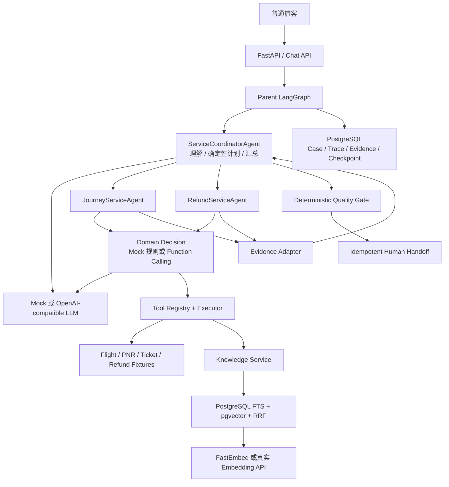
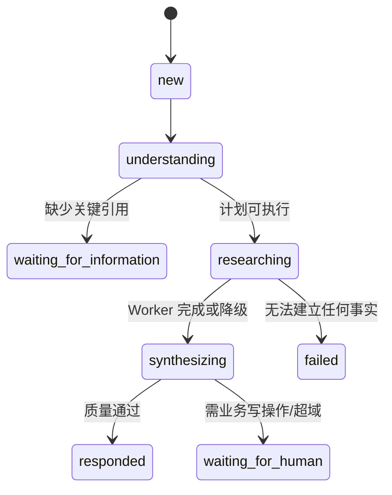
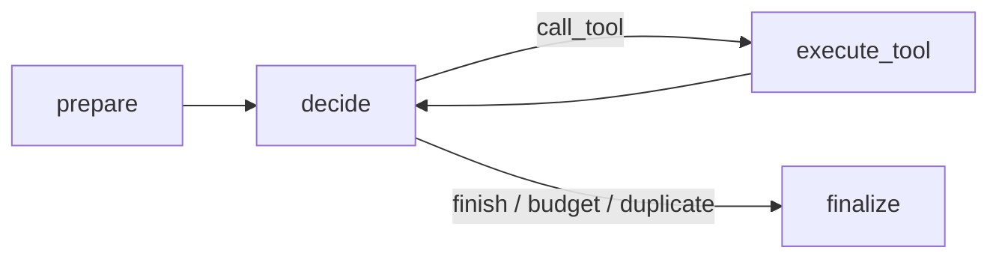
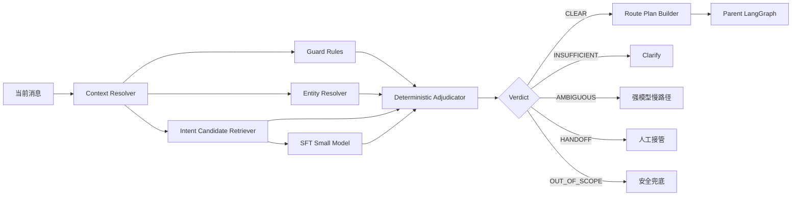

# EchoMind Airline Care：架构完整的面试级 MVP 设计

> 代码注释中的 `Design §N` 均指向本文对应章节。本文既是设计基线，也是实现验收清单。
> 除明确标注“拟新增”的内容外，§1～§25 描述当前代码已经实现的能力；§26～§29
> 用于记录基于现状的下一阶段演进，避免把目标架构误认为已经上线。

配套文档：

- [代码—设计章节映射](CODE_DESIGN_MAP.md)：从设计章节定位当前代码；
- [Function Calling 改造与完整链路](FUNCTION_CALLING_ARCHITECTURE.md)：解释领域 Worker 如何选择工具；
- [生产级意图识别架构](INTENT_RECOGNITION_ARCHITECTURE.md)：下一阶段 Intent Catalog、SFT 和路由设计；
- [真实后端运行指南](REAL_BACKENDS_GUIDE.md)：PostgreSQL、pgvector、Embedding 和真实 LLM 的启动方式。

## §1. 项目目标

面向普通旅客处理航变、客票和退款查询。项目要在一周左右可完整掌握，同时展示
主流多智能体系统的关键工程能力：LangGraph 状态编排、领域 Agent、工具权限、
RAG、证据、人工接管、Trace 和离线评测。

MVP 的价值不是替旅客自动改签或退款，而是把跨系统调查变成一次可信回答，
并将必须写操作的问题携带完整事实交给人工，降低重复询问和人工查数时间。

## §2. MVP 范围

包含：

- 航班状态、航变类型、PNR、票联、退款和支付链路查询；
- Journey 与 Refund 两个运行域；
- 当前有效政策检索和原文引用；
- 缺参澄清、失败降级、人工接管；
- 航司 Fixture、真实 OpenAI-compatible LLM、PostgreSQL 业务库与 Checkpoint、
  FastEmbed 和 PostgreSQL FTS + pgvector RAG；
- API、CLI、Trace 和固定评测集。

当前实现边界：

- 运行时代码只编译 Journey 与 Refund 两个领域 Worker；
- `RequestUnderstanding` 目前只稳定识别 `journey_support`、`refund_status`、
  `unsupported` 三类粗粒度意图；
- RAG 当前作为领域 Worker 的只读工具使用，尚未实现“普通闲聊 Direct”或
  “政策问题直接进入 RAG”的独立快速路径；
- `conversation_id` 已持久化，但一次 `POST /v1/chat` 仍创建一个新的 Case 和
  LangGraph `thread_id`，尚未自动恢复同一 Conversation 的历史消息；
- 真实 LLM、PostgreSQL、pgvector 和 FastEmbed 已有 Adapter，航司业务 API
  仍固定为合成 Fixture。

不包含：

- 真实航司生产系统接入；
- 退票、改签、赔付等业务写操作；
- 多渠道身份认证、生产级 PII/KMS；
- 自动学习、Experience Memory 和复杂图检索。

## §3. 核心旅客旅程

主 Demo：

1. 旅客说明 `EK302 / 2026-08-15 / PNR EK7D3M`，查询一张票的退款进度，
   并咨询另一张票的退改选项。
2. Coordinator 识别 Journey + Refund 两个独立调查任务。
3. 两个领域 Worker 并行读取航班/客票和退款/支付系统。
4. 每个 Worker 在自己的业务域内检索政策候选，再下钻确切版本与章节。
5. Coordinator 合并可验证事实，明确区分“查询结果”和“尚未执行的选项”。
6. Quality Gate 检查引用、权限和高风险话术。
7. 确定性 Handoff Repository 创建幂等人工接管记录。

## §4. Agent 划分原则

按业务责任划分，不按模型厂商划分：

| Agent | 对客 | 工具 | 核心职责 |
|---|---:|---|---|
| ServiceCoordinatorAgent | 是 | 无 | 理解、计划、路由、聚合、回复 |
| JourneyServiceAgent | 否 | Journey 只读工具 | 航班、PNR、客票、航变与政策 |
| RefundServiceAgent | 否 | Refund 只读工具 | 退款、支付链路与政策 |

Quality、Memory、Evidence、Trace 是平台服务或确定性节点，不创建成 Agent。
Baggage 只保留配置扩展示例，不进入 MVP 路由。

## §5. 设计原则

- 控制流显式：节点、边、预算和终止条件由 LangGraph 管理；
- 最小权限：Coordinator 无工具，Worker 只拿到任务白名单；
- 事实外置：模型不能把自然语言推断升级为业务事实；
- 结构化交互：Agent 之间只传 Pydantic 合同；
- 可替换：模型、RAG Store 和业务 Adapter 均通过接口注入；
- 可回放：关键决策、调用、证据、质检和接管均有 Trace。

## §6. 系统边界

旅客消息与已验证主体由上游渠道传入。`verified_subject_id` 是服务端上下文，
不能由模型生成。Tool Executor 负责检查主体、域和工具白名单。Fixture 仅是
System-of-Record Adapter 的本地实现，生产替换时不改变 Agent 协议。

## §7. 总体架构



图中 LLM 的 Function Call 只是调用提议。只有 `ToolExecutor` 完成 Domain、Task、
主体权限和 Pydantic Schema 复验并返回成功，结果才会转换为 Evidence。LangGraph
负责循环、并行和终止；项目没有使用 LangChain 的自由 Agent Executor。

## §8. Agent Runtime 与模型无关性

`ModelGateway` 定义理解、计划、域内下一步、Finding 和最终合成接口。
默认 `DeterministicModelGateway` 保证离线可演示；`StructuredLLMGateway`
调用 OpenAI-compatible API，但不同方法使用的机制并不相同：

| 方法 | 真实模型模式 | 确定性边界 |
|---|---|---|
| `understand()` | Pydantic Structured Output | 与规则解析结果合并，修正显式实体、漏召回和风险标记 |
| `plan()` | 不调用模型 | 复用确定性 Planner 生成 Domain、工具白名单和调用预算 |
| `decide_domain_step()` | `bind_tools()` 原生 Function Calling | 模型只提议；Executor 重新校验并执行 |
| `finalize_finding()` | Pydantic Structured Output | `task_id`、Domain 和 Evidence ID 受服务端约束 |
| `synthesize()` | Pydantic Structured Output | 写操作接管、证据引用和高风险话术由代码兜底 |

因此 Function Calling 只用于领域 Worker 的工具选择与参数生成，不用于 Parent Graph
的意图分类、任务规划或权限授予。确定性 Planner、ToolExecutor 和 QualityGate
始终不会交给模型。

业务图不依赖 Codex、Claude、OpenCode 或具体模型名称。替换模型时保持：

- `CasePlan`
- `DomainDecision`
- `DomainFinding`
- `ServiceResponse`

不变即可。

## §9. Case 生命周期



MVP 不把“生成了一段文字”视为解决；最终状态由确定性 Persist 节点决定。

## §10. LangGraph State

Parent State 包含标识、消息、理解结果、CasePlan、并行 Worker 输出、
ServiceResponse、QualityReport、Handoff 和预算。

并行字段必须有 Reducer：

- `findings`：按 `task_id` 合并，重试覆盖同任务旧结果；
- `evidence`：按 `evidence_id` 去重；
- `tool_calls/errors`：追加。

ServiceResponse 等标量仅由 Parent 单写，避免并行更新冲突。

## §11. 跨组件结构化合同

- `RequestUnderstanding`：意图、实体、缺参和风险；
- `CasePlan` / `DomainTask`：任务域、目标、白名单和预算；
- `DomainDecision`：`call_tool | finish` 及参数；
- `ToolResult`：状态、数据、来源、警告和审计；
- `EvidenceItem`：事实、来源、版本、定位和置信度；
- `DomainFinding`：facts / inferences / policy / gaps；
- `ServiceResponse`：旅客回答、证据引用和未执行选项；
- `HandoffPacket`：接管原因、队列、证据和未解决项。

禁止 Agent 之间以自由文本对话作为唯一协议。

当前 `RequestUnderstanding` 还包含 `requested_write_action`，用于只读 MVP 的人工接管
守卫。它是当前粗粒度实现，不是最终生产级 Intent Schema。下一阶段将引入
`ProblemType`、`IntentHypothesis` 和 `IntentResolution`，并由 Intent Catalog 推导
知识来源、执行模式和工具权限，详见 §26 和
[意图识别架构文档](INTENT_RECOGNITION_ARCHITECTURE.md)。

## §12. 各 Agent 详细职责

### ServiceCoordinatorAgent

- 输入：旅客当前消息和会话标识；
- 输出：RequestUnderstanding、CasePlan、ServiceResponse；
- 权限：没有业务工具；
- 结束：已回答、需澄清或已生成 Handoff Proposal；
- 降级：不支持域转人工，不编造处理结果。

### JourneyServiceAgent

- 工具：flight、booking、ticket、disruption、knowledge、policy clause；
- 可读：任务实体和本任务新证据；
- 输出：Journey DomainFinding；
- 禁止：退款系统、任何写工具；
- 预算：最多 6 次调用。

### RefundServiceAgent

- 工具：refund、payment、knowledge、policy clause；
- 输出：Refund DomainFinding；
- 禁止：航班/客票系统、任何写工具；
- 预算：最多 4 次调用。

## §13. 通用 DomainWorkerGraph



Journey 和 Refund 不是两份复制代码，而是同一子图加不同
`DomainAgentConfig`。真正的 Agent 实例由“图 + 配置 + ModelGateway”组成。

## §14. 动态路由与防循环

- 缺参：直接 Clarify，不启动 Worker；
- 仅航班/客票：Journey；
- 仅退款：Refund；
- 复杂航变退款：Journey 与 Refund 使用 `Send` 并行；
- 不支持域或写操作：调查后人工接管。

这是当前代码的路由规则。当前尚没有 Direct、RAG-only、低置信度强模型回退和
跨轮 Context Resolver 分支；这些能力属于 §26 的拟新增意图路由，不应在介绍现有 Demo
时声称已经实现。

控制措施：

- 单任务最多 4～6 次工具调用；
- 最多两个业务域；
- 同一 Worker 检测规范化工具签名重复；
- Parent recursion limit 50，Worker 30；
- 质量修订最多一次且是确定性回退；
- Worker 不允许相互 handoff，因此不存在 A2A 乒乓。

## §15. 只读 Tool Contract

MVP 工具：

1. `get_flight_status`
2. `get_booking`
3. `get_ticket_status`
4. `get_disruption_info`
5. `get_payment_status`
6. `get_refund_status`
7. `search_airline_knowledge`
8. `get_policy_clause`

Executor 顺序：注册检查 → Domain 白名单 → Task 白名单 → 主体权限 →
Pydantic 参数校验 → Adapter → 标准化结果 → Trace/Evidence。

状态语义：

- `success/partial/not_found`：可形成证据；
- `timeout/unavailable`：未知，只能形成 gap；
- `denied`：越权或身份不足；
- `invalid_input`：模型参数不满足 Schema。

只读超时最多自动重试一次。写工具根本不注册，避免“靠 Prompt 禁止”的脆弱边界。

## §16. RAG 设计

RAG 在各业务域内部作为工具，不单独创建 Knowledge Agent：

1. Query + Domain + Carrier + `as_of` 进入 `search_airline_knowledge`；
2. Store 先过滤域、承运人、有效期和 active 状态；
3. pgvector 与 FTS 分别召回，再通过 RRF 融合；
4. 返回候选文档坐标、authority、URL、Hash、score 和摘要；
5. Worker 必须调用 `get_policy_clause(documentId, version, section)`；
6. 最终回答只引用下钻后的原始条款 Evidence。

面试运行档统一使用 PostgreSQL；Embedding 默认由本地 FastEmbed
`BAAI/bge-small-zh-v1.5` 生成，也可切换 OpenAI-compatible API。
Hash + LocalKnowledgeStore 只用于离线测试。官网快照保留 URL、抓取时间和
SHA-256，旧版本标记 `superseded` 但不删除。

当前实现中，即使问题只是“经济舱可以托运多少行李”这样的政策咨询，也必须先被现有
粗粒度意图映射到某个已编译的 Domain Worker，才能使用知识工具。下一阶段计划让
`POLICY_QA` 通过受控 RAG Node 进入相同的 `KnowledgeService`，跳过不必要的业务工具
循环；这仍然是平台节点，不新增 Knowledge Agent。Intent 候选召回索引和政策 RAG
索引是两个用途不同的索引，后续实现时不得混用。

## §17. API 与 Checkpoint

API 仅做传输层：

- `POST /v1/chat`
- `GET /v1/cases/{case_id}`
- `GET /v1/cases/{case_id}/trace`
- `GET /health`

每个 Case 使用自己的 LangGraph `thread_id`，避免不同 Case 的 Reducer 状态互相污染。
面试运行档使用 `PostgresSaver`；单元与 E2E 测试显式使用 MemorySaver，固定离线评测
使用 SQLiteSaver。Checkpoint 和业务表仍是两个独立协议。

需要特别区分 `conversation_id`、`case_id` 和 `thread_id`：

- API 接受可选 `conversation_id`，Repository 会将 Conversation 与多个 Case 关联；
- 当前每次 `chat()` 都生成新的 `case_id`，并令 `thread_id = case_id`；
- 当前模型输入只包含本次消息，没有从 Conversation 表加载最近消息；
- 因此 PostgresSaver 当前解决的是单个 Case 图执行的持久化与恢复基础，不等于已经实现
  面向旅客的跨请求多轮记忆。

下一阶段的 Context Resolver 需要在创建意图解析输入前读取最近消息、当前未完成 Case、
确认实体和等待槽位，同时保持每个 Case 的 Checkpoint 隔离。

## §18. PostgreSQL 数据与 Case Summary

表：Conversation、Message、Case、ToolCall、EvidenceItem、ServiceResponse、
Handoff、TraceEvent。

业务记录和图 Checkpoint 分离：

- 业务表用于审计、展示和评测；
- Checkpoint 用于图恢复；
- `case_summary` 只保存稳定摘要，不把全部历史重新注入每次 Prompt。

Schema 只执行前向 CREATE/ALTER，没有删除数据的运行时 API。PostgreSQL 使用
psycopg 连接池，并用事务级 advisory lock 生成有序 Trace。SQLite 只保留给测试。

当前 `messages` 表记录进入系统的用户消息，模型最终回复单独保存在
`service_responses`；尚未实现完整的 Conversation Transcript 读取、摘要更新和跨 Case
实体合并。`case_summary` 当前是由 Intent、Evidence 数量、Tool 数量和响应状态组成的
稳定机器摘要，不是 LLM 生成的长期对话摘要。该限制必须在实现 §26 的上下文和记忆能力时
补齐。

## §19. Evidence 与 Quality

Evidence 必含：

- `evidence_id`
- source system / record id
- authority
- version / valid time
- locator（toolCallId + recordIndex）
- confidence

Finding 只引用 Evidence ID。最终 Quality Gate 检查：

- 引用是否属于当前 Case；
- 未执行选项是否保持 `not_executed`；
- 是否声称退款、改签、赔付已成功；
- Handoff 是否有原因码。

一次修订仍失败时输出保守回退，不进入 Agent Review 循环。

## §20. 人工接管

LLM 只能生成 `HandoffPacket` 所需的结构化意图，不能写队列。
`HandoffRepository.queue` 使用 `(case_id, reason_code, response_version)`
唯一约束保证幂等，成功后才把状态标记为 `queued`。

触发条件：

- 旅客要求退票/改签/补偿等写操作；
- 关键退款记录缺失且需人工提交；
- 不支持业务域；
- 高风险或 Quality fallback。

## §21. Fixture 与 Demo

Fixture 是版本化合成数据，包含：

- 已取消航班 `CZ3101`；
- 正常航班 `CZ8888`；
- 已取消航班 `EK302`；
- PNR `AB12CD` 的两张票：一张 `REFUNDED`，一张 `OPEN`；
- PNR `ZX90YU` 和客票 `TKT2001`，用于正常航班查询；
- PNR `EK7D3M` 的两张票及退款 `RF3001`，用于主 Demo；
- 退款 `RF1001` 仍在收单机构处理中；
- 跨主体 PNR `PRIVATE1` 用于越权测试；
- 当前和过期政策版本。

所有 Fixture Adapter 只读，返回前移除 `subjectId`。

业务 Fixture 是明确标注的合成数据；`data/knowledge/.../official_snapshots` 则保存公开官网
内容快照、来源 URL、抓取时间和 Hash。两类数据不能混称为真实航司生产数据。

## §22. 失败与降级

- `not_found`：明确的系统观察，可进入 Evidence；
- `timeout/unavailable`：不能证明业务事实，进入 Finding gaps；
- `denied`：不回退到猜测或其他越权引用；
- Worker 部分失败：保留已核验事实，最终响应标记 degraded；
- 无证据：明确说明无法建立事实；
- 质量阻断：安全回退并转人工。

## §23. Trace 与可观测性

链路：

```text
requestId → conversationId → caseId → invocationId → toolCallId
          → evidenceId → handoffId
```

关键事件包括 request、plan、dispatch、agent invoke/decision/complete、
tool complete、synthesize、quality、handoff、case complete。Trace 使用
Case 内严格递增序号，可通过 API 回放。

## §24. Offline 与 Trace-level Eval

固定数据集覆盖：

- 双域复杂航变退款；
- 简单航班查询；
- 退款处理中；
- 缺少引用；
- 跨主体越权；
- 工具超时。

当前固定数据集共 6 个 Case，使用 Mock 模型、SQLite、SQLite Checkpoint 和本地知识库
执行确定性回归。它验证的是现有编排、工具权限、Evidence 和降级链路，不验证真实 LLM
的随机性、PostgreSQL 服务可用性、SFT 意图分类效果或模型推理延迟。

分项指标：

- routing；
- required/forbidden tools；
- response/handoff；
- evidence grounding；
- no write-success claim；
- no duplicate tool signature。

不使用单一总分掩盖高风险失败。`passRate` 只用于汇总，具体分项始终保留。

真实 PostgreSQL + pgvector 使用独立集成测试，并通过环境变量显式启用；默认测试不会因为
开发者本机 `.env` 而产生真实 API 费用。下一阶段意图系统需要新增独立数据集和 Macro-F1、
OOD、拒识、路由、安全及 p95/p99 延迟指标，不能复用这 6 个 Case 作为 SFT 结论依据。

## §25. 安全、隐私与生产差距

已实现：

- Agent/Task/Executor 三层工具白名单；
- 敏感读取需要 verified subject；
- Fixture 返回前去授权字段；
- 无业务写工具；
- 参数 Schema 和 Adapter 错误收口；
- Evidence 引用和越权话术硬校验；
- Handoff 幂等；
- PostgreSQL 审计记录和可查询后端健康状态。
- 真实后端配置缺失时快速失败，不静默回退到 SQLite 或 Mock；
- Compose 只把 PostgreSQL 和 API 端口绑定到 `127.0.0.1`；
- LLM API Key 只从环境变量读取，健康检查和 Trace 不输出密钥。

生产补充：

- OIDC/渠道签名和对象级授权服务；
- PII 字段级加密、Trace 脱敏和保留策略；
- 多租户 Row-Level Security；
- 真实 Adapter 的熔断、限流和 SLA；
- Prompt Injection 分类器与知识入库审核；
- 人工工作台、用户遗忘权和审计导出。
- Conversation 级 Context Resolver、跨 Case 记忆和实体冲突纠正；
- Intent Catalog、SFT 小模型、OOD 拒识和快慢路径级联；
- 模型、Catalog、阈值和训练数据的统一版本治理。

## §26. 意图识别演进（拟新增）

### §26.1 为什么需要演进

现有 `RequestUnderstanding → Deterministic Plan` 足以演示 Journey/Refund 双域编排，
但继续增加行李、中转、值机、票务和特殊旅客问题时，不能把所有政策咨询都粗暴归入
`journey_support`，也不能让一个大模型直接生成工具和 Agent 路由。

目标是引入受控的分层解析流水线：



正常请求只调用一次小模型。Guard、实体解析和候选召回可以并行；强模型只处理歧义、
低置信度、分布外或复杂多意图请求。

### §26.2 最小模型输出

小模型只输出语义假设：

```text
IntentHypothesis
├── problem_type
├── intent_candidates[]
├── semantic_entities
└── abstain_reason
```

它不输出 `allowed_tools`、`information_needs` 或最终 Route。业务域、RAG、工具和接管策略
由版本化 Intent Catalog 推导。模型分类结果不会扩大 [`domain_config.py`](../src/airline_mvp/domain_config.py)
和 [`tools.py`](../src/airline_mvp/tools.py) 已定义的权限。

### §26.3 Problem Type 与执行模式

| Problem Type | 含义 | 典型执行模式 |
|---|---|---|
| `CHAT` | 问候、感谢、能力说明 | Direct |
| `POLICY_QA` | 行李、值机、中转、客票等规则 | RAG |
| `PUBLIC_QUERY` | 指定航班等公开实时数据 | Tool |
| `PRIVATE_QUERY` | 本人订单、客票、支付、退款 | Tool 或 Tool + RAG |
| `ACTION_REQUEST` | 要求退票、改签、赔付 | Handoff |
| `COMPLAINT_OR_RISK` | 投诉、监管、安全风险 | Handoff |
| `UNKNOWN` | 无法确定或超域 | Clarify/Fallback |

`topics[]` 不再作为模型自由输出，而由 Intent Catalog 的 `domain` 获取；
`requested_action` 不再作为孤立布尔值，而由 Problem Type、具体 Intent 和写操作 Guard
共同确定。

### §26.4 首版 Intent 范围

建议先覆盖 14～18 个能改变执行路径的意图：

- Direct：普通闲聊、能力说明、人工服务请求；
- RAG：行李、值机、中转、票务、退票、航变和特殊旅客政策；
- Tool：航班、预订、客票、退款、支付状态；
- Tool + RAG：结合具体订单判断退款资格或航变权益；
- Handoff：退款、改签、补偿写请求以及监管风险。

Baggage Policy 可以先通过 RAG-only 路由提供服务，不需要立刻创建拥有独立工具的
`BaggageServiceAgent`。只有未来接入行李追踪、行李额购买或异常行李工单等专属业务系统时，
才有充分理由增加 Baggage Domain Worker。

### §26.5 SFT 与强化学习边界

- Phase 1 先用现有真实大模型建立 Prompt 基线；
- Phase 2 使用 Qwen 小模型 LoRA/QLoRA SFT，并与 Embedding-only 比较；
- 只有全参 SFT 在冻结测试集上稳定优于 LoRA 时才采用；
- 强化学习必须等 SFT、OOD、拒识标准和规则 Reward 稳定后再评估；
- 100ms 是固定硬件和输入条件下的压测目标，不是架构承诺。

完整 Schema、数据集切分、SFT、RL、延迟和评测指标见
[生产级意图识别架构](INTENT_RECOGNITION_ARCHITECTURE.md)。

## §27. 当前实现状态矩阵

下表用于面试或代码走读时区分“已经运行的能力”和“设计中的下一步”。

| 能力 | 当前状态 | 代码证据 | 下一步 |
|---|---|---|---|
| Parent/Worker 编排 | 已实现 | [`parent_graph.py`](../src/airline_mvp/parent_graph.py)、[`worker_graph.py`](../src/airline_mvp/worker_graph.py) | 增加 Intent Verdict 路由 |
| Journey/Refund Agent | 已实现 | [`domain_config.py`](../src/airline_mvp/domain_config.py) | 按业务价值决定是否增加新域 |
| Baggage Agent | 只有配置示例，未编译 | [`parent_graph.py`](../src/airline_mvp/parent_graph.py) | 先做 RAG-only，不急于增加 Agent |
| 真实 LLM Structured Output | 已实现 | [`model_gateway.py`](../src/airline_mvp/model_gateway.py) | 增加独立 Intent Classifier Adapter |
| 原生 Function Calling | 已实现于 Worker | [`model_gateway.py`](../src/airline_mvp/model_gateway.py)、[`tools.py`](../src/airline_mvp/tools.py) | 保持工具协议不变 |
| 写业务工具 | 未注册 | [`tools.py`](../src/airline_mvp/tools.py) | 完整版再引入审批、幂等和补偿 |
| 航司业务 API | 合成 Fixture | [`fixtures.py`](../src/airline_mvp/fixtures.py) | 生产替换为 System-of-Record Adapter |
| PostgreSQL 业务库 | 已实现 | [`persistence.py`](../src/airline_mvp/persistence.py) | 增加迁移工具和生产备份策略 |
| PostgreSQL Checkpoint | 已实现 | [`checkpointing.py`](../src/airline_mvp/checkpointing.py) | 增加中断恢复验收 |
| FTS + pgvector + RRF | 已实现 | [`knowledge.py`](../src/airline_mvp/knowledge.py) | 增加更多中文航司政策与检索评测 |
| 官网知识同步 | 已实现白名单快照和导入 | [`sync_official_knowledge.py`](../scripts/sync_official_knowledge.py) | 增加审核、版本审批和定时同步 |
| Conversation 数据表 | 已实现存储 | [`persistence.py`](../src/airline_mvp/persistence.py) | 实现 Transcript 读取和 Context Resolver |
| 跨请求多轮记忆 | 未实现 | `chat()` 每次创建新 Case/Thread | 按 §26 加载最近消息和 Case Anchor |
| 粗粒度意图 | 已实现 | [`models.py`](../src/airline_mvp/models.py)、[`model_gateway.py`](../src/airline_mvp/model_gateway.py) | Intent Catalog + SFT + Adjudicator |
| Quality Gate | 已实现确定性检查 | [`quality.py`](../src/airline_mvp/quality.py) | 扩展政策时效和 Intent 安全检查 |
| 人工接管 | 已实现幂等记录 | [`persistence.py`](../src/airline_mvp/persistence.py) | 接入真实人工工作台 |
| Trace API | 已实现 | [`api.py`](../src/airline_mvp/api.py) | 增加 Intent 阶段和模型版本事件 |
| 固定离线评测 | 已实现 6 个 Case | [`evaluation.py`](../src/airline_mvp/evaluation.py) | 新增 300+ 条 Intent 冻结测试集 |

## §28. 运行档与依赖装配

同一套 Graph 通过 [`service.py`](../src/airline_mvp/service.py) 注入不同 Adapter，当前有三种
需要明确区分的运行档。

### §28.1 确定性测试档

```text
LLM                  mock
业务数据库            SQLite
Checkpoint           MemorySaver 或 SQLiteSaver
Knowledge Store      LocalKnowledgeStore
Embedding            mock/hash
航司 API              Fixture
```

用途：单元测试、6 Case 固定评测、无网络演示。测试代码显式创建 `RuntimeSettings`，不会读取
开发者 `.env` 并产生真实 API 费用。

### §28.2 面试真实链路档

```text
LLM                  OpenAI-compatible
业务数据库            PostgreSQL
Checkpoint           PostgresSaver
Knowledge Store      PostgreSQL FTS + pgvector + RRF
Embedding            FastEmbed 或 OpenAI-compatible
航司 API              Fixture
```

用途：除航司业务 API 外走通完整真实链路。选择真实后端但缺少 URL、模型或 Key 时配置校验
直接失败，不允许静默降级。

### §28.3 Docker Compose 档

[`compose.yaml`](../compose.yaml) 包含：

- `postgres`：PostgreSQL 17 + pgvector，使用命名卷保存数据；
- `knowledge-sync`：等待数据库健康后生成 Embedding 并执行知识 Upsert；
- `api`：等待数据库和知识同步完成后启动 FastAPI；
- `airline_postgres_data`：数据库持久卷；
- `airline_runtime_data`：FastEmbed 模型缓存等运行数据。

数据库初始化脚本只会在空数据卷第一次创建时由 PostgreSQL 镜像自动执行；已有数据卷不会
重复执行初始化目录。后续 Schema 变更使用前向迁移脚本，不删除或清空已有数据。

## §29. 下一阶段实施顺序

在不破坏现有可运行链路的前提下，建议按以下顺序演进：

1. **评测先行**：定义首版 Intent Catalog，人工建立冻结测试集和混淆对；
2. **上下文补齐**：实现 Conversation 最近消息、当前 Case Anchor 和实体冲突规则；
3. **受控意图解析**：实现 Guard、候选召回、Prompt 分类器和 Adjudicator；
4. **LangGraph 路由**：增加 Direct、RAG-only、Tool、Tool + RAG、Clarify、Handoff；
5. **保持兼容**：Journey/Refund Worker、Function Calling、Tool Contract 不重写；
6. **SFT 替换**：在稳定接口后接入小模型，不让训练代码侵入业务 Graph；
7. **推理优化**：量化、约束输出、缓存和 p50/p95/p99 压测；
8. **可选强化学习**：仅在 SFT 平台期和可验证 Reward 完成后进行。

阶段验收应同时满足：意图准确、工具不越权、Evidence 可追溯、写操作不误执行、跨轮实体
不串 Case、失败可降级，以及 Prompt/SFT 分类后端可以独立切换和回滚。
