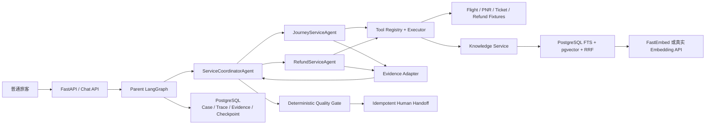
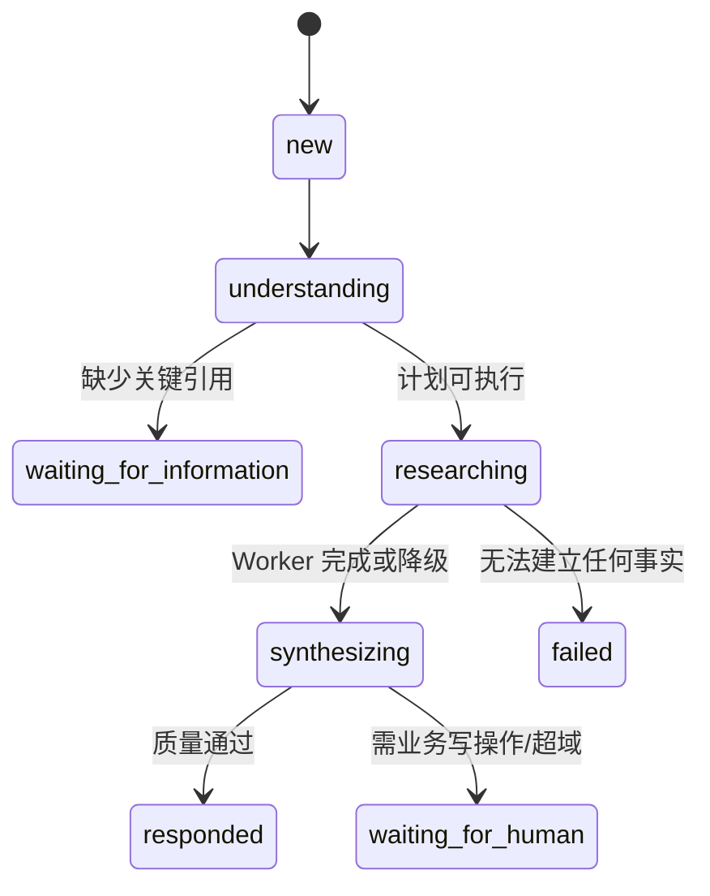
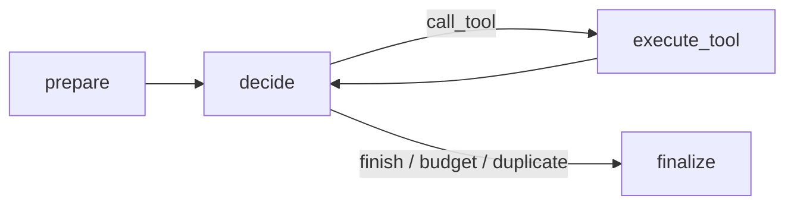

# EchoMind Airline Care：架构完整的面试级 MVP 设计

> 代码注释中的 `Design §N` 均指向本文对应章节。本文既是设计基线，也是实现验收清单。

## §1. 项目目标

面向普通旅客处理航变、客票和退款查询。项目要在一周左右可完整掌握，同时展示
主流多智能体系统的关键工程能力：LangGraph 状态编排、领域 Agent、工具权限、
RAG、证据、人工接管、Trace 和离线评测。

MVP 的价值不是替旅客自动改签或退款，而是把跨系统调查变成一次可信回答，
并将必须写操作的问题携带完整事实交给人工，降低重复询问和人工查数时间。

## §2. MVP 范围

包含：

- 航班状态、航变类型、PNR、票联、退款和支付链路查询；
- Journey 与 Refund 两个运行域；
- 当前有效政策检索和原文引用；
- 缺参澄清、失败降级、人工接管；
- 航司 Fixture、真实 OpenAI-compatible LLM、PostgreSQL 业务库与 Checkpoint、
  FastEmbed 和 PostgreSQL FTS + pgvector RAG；
- API、CLI、Trace 和固定评测集。

不包含：

- 真实航司生产系统接入；
- 退票、改签、赔付等业务写操作；
- 多渠道身份认证、生产级 PII/KMS；
- 自动学习、Experience Memory 和复杂图检索。

## §3. 核心旅客旅程

主 Demo：

1. 旅客说明 `EK302 / 2026-08-15 / PNR EK7D3M`，查询一张票的退款进度，
   并咨询另一张票的退改选项。
2. Coordinator 识别 Journey + Refund 两个独立调查任务。
3. 两个领域 Worker 并行读取航班/客票和退款/支付系统。
4. 每个 Worker 在自己的业务域内检索政策候选，再下钻确切版本与章节。
5. Coordinator 合并可验证事实，明确区分“查询结果”和“尚未执行的选项”。
6. Quality Gate 检查引用、权限和高风险话术。
7. 确定性 Handoff Repository 创建幂等人工接管记录。

## §4. Agent 划分原则

按业务责任划分，不按模型厂商划分：

| Agent | 对客 | 工具 | 核心职责 |
|---|---:|---|---|
| ServiceCoordinatorAgent | 是 | 无 | 理解、计划、路由、聚合、回复 |
| JourneyServiceAgent | 否 | Journey 只读工具 | 航班、PNR、客票、航变与政策 |
| RefundServiceAgent | 否 | Refund 只读工具 | 退款、支付链路与政策 |

Quality、Memory、Evidence、Trace 是平台服务或确定性节点，不创建成 Agent。
Baggage 只保留配置扩展示例，不进入 MVP 路由。

## §5. 设计原则

- 控制流显式：节点、边、预算和终止条件由 LangGraph 管理；
- 最小权限：Coordinator 无工具，Worker 只拿到任务白名单；
- 事实外置：模型不能把自然语言推断升级为业务事实；
- 结构化交互：Agent 之间只传 Pydantic 合同；
- 可替换：模型、RAG Store 和业务 Adapter 均通过接口注入；
- 可回放：关键决策、调用、证据、质检和接管均有 Trace。

## §6. 系统边界

旅客消息与已验证主体由上游渠道传入。`verified_subject_id` 是服务端上下文，
不能由模型生成。Tool Executor 负责检查主体、域和工具白名单。Fixture 仅是
System-of-Record Adapter 的本地实现，生产替换时不改变 Agent 协议。

## §7. 总体架构



## §8. Agent Runtime 与模型无关性

`ModelGateway` 定义理解、计划、域内下一步、Finding 和最终合成接口。
默认 `DeterministicModelGateway` 保证离线可演示；`StructuredLLMGateway`
实际调用 OpenAI-compatible API，参与结构化理解、工具选择、Finding 和
旅客回复。确定性 Planner、ToolExecutor 和 QualityGate 不会交给模型。

业务图不依赖 Codex、Claude、OpenCode 或具体模型名称。替换模型时保持：

- `CasePlan`
- `DomainDecision`
- `DomainFinding`
- `ServiceResponse`

不变即可。

## §9. Case 生命周期



MVP 不把“生成了一段文字”视为解决；最终状态由确定性 Persist 节点决定。

## §10. LangGraph State

Parent State 包含标识、消息、理解结果、CasePlan、并行 Worker 输出、
ServiceResponse、QualityReport、Handoff 和预算。

并行字段必须有 Reducer：

- `findings`：按 `task_id` 合并，重试覆盖同任务旧结果；
- `evidence`：按 `evidence_id` 去重；
- `tool_calls/errors`：追加。

ServiceResponse 等标量仅由 Parent 单写，避免并行更新冲突。

## §11. 跨组件结构化合同

- `RequestUnderstanding`：意图、实体、缺参和风险；
- `CasePlan` / `DomainTask`：任务域、目标、白名单和预算；
- `DomainDecision`：`call_tool | finish` 及参数；
- `ToolResult`：状态、数据、来源、警告和审计；
- `EvidenceItem`：事实、来源、版本、定位和置信度；
- `DomainFinding`：facts / inferences / policy / gaps；
- `ServiceResponse`：旅客回答、证据引用和未执行选项；
- `HandoffPacket`：接管原因、队列、证据和未解决项。

禁止 Agent 之间以自由文本对话作为唯一协议。

## §12. 各 Agent 详细职责

### ServiceCoordinatorAgent

- 输入：旅客当前消息和会话标识；
- 输出：RequestUnderstanding、CasePlan、ServiceResponse；
- 权限：没有业务工具；
- 结束：已回答、需澄清或已生成 Handoff Proposal；
- 降级：不支持域转人工，不编造处理结果。

### JourneyServiceAgent

- 工具：flight、booking、ticket、disruption、knowledge、policy clause；
- 可读：任务实体和本任务新证据；
- 输出：Journey DomainFinding；
- 禁止：退款系统、任何写工具；
- 预算：最多 6 次调用。

### RefundServiceAgent

- 工具：refund、payment、knowledge、policy clause；
- 输出：Refund DomainFinding；
- 禁止：航班/客票系统、任何写工具；
- 预算：最多 4 次调用。

## §13. 通用 DomainWorkerGraph



Journey 和 Refund 不是两份复制代码，而是同一子图加不同
`DomainAgentConfig`。真正的 Agent 实例由“图 + 配置 + ModelGateway”组成。

## §14. 动态路由与防循环

- 缺参：直接 Clarify，不启动 Worker；
- 仅航班/客票：Journey；
- 仅退款：Refund；
- 复杂航变退款：Journey 与 Refund 使用 `Send` 并行；
- 不支持域或写操作：调查后人工接管。

控制措施：

- 单任务最多 4～6 次工具调用；
- 最多两个业务域；
- 同一 Worker 检测规范化工具签名重复；
- Parent recursion limit 50，Worker 30；
- 质量修订最多一次且是确定性回退；
- Worker 不允许相互 handoff，因此不存在 A2A 乒乓。

## §15. 只读 Tool Contract

MVP 工具：

1. `get_flight_status`
2. `get_booking`
3. `get_ticket_status`
4. `get_disruption_info`
5. `get_payment_status`
6. `get_refund_status`
7. `search_airline_knowledge`
8. `get_policy_clause`

Executor 顺序：注册检查 → Domain 白名单 → Task 白名单 → 主体权限 →
Pydantic 参数校验 → Adapter → 标准化结果 → Trace/Evidence。

状态语义：

- `success/partial/not_found`：可形成证据；
- `timeout/unavailable`：未知，只能形成 gap；
- `denied`：越权或身份不足；
- `invalid_input`：模型参数不满足 Schema。

只读超时最多自动重试一次。写工具根本不注册，避免“靠 Prompt 禁止”的脆弱边界。

## §16. RAG 设计

RAG 在各业务域内部作为工具，不单独创建 Knowledge Agent：

1. Query + Domain + Carrier + `as_of` 进入 `search_airline_knowledge`；
2. Store 先过滤域、承运人、有效期和 active 状态；
3. pgvector 与 FTS 分别召回，再通过 RRF 融合；
4. 返回候选文档坐标、authority、URL、Hash、score 和摘要；
5. Worker 必须调用 `get_policy_clause(documentId, version, section)`；
6. 最终回答只引用下钻后的原始条款 Evidence。

面试运行档统一使用 PostgreSQL；Embedding 默认由本地 FastEmbed
`BAAI/bge-small-zh-v1.5` 生成，也可切换 OpenAI-compatible API。
Hash + LocalKnowledgeStore 只用于离线测试。官网快照保留 URL、抓取时间和
SHA-256，旧版本标记 `superseded` 但不删除。

## §17. API 与 Checkpoint

API 仅做传输层：

- `POST /v1/chat`
- `GET /v1/cases/{case_id}`
- `GET /v1/cases/{case_id}/trace`
- `GET /health`

每个 Case 使用自己的 LangGraph `thread_id`，避免不同 Case 的 Reducer 状态互相污染。
面试运行档使用 `PostgresSaver`，测试显式使用 MemorySaver。Checkpoint 和
业务表仍是两个独立协议。

## §18. PostgreSQL 数据与 Case Summary

表：Conversation、Message、Case、ToolCall、EvidenceItem、ServiceResponse、
Handoff、TraceEvent。

业务记录和图 Checkpoint 分离：

- 业务表用于审计、展示和评测；
- Checkpoint 用于图恢复；
- `case_summary` 只保存稳定摘要，不把全部历史重新注入每次 Prompt。

Schema 只执行前向 CREATE/ALTER，没有删除数据的运行时 API。PostgreSQL 使用
psycopg 连接池，并用事务级 advisory lock 生成有序 Trace。SQLite 只保留给测试。

## §19. Evidence 与 Quality

Evidence 必含：

- `evidence_id`
- source system / record id
- authority
- version / valid time
- locator（toolCallId + recordIndex）
- confidence

Finding 只引用 Evidence ID。最终 Quality Gate 检查：

- 引用是否属于当前 Case；
- 未执行选项是否保持 `not_executed`；
- 是否声称退款、改签、赔付已成功；
- Handoff 是否有原因码。

一次修订仍失败时输出保守回退，不进入 Agent Review 循环。

## §20. 人工接管

LLM 只能生成 `HandoffPacket` 所需的结构化意图，不能写队列。
`HandoffRepository.queue` 使用 `(case_id, reason_code, response_version)`
唯一约束保证幂等，成功后才把状态标记为 `queued`。

触发条件：

- 旅客要求退票/改签/补偿等写操作；
- 关键退款记录缺失且需人工提交；
- 不支持业务域；
- 高风险或 Quality fallback。

## §21. Fixture 与 Demo

Fixture 是版本化合成数据，包含：

- 已取消航班 `CZ3101`；
- PNR `AB12CD` 的两张票：一张 `REFUNDED`，一张 `OPEN`；
- 退款 `RF1001` 仍在收单机构处理中；
- 跨主体 PNR `PRIVATE1` 用于越权测试；
- 当前和过期政策版本。

所有 Fixture Adapter 只读，返回前移除 `subjectId`。

## §22. 失败与降级

- `not_found`：明确的系统观察，可进入 Evidence；
- `timeout/unavailable`：不能证明业务事实，进入 Finding gaps；
- `denied`：不回退到猜测或其他越权引用；
- Worker 部分失败：保留已核验事实，最终响应标记 degraded；
- 无证据：明确说明无法建立事实；
- 质量阻断：安全回退并转人工。

## §23. Trace 与可观测性

链路：

```text
requestId → conversationId → caseId → invocationId → toolCallId
          → evidenceId → handoffId
```

关键事件包括 request、plan、dispatch、agent invoke/decision/complete、
tool complete、synthesize、quality、handoff、case complete。Trace 使用
Case 内严格递增序号，可通过 API 回放。

## §24. Offline 与 Trace-level Eval

固定数据集覆盖：

- 双域复杂航变退款；
- 简单航班查询；
- 退款处理中；
- 缺少引用；
- 跨主体越权；
- 工具超时。

分项指标：

- routing；
- required/forbidden tools；
- response/handoff；
- evidence grounding；
- no write-success claim；
- no duplicate tool signature。

不使用单一总分掩盖高风险失败。`passRate` 只用于汇总，具体分项始终保留。

## §25. 安全、隐私与生产差距

已实现：

- Agent/Task/Executor 三层工具白名单；
- 敏感读取需要 verified subject；
- Fixture 返回前去授权字段；
- 无业务写工具；
- 参数 Schema 和 Adapter 错误收口；
- Evidence 引用和越权话术硬校验；
- Handoff 幂等；
- PostgreSQL 审计记录和可查询后端健康状态。

生产补充：

- OIDC/渠道签名和对象级授权服务；
- PII 字段级加密、Trace 脱敏和保留策略；
- 多租户 Row-Level Security；
- 真实 Adapter 的熔断、限流和 SLA；
- Prompt Injection 分类器与知识入库审核；
- 人工工作台、用户遗忘权和审计导出。
