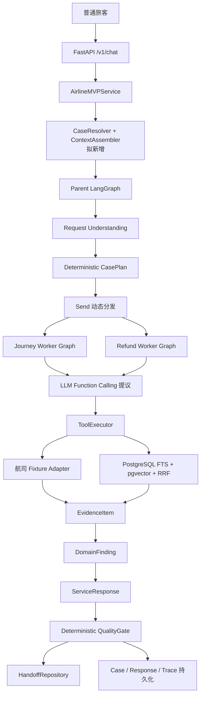
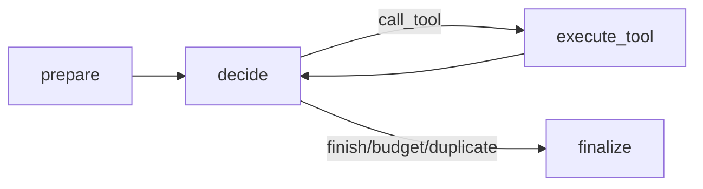
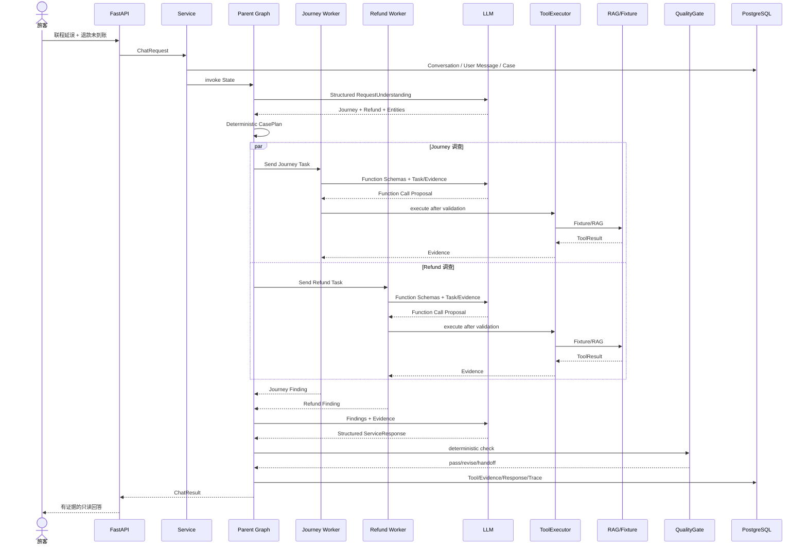

# EchoMind Airline MVP：用一个全新 Case 走完整体流程

> 文档定位：面向第一次阅读项目、对整体控制流仍不熟悉的学习者
>
> 文档状态：教学说明，不代表新增代码已经实现
>
> 案例数据：全部为本文件构造的虚拟教学数据，不在当前 Fixture 和 Eval 数据集中
>
> 阅读目标：看懂一次请求如何经过 API、意图、LangGraph、领域 Agent、Function Calling、Tool、RAG、Evidence、Quality、持久化和 Trace，并理解下一轮请求如何续接同一个 Case

## 1. 先记住整套系统的主线

先不要把注意力放在每个类名上。整个系统本质上只做下面这件事：

```text
接收旅客问题
→ 判断用户到底在问什么
→ 把问题拆成有限的业务任务
→ 让有权限的领域 Worker 调用只读工具调查
→ 把工具结果转换成可追溯 Evidence
→ 根据 Evidence 组织旅客回复
→ 用确定性规则检查回复是否越权或编造
→ 保存 Case、Trace、Evidence 和人工接管结果
```

当前系统最重要的边界是：

> LLM 可以理解、选择和组织，但不能直接读取数据库、不能直接执行退款或改签，也不能仅凭
> 自然语言宣布某个业务操作已经成功。

## 2. 本文使用的新教学 Case

### 2.1 第一轮请求

旅客发送：

> 我 2026 年 10 月 6 日乘坐 MF8207，经厦门转 MF8391 去杭州，PNR 是 N4K8WP。
> 第一段延误了，中转只剩 35 分钟，我还能赶上吗？另外我上个月客票 TKT9007 的退款一直
> 没到账，也帮我查一下。

这条消息同时包含两个独立调查目标：

1. Journey：航班、预订、中转和航变问题；
2. Refund：另一张客票的退款与支付链路问题。

### 2.2 第二轮请求

系统回答第一轮后，旅客继续说：

> 如果赶不上，你直接帮我改到明早吧。

第二轮依赖第一轮上下文：

- “赶不上”指第一轮的中转风险；
- “你”指当前智能客服；
- “改到明早”是改签写操作；
- 消息中没有重新提供 PNR、航班号和日期。

系统需要续接第一轮 Case，但必须拒绝自行执行改签，并携带已核验信息转交人工。

### 2.3 假设的教学业务数据

为了讲清正常成功路径，本文假设航司 Adapter 中存在以下记录：

```json
{
  "pnrRef": "N4K8WP",
  "subjectId": "subject_teaching_001",
  "segments": [
    {
      "flightNo": "MF8207",
      "date": "2026-10-06",
      "origin": "PEK",
      "destination": "XMN"
    },
    {
      "flightNo": "MF8391",
      "date": "2026-10-06",
      "origin": "XMN",
      "destination": "HGH"
    }
  ],
  "ticketRefs": ["TKT9008"]
}
```

```json
{
  "flightNo": "MF8207",
  "date": "2026-10-06",
  "status": "DELAYED",
  "delayMinutes": 95,
  "reasonCategory": "WEATHER"
}
```

```json
{
  "refundRef": "RF9007",
  "ticketRef": "TKT9007",
  "refundStatus": "PROCESSING",
  "stage": "ACQUIRING_BANK"
}
```

这些数据只是教学假设。当前仓库的 Fixture 中没有 `MF8207`、`MF8391`、`N4K8WP`、
`TKT9007` 或 `RF9007`。如果直接向当前 API 发送本文请求，业务查询会得到 `not_found`；
本文没有修改 Fixture，也没有实际执行这些工具结果。

## 3. 整体架构鸟瞰



其中：

- `CaseResolver + ContextAssembler` 是已经设计、尚未实现的跨请求模块；
- Parent Graph、Journey/Refund Worker、Function Calling、ToolExecutor、RAG、Evidence、
  Quality Gate 和持久化都已经存在；
- 航司业务 API 目前是 Fixture；
- LLM 可以选择 Mock 或 OpenAI-compatible 真实调用；
- PostgreSQL、pgvector、FastEmbed 和 PostgresSaver 已经有真实 Adapter。

## 4. 先认识五种不同的数据

读代码容易混乱，是因为同一轮里有五类数据在流动。

| 数据 | 例子 | 谁生成 | 能否作为最终事实 |
|---|---|---|---:|
| 用户输入 | “退款一直没到账” | 旅客 | 否，只是用户陈述 |
| 模型理解 | `refund_status` | LLM/规则 | 否，只是分类结果 |
| 工具调用提议 | `get_refund_status(...)` | LLM Function Call | 否，还没有执行 |
| ToolResult | `PROCESSING` | ToolExecutor + Adapter | 条件可以 |
| EvidenceItem | 带来源、时间、版本的退款状态 | Evidence Adapter | 是，最终回复必须引用它 |

最容易犯的错误是把第三类“模型提议调用工具”误认为第四类“工具已经执行成功”。

## 5. 第一轮：请求进入 API

### 5.1 HTTP 请求

教学请求可以表示为：

```json
{
  "message": "我 2026 年 10 月 6 日乘坐 MF8207，经厦门转 MF8391 去杭州，PNR 是 N4K8WP。第一段延误了，中转只剩 35 分钟，我还能赶上吗？另外我上个月客票 TKT9007 的退款一直没到账，也帮我查一下。",
  "conversation_id": "conv_teaching_001",
  "verified_subject_id": "subject_teaching_001",
  "locale": "zh-CN"
}
```

当前 `ChatRequest` 包含：

- `message`；
- 可选 `conversation_id`；
- `verified_subject_id`；
- `locale`。

`verified_subject_id` 必须来自已经完成登录或身份验证的上游渠道，不能由 LLM 从“我是张三”
之类的自然语言里生成。

代码入口：

- [`api.py`](../src/airline_mvp/api.py)
- [`ChatRequest`](../src/airline_mvp/models.py)
- [`AirlineMVPService.chat`](../src/airline_mvp/service.py)

### 5.2 FastAPI 不负责业务推理

FastAPI 只做：

1. 使用 Pydantic 校验请求；
2. 通过依赖取得单例 `AirlineMVPService`；
3. 调用 `service.chat(request)`；
4. 把 `ChatResult` 序列化为 HTTP 响应。

API 层不会：

- 判断 Journey 或 Refund；
- 调用航司工具；
- 查询 RAG；
- 组织最终客服回答。

因此即使未来把 FastAPI 换成 WebSocket、企业微信或 App Gateway，业务 Graph 也不需要重写。

## 6. 创建 Request、Conversation、Case 和 Trace

### 6.1 当前代码

`AirlineMVPService.chat()` 会生成：

```text
request_id       = 本次 HTTP 请求 ID
conversation_id  = 使用请求值，或者生成新值
case_id          = 每次请求都生成新值
trace_id         = 本次完整运行轨迹 ID
thread_id        = case_id
```

然后调用 `CaseRepository.start_case()`：

1. Upsert Conversation；
2. 插入一条 User Message；
3. 创建 Case；
4. Case 状态为 `new`。

### 6.2 目标跨请求方案

未来在创建 Case 前增加：

```text
Identity Guard
→ Idempotency Guard
→ CaseResolver
→ ContextAssembler
```

第一轮没有旧 Case，因此结果为：

```json
{
  "decision": "create",
  "case_id": "case_teaching_001",
  "reason_code": "NO_RESUMABLE_CASE"
}
```

随后：

```text
thread_id = case_teaching_001
context_version = 1
```

这里需要记住：

> Conversation 是聊天窗口；Case 是业务问题；Thread 是这个 Case 的 LangGraph 状态。

## 7. 初始 LangGraph State

当前服务会构造类似下面的初始 State：

```python
{
    "request_id": "req_teaching_001",
    "trace_id": "trace_teaching_001",
    "thread_id": "case_teaching_001",
    "conversation_id": "conv_teaching_001",
    "case_id": "case_teaching_001",
    "messages": [HumanMessage(...)],
    "current_message": "...",
    "verified_subject_id": "subject_teaching_001",
    "intents": [],
    "missing_fields": [],
    "risk_flags": [],
    "domain_tasks": [],
    "findings": [],
    "evidence": [],
    "tool_calls": [],
    "errors": [],
    "status": "new"
}
```

这些字段可以分成三类：

### 控制字段

```text
request_id / trace_id / case_id / thread_id
status / replan_count / revision_count
```

### 认知字段

```text
current_message / intents / entities / missing_fields / plan
```

### 调查结果字段

```text
findings / evidence / tool_calls / errors / service_response
```

并行 Worker 会同时写入 `findings`、`evidence`、`tool_calls` 和 `errors`，因此这些字段使用
Reducer 合并，而不是让后完成的 Worker 覆盖先完成的 Worker。

代码位置：[`state.py`](../src/airline_mvp/state.py)。

## 8. Parent Graph 第一个节点：validate_and_load

Parent Graph 从 `START` 进入 `validate_and_load`。

它做两件事：

1. 写入 `request.received` Trace；
2. 把 Case 状态从 `new` 更新为 `understanding`。

Trace Payload 不保存完整敏感数据，只记录：

```json
{
  "requestId": "req_teaching_001",
  "conversationId": "conv_teaching_001",
  "messageLength": 108
}
```

这个节点没有调用 LLM，也没有调用工具。它是应用进入 Graph 后的审计边界。

代码位置：[`parent_graph.py`](../src/airline_mvp/parent_graph.py)。

## 9. 理解用户请求

### 9.1 当前真实代码怎么做

`understand_and_plan` 首先调用：

```python
understanding = model.understand(current_message)
```

如果使用 `StructuredLLMGateway`：

1. 使用 OpenAI-compatible Chat Model；
2. 使用 `with_structured_output(RequestUnderstanding)`；
3. LLM 输出 Intent、Entity、Missing Field 和 Risk；
4. 再使用 `DeterministicModelGateway.understand()` 做规则补充；
5. 显式航班号、日期、PNR、票号等以确定性解析结果纠正模型；
6. 最终只允许 `journey_support`、`refund_status` 和 `unsupported`。

这一步不是 Function Calling。它是 Pydantic Structured Output。

### 9.2 当前 Case 的理解结果

按照现有粗粒度 Schema，教学结果大致是：

```json
{
  "user_goal": "调查联程航班中转风险，并查询另一张客票的退款进度",
  "intents": [
    "journey_support",
    "refund_status"
  ],
  "entities": {
    "flight_no": "MF8207",
    "travel_date": "2026-10-06",
    "pnr_ref": "N4K8WP",
    "ticket_refs": ["TKT9007"]
  },
  "missing_fields": [],
  "risk_flags": [],
  "requested_write_action": false
}
```

注意：当前 `AirlineEntities` 只能保存一个 `flight_no`，对 `MF8207 + MF8391` 这种联程实体
表达不足。这是一个真实的模型边界。完整实现应该把航段扩展为 `segments[]` 或至少增加
`flight_refs[]`，否则第二段航班可能只保留在 `user_goal` 里。

### 9.3 目标意图架构怎么做

后续实现生产级 Intent Pipeline 后，这一步会变成：

```text
Routing Context
→ Guard Rules
→ Entity Resolver
→ Intent Candidate Retriever
→ SFT Small Model
→ Deterministic Adjudicator
```

目标输出可能是：

```json
{
  "verdict": "clear",
  "problem_type": "private_query",
  "selected_intents": [
    "connection_disruption_query",
    "refund_status_query"
  ],
  "resolved_entities": {
    "pnr_ref": "N4K8WP",
    "flight_refs": [
      {"flight_no": "MF8207", "date": "2026-10-06"},
      {"flight_no": "MF8391", "date": "2026-10-06"}
    ],
    "ticket_refs": ["TKT9007"]
  }
}
```

这个目标架构尚未实现，详细设计见
[生产级意图识别架构](INTENT_RECOGNITION_ARCHITECTURE.md)。

## 10. 生成 CasePlan

### 10.1 Planner 为什么是确定性的

接下来调用：

```python
plan = model.plan(understanding)
```

即使启用了真实 LLM，`StructuredLLMGateway.plan()` 仍然委托给确定性 Planner。

原因是 CasePlan 包含：

- Domain；
- allowed_tools；
- required_evidence；
- max_tool_calls；
- 是否并行；
- 是否可能需要人工操作。

这些是权限与治理数据，不能让模型自由生成。

### 10.2 本 Case 的 Journey Task

教学计划可能是：

```json
{
  "task_id": "task_journey_teaching",
  "domain": "journey",
  "objective": "核实联程预订、第一段航班状态、异常原因和中转处置政策",
  "entity_refs": {
    "pnr_ref": "N4K8WP",
    "flight_no": "MF8207",
    "travel_date": "2026-10-06"
  },
  "allowed_tools": [
    "get_flight_status",
    "get_booking",
    "get_ticket_status",
    "get_disruption_info",
    "search_airline_knowledge",
    "get_policy_clause"
  ],
  "required_evidence": [
    "flight",
    "booking",
    "ticket",
    "policy"
  ],
  "max_tool_calls": 6
}
```

### 10.3 本 Case 的 Refund Task

```json
{
  "task_id": "task_refund_teaching",
  "domain": "refund",
  "objective": "核实 TKT9007 的退款申请和支付网关阶段",
  "entity_refs": {
    "ticket_ref": "TKT9007"
  },
  "allowed_tools": [
    "get_refund_status",
    "get_payment_status",
    "search_airline_knowledge",
    "get_policy_clause"
  ],
  "required_evidence": [
    "refund",
    "payment",
    "policy"
  ],
  "max_tool_calls": 4
}
```

### 10.4 总计划

```json
{
  "case_type": "journey_and_refund_investigation",
  "tasks": [
    "task_journey_teaching",
    "task_refund_teaching"
  ],
  "parallel": true,
  "human_action_likely": false
}
```

Planner 最多允许两个不同 Domain，不能给同一个 Domain 创建两个重复 Task，也不能超过每个
Worker 的工具预算。

## 11. Parent Graph 决定下一步

`route_after_plan()` 只有三个当前分支：

```text
有 missing_fields       → clarify
没有任何 Domain Task    → unsupported
有可执行 Domain Task    → dispatch
```

本 Case 无缺失字段且包含两个 Task，所以进入 `dispatch`。

未来意图架构会扩展为：

```text
Direct / RAG-only / Tool / Tool+RAG / Clarify / Handoff / Fallback
```

但当前代码还没有这些细粒度分支。

## 12. 使用 Send 并行分发两个 Worker

`fan_out()` 根据 `plan.tasks` 生成两个 LangGraph `Send`：

```text
Send("run_domain_worker", Journey Task State)
Send("run_domain_worker", Refund Task State)
```

两个 Worker 可以并行调查，因为：

- Journey 查询航班、PNR 和航变政策；
- Refund 查询退款、支付和退款时效政策；
- 两者不修改相同业务系统；
- 当前所有工具都是只读。

每个 Worker 只收到自己的：

- Task；
- Entity；
- Case/Request/Trace ID；
- `verified_subject_id`；
- 空的本域 Evidence、Tool Calls 和 Errors。

Journey Worker 不会看到 Refund 的私有临时循环 State，Refund Worker 也不能调用 Journey
工具。

## 13. 领域 Agent 到底是什么

项目里的领域 Agent 不是一个神秘的独立进程。它由三部分组成：

```text
DomainWorkerGraph
+ DomainAgentConfig
+ ModelGateway
```

Journey 和 Refund 使用同一份图代码：



区别来自 `DomainAgentConfig`：

- 角色说明不同；
- allowed_tools 不同；
- knowledge_domains 不同；
- required_evidence_types 不同；
- max_tool_calls 不同。

代码位置：

- [`worker_graph.py`](../src/airline_mvp/worker_graph.py)
- [`domain_config.py`](../src/airline_mvp/domain_config.py)

## 14. Journey Worker 第一步：prepare

`prepare()` 生成：

```text
invocation_id = inv_journey_teaching
```

并写入：

```json
{
  "event_type": "agent.invoked",
  "agent": "journeyServiceAgent",
  "taskId": "task_journey_teaching",
  "allowedTools": [
    "get_flight_status",
    "get_booking",
    "get_ticket_status",
    "get_disruption_info",
    "search_airline_knowledge",
    "get_policy_clause"
  ]
}
```

然后初始化本 Worker 的：

```text
evidence = []
tool_calls = []
called_signatures = []
errors = []
```

## 15. Journey Worker 第二步：Function Calling 选择工具

### 15.1 模型看到哪些函数

真实 LLM 模式下，`decide_domain_step()` 调用：

```python
registry.function_call_schemas(
    domain=DomainName.JOURNEY,
    allowed_tools=task.allowed_tools,
)
```

Registry 只导出 Journey Task 白名单内的 JSON Schema。模型根本看不到：

- `get_refund_status`；
- `get_payment_status`；
- 任何写工具；
- 未注册函数。

这叫“暴露层权限”。

### 15.2 模型输入

模型会收到：

- Agent Role；
- Task Objective；
- Entity；
- 当前已有 Evidence；
- 已完成 Tool Calls；
- 当前允许的 Function Schema。

第一轮决定可能是：

```json
{
  "name": "get_booking",
  "args": {
    "pnr_ref": "N4K8WP"
  },
  "id": "provider_call_001"
}
```

这时还没有查询航司数据。它只是模型提出：

> 我认为下一步应该调用 `get_booking`，参数是 `N4K8WP`。

### 15.3 为什么每轮只处理一个 Function Call

当前 Worker 每轮只允许一个动作。如果模型同一轮返回多个 Tool Call，系统确定性地只处理
第一个，避免：

- 并行工具参数互相依赖；
- 同一轮绕过预算；
- 失败时不知道哪个结果被模型消费；
- Trace 难以回放。

Worker 完成一次调用后，把新 Evidence 重新交给模型，再决定下一步。

## 16. ToolExecutor 才是真正的执行边界

模型返回 Function Call 后，Worker 构造服务端可信的 `ToolExecutionContext`：

```json
{
  "request_id": "req_teaching_001",
  "case_id": "case_teaching_001",
  "invocation_id": "inv_journey_teaching",
  "tool_call_id": "tc_booking_teaching",
  "verified_subject_id": "subject_teaching_001"
}
```

这些值由服务端生成，不允许模型提供。

ToolExecutor 按顺序检查：

```text
1. 工具是否注册
2. 工具是否在 Task allowed_tools 中
3. 当前 Domain 是否允许使用该工具
4. sensitive_read 是否有 verified_subject_id
5. Function 参数是否通过 Pydantic Schema
6. 是否需要规范化服务端控制参数
7. 是否调用 Adapter
8. 是否重试一次只读 Timeout
9. 是否标准化为 ToolResult
```

这叫“执行层权限”。即使模型或模型供应商伪造一个：

```json
{"name": "execute_refund", "args": {...}}
```

Executor 也会返回：

```text
status = denied
error_code = TOOL_NOT_ALLOWED
```

代码位置：[`tools.py`](../src/airline_mvp/tools.py)。

## 17. Journey Worker 的完整工具循环

在教学成功路径中，Journey Worker 可能按以下顺序调查。

### 17.1 查询 PNR

```text
get_booking(pnr_ref=N4K8WP)
```

假设返回：

```json
{
  "status": "success",
  "booking": {
    "pnrRef": "N4K8WP",
    "segments": ["MF8207", "MF8391"],
    "ticketRefs": ["TKT9008"]
  }
}
```

这证明两个航段属于同一个经过授权的预订。

### 17.2 查询第一段航班状态

```text
get_flight_status(flight_no=MF8207, date=2026-10-06)
```

假设返回：

```text
status = DELAYED
delayMinutes = 95
```

### 17.3 查询异常类型

```text
get_disruption_info(flight_no=MF8207, date=2026-10-06)
```

假设返回：

```text
type = DELAY
reasonCategory = WEATHER
```

### 17.4 查询客票状态

```text
get_ticket_status(ticket_refs=[TKT9008])
```

假设返回票联仍为 `OPEN`。

### 17.5 检索中转/航变政策

```text
search_airline_knowledge(
    query="联程航班第一段延误导致中转时间不足如何处理",
    domains=[journey, disruption, ticketing],
    as_of="2026-10-06",
    carrier_codes=[MF]
)
```

`domains` 会被 ToolExecutor 根据 Journey 配置覆盖，不能由模型扩展为其他知识域。

### 17.6 下钻政策原文

搜索只返回候选：

```json
{
  "documentId": "connection_protection_2026",
  "version": "2026-09-01",
  "section": "4.2",
  "score": 0.87
}
```

候选摘要不能直接成为最终事实。Worker 必须继续调用：

```text
get_policy_clause(
    document_id=connection_protection_2026,
    version=2026-09-01,
    section=4.2
)
```

Journey 最大预算是 6 次，本教学路径刚好使用 6 次。此后即使模型还想调用工具，Worker 也会
因为预算达到上限转入 `finalize`。

## 18. Refund Worker 的并行工具循环

Refund Worker 与 Journey 同时执行，但只能看到 Refund 白名单。

### 18.1 查询退款记录

```text
get_refund_status(ticket_ref=TKT9007)
```

假设返回：

```text
refundRef = RF9007
refundStatus = PROCESSING
stage = ACQUIRING_BANK
```

### 18.2 查询支付网关

当前 `get_payment_status` 的参数要求 PNR 或 Order Reference。仅有 `TKT9007` 时，模型不能
猜测订单号。

这里存在两种合法结果：

1. `get_refund_status` 返回了可用于关联的订单引用，再调用 Payment；
2. 没有订单引用，Refund Finding 把“无法核验支付网关”记录为 Gap。

本文假设退款记录中带回了 `orderRef=ORD9007`，因此调用：

```text
get_payment_status(order_ref=ORD9007)
```

假设结果：

```text
paymentStatus = CAPTURED
refundGatewayStatus = SUBMITTED_TO_ACQUIRER
```

### 18.3 查询退款时效政策

```text
search_airline_knowledge(
    query="退款进入收单机构处理后多久可以到账",
    domains=[refund, payment],
    as_of="2026-10-06"
)
```

### 18.4 下钻政策原文

```text
get_policy_clause(document_id=..., version=..., section=...)
```

Refund 最大预算是 4 次，本路径使用 4 次。

## 19. RAG 内部到底做了什么

`search_airline_knowledge` 最终进入 `KnowledgeService`。

面试真实链路使用：

```text
PostgreSQL FTS 关键词召回
+ pgvector 语义召回
→ RRF 融合
→ Domain/Carrier/有效期/状态过滤
→ 返回 Top-K 候选
```

### 19.1 为什么同时使用 FTS 和向量

- FTS 擅长航班、中转、收单机构等明确词；
- 向量擅长“来不及转机”“退款卡住了”等语义表达；
- RRF 根据排名融合，不要求两个分数位于同一数值空间。

### 19.2 为什么检索后还要 get_policy_clause

搜索结果可能只是：

- 摘要；
- 旧版本；
- 相关但不适用的章节；
- 低权威 FAQ；
- 切块中的局部内容。

`get_policy_clause` 使用 `documentId + version + section` 返回确切原文坐标，最终 Evidence 才能
说明：

```text
来源是谁
政策版本是什么
哪一天生效
具体位于哪个章节
是否已经过期
```

代码位置：[`knowledge.py`](../src/airline_mvp/knowledge.py)。

## 20. ToolResult 如何变成 Evidence

ToolExecutor 返回的是标准 `ToolResult`：

```json
{
  "status": "success",
  "data": {},
  "source": {
    "system": "airline_fixture_get_flight_status",
    "dataset_version": "teaching-v1"
  },
  "audit": {
    "tool_call_id": "tc_flight_teaching",
    "duration_ms": 3.2,
    "attempt": 1
  }
}
```

Evidence Adapter 转换成：

```json
{
  "evidence_id": "ev_flight_teaching",
  "case_id": "case_teaching_001",
  "evidence_type": "flight",
  "source_type": "airline_fixture_get_flight_status",
  "source_id": "get_flight_status:MF8207",
  "authority": "system_of_record",
  "summary": "MF8207 2026-10-06 状态为 DELAYED",
  "observed_at": "2026-10-06T07:30:00+08:00",
  "version": "teaching-v1",
  "locator": {
    "toolCallId": "tc_flight_teaching",
    "recordIndex": 0
  },
  "confidence": 1.0
}
```

### 20.1 不同 ToolStatus 的事实语义

| ToolStatus | 是否产生 Evidence | 含义 |
|---|---:|---|
| `success` | 是 | 找到有效记录 |
| `partial` | 是 | 找到部分记录，必须保留不完整性 |
| `not_found` | 是 | System of Record 明确未找到，也是一项观察 |
| `timeout` | 否 | 未知，不能说“没有记录” |
| `unavailable` | 否 | 系统不可用，不代表业务事实 |
| `denied` | 否 | 越权或身份不足 |
| `invalid_input` | 否 | 参数协议错误 |

代码位置：[`evidence.py`](../src/airline_mvp/evidence.py)。

## 21. Worker 如何避免无限循环

每次工具调用后，Worker 回到 `decide`。防循环机制包括：

### 工具预算

```text
Journey 最多 6 次
Refund 最多 4 次
```

### 重复签名检测

系统计算：

```text
SHA256(tool_name + 排序后的 arguments)
```

如果模型重复调用完全相同的函数和参数，Worker 终止循环并进入 Finalize。

### 同轮只处理一个调用

模型同轮返回多个 Function Call 时只处理第一个。

### Graph recursion limit

Parent 和 Worker 都有递归上限。即使其他保护失效，LangGraph 也不会无限运行。

### Worker 不能相互 Handoff

Journey 不会把任务交给 Refund，Refund 也不会再把任务交回 Journey。所有 Domain 分发都由
Parent Graph 完成，所以不存在 A2A 乒乓。

## 22. DomainFinding 是什么

Worker 达到以下任一条件后进入 `finalize`：

- 模型不再返回 Function Call；
- 已有足够 Evidence；
- 达到工具预算；
- 检测到重复调用；
- 无法继续调查。

Journey Finding 示例：

```json
{
  "task_id": "task_journey_teaching",
  "domain": "journey",
  "status": "completed",
  "facts": [
    {
      "statement": "MF8207 在 2026-10-06 延误 95 分钟",
      "evidence_ids": ["ev_flight_teaching"]
    },
    {
      "statement": "MF8207 与 MF8391 属于同一 PNR 的联程航段",
      "evidence_ids": ["ev_booking_teaching"]
    }
  ],
  "policy_conclusions": [
    {
      "statement": "联程保护应根据实际到达时间和适用政策由航司进一步安排",
      "evidence_ids": ["ev_connection_policy_teaching"]
    }
  ],
  "gaps": [
    "当前系统无法预测机场实际转机耗时，因此不能保证一定赶上"
  ]
}
```

Refund Finding 示例：

```json
{
  "task_id": "task_refund_teaching",
  "domain": "refund",
  "status": "completed",
  "facts": [
    {
      "statement": "TKT9007 的退款仍为 PROCESSING",
      "evidence_ids": ["ev_refund_teaching"]
    },
    {
      "statement": "退款已经提交至收单机构",
      "evidence_ids": ["ev_payment_teaching"]
    }
  ],
  "policy_conclusions": [
    {
      "statement": "当前阶段不能承诺银行具体到账日期",
      "evidence_ids": ["ev_refund_policy_teaching"]
    }
  ],
  "gaps": []
}
```

Finding 是给 Coordinator 的调查报告，不直接展示给旅客。

## 23. 两个 Worker 如何合并

Journey 和 Refund 并行完成后，将结果返回 Parent Graph：

```text
findings  → 按 task_id 合并
evidence  → 按 evidence_id 去重
tool_calls → 追加
errors    → 追加
```

这一步必须使用 LangGraph Reducer。否则：

```text
Journey 先写 findings
Refund 后写 findings
→ Refund 把 Journey 覆盖
```

就会丢失一个业务域的全部调查结果。

## 24. Coordinator 生成旅客回复

Parent Graph 进入 `synthesize`：

```python
model.synthesize(
    user_message=current_message,
    plan=case_plan,
    findings=all_findings,
    evidence=all_evidence,
)
```

真实 LLM 使用 `with_structured_output(ServiceResponse)`，不是 Function Calling。

教学回复可能是：

> 已核实，MF8207 在 2026 年 10 月 6 日出现 95 分钟延误，并且 MF8207 与 MF8391
> 属于同一 PNR 的联程航段。由于实际转机时间还受到落地、摆渡和登机截止时间影响，当前
> 只读系统不能保证一定可以赶上。若最终无法衔接，需由航司按照适用联程政策进一步安排。
> 另外，TKT9007 的退款目前仍处于处理中，记录显示已经提交至收单机构；现阶段不能承诺
> 银行具体到账日期。

结构化响应必须把每个已核验事实关联 Evidence ID：

```json
{
  "response_status": "answered",
  "verified_facts": [
    {
      "statement": "MF8207 延误 95 分钟",
      "evidence_ids": ["ev_flight_teaching"]
    },
    {
      "statement": "TKT9007 退款仍处于处理中",
      "evidence_ids": ["ev_refund_teaching"]
    }
  ],
  "must_not_claim": [
    "保证一定赶上后续航班",
    "承诺银行具体到账日期",
    "已经执行改签或退票"
  ]
}
```

## 25. Quality Gate 检查什么

Quality Gate 是确定性代码，不是另一个会自由讨论的 Agent。

它检查：

1. 回复引用的 Evidence ID 是否真的存在于当前 Case；
2. 是否使用不存在或其他 Case 的 Evidence；
3. 是否包含“已退款成功”“已为您改签”等禁用话术；
4. Handoff 尚未真正入队时，是否声称“已经转交人工”；
5. 是否需要 revise、block 或 handoff。

如果检查失败，只进行一次确定性安全修订，不让 Answer Agent 和 Review Agent 无限互相修改。

安全回退大意是：

> 当前只读系统暂时无法在证据约束内完整回答。我不会声称退票、改签、退款或补偿操作已经
> 完成；如需继续办理，请由人工客服核验。

代码位置：[`quality.py`](../src/airline_mvp/quality.py)。

## 26. 第一轮如何持久化

Quality 通过后，`persist` 保存：

### tool_calls

```text
每次函数名、参数、Domain、状态、错误码、开始和结束时间
```

### evidence_items

```text
每条 Evidence 的来源、版本、定位、结构化数据和时间
```

### service_responses

```text
结构化旅客回答和 response_version
```

### cases

```text
最终状态、user_goal、plan_json、case_summary
```

### trace_events

```text
从 request.received 到 case.completed 的完整事件
```

当前 `case_summary` 类似：

```text
intent=journey_support,refund_status; evidence=9; tools=10; response=answered
```

它是稳定机器摘要，不是完整 Conversation Memory。

未来跨请求方案还会：

- 把客服回复存成 Assistant Message；
- 更新 CaseContext；
- 保存 confirmed entities、pending slots 和 Evidence Anchors；
- 增加 context_version。

## 27. 第一轮完整 Trace 长什么样

教学 Trace 的逻辑顺序可能是：

```text
01 request.received
02 coordinator.planned
03 coordinator.dispatched

04 agent.invoked             Journey
05 agent.invoked             Refund

06 agent.decision            Journey → get_booking
07 tool.completed            get_booking
08 agent.decision            Refund → get_refund_status
09 tool.completed            get_refund_status

10 agent.decision            Journey → get_flight_status
11 tool.completed            get_flight_status
12 agent.decision            Refund → get_payment_status
13 tool.completed            get_payment_status

14 agent.decision            Journey → get_disruption_info
15 tool.completed            get_disruption_info
16 agent.decision            Refund → search_airline_knowledge
17 tool.completed            search_airline_knowledge

18 agent.decision            Journey → get_ticket_status
19 tool.completed            get_ticket_status
20 agent.decision            Refund → get_policy_clause
21 tool.completed            get_policy_clause
22 agent.completed           Refund

23 agent.decision            Journey → search_airline_knowledge
24 tool.completed            search_airline_knowledge
25 agent.decision            Journey → get_policy_clause
26 tool.completed            get_policy_clause
27 agent.completed           Journey

28 coordinator.synthesized
29 quality.checked
30 case.completed
```

实际并行时 Journey 和 Refund 的事件可能交错，但同一个 Case 内 `sequence_no` 严格递增。

通过：

```text
GET /v1/cases/{case_id}/trace
```

可以回答：

- 为什么创建两个 Domain Task；
- 每个 Agent 看到了哪些工具；
- 模型提议了什么；
- 服务端实际执行了什么；
- 哪些调用形成了 Evidence；
- 最终回复引用了什么；
- Quality 为什么通过或拦截。

## 28. 第二轮：旅客要求直接改签

第二轮请求：

> 如果赶不上，你直接帮我改到明早吧。

### 28.1 当前代码实际会怎样

即使请求继续使用：

```text
conversation_id = conv_teaching_001
```

当前 `service.chat()` 仍然会：

```text
生成新 case_id
生成新 thread_id
只把第二轮消息放进 State
```

所以当前代码可能无法知道：

- “赶不上”指哪个中转；
- “改到明早”是哪一张票；
- 原 PNR 和航班日期；
- 第一轮已经核验了什么。

这正是跨请求多轮方案需要解决的问题。

### 28.2 目标 CaseResolver

后续实现后，CaseResolver 检查：

- `conversation_id` 相同；
- 主体仍为 `subject_teaching_001`；
- 最近 Case 是 `case_teaching_001`；
- 当前消息包含“赶不上”这一指代；
- 最近 Case 的目标包含联程风险；
- 没有另一个同样可能的活动 Case。

得到：

```json
{
  "decision": "resume",
  "case_id": "case_teaching_001",
  "reason_code": "RECENT_CASE_DEICTIC_REFERENCE",
  "confidence_band": "high"
}
```

### 28.3 ContextAssembler

装配：

```json
{
  "current_message": "如果赶不上，你直接帮我改到明早吧。",
  "recent_messages": [
    "用户第一轮问题",
    "系统第一轮回答"
  ],
  "active_case_id": "case_teaching_001",
  "previous_intents": [
    "connection_disruption_query",
    "refund_status_query"
  ],
  "confirmed_entities": {
    "pnr_ref": "N4K8WP",
    "flight_refs": ["MF8207", "MF8391"],
    "travel_date": "2026-10-06"
  },
  "verified_fact_refs": [
    "ev_booking_teaching",
    "ev_flight_teaching",
    "ev_connection_policy_teaching"
  ],
  "context_version": 1
}
```

它不会把另一张客票 `TKT9007` 的退款事实当成改签目标，因为当前表达与联程 Journey
上下文相关。

完整跨请求设计见
[跨请求多轮上下文与 Case 记忆设计](CROSS_REQUEST_CONVERSATION_MEMORY_ARCHITECTURE.md)。

## 29. 第二轮的意图和路由

目标意图解析结果：

```json
{
  "verdict": "handoff",
  "problem_type": "action_request",
  "selected_intents": [
    "change_booking_action_request"
  ],
  "resolved_entities": {
    "pnr_ref": "N4K8WP",
    "requested_time": "2026-10-07 morning"
  },
  "decision_reason_codes": [
    "WRITE_ACTION_GUARD",
    "CONTEXT_ENTITY_RESOLVED"
  ]
}
```

当前 MVP 没有：

```text
change_booking
execute_rebooking
reserve_seat
```

这不是“模型能力不够”，而是产品权限明确禁止 AI 写入航司业务系统。

因此系统最多可以：

1. 使用已有 Evidence 整理当前情况；
2. 必要时重新查询过期航班状态；
3. 形成未执行选项；
4. 构造 `HandoffPacket`；
5. 由服务端 Repository 入队人工客服。

## 30. Handoff 为什么不是 LLM 自己写数据库

LLM 可以生成接管所需的语义：

```text
用户想改签
目标是明早航班
相关 PNR 是 N4K8WP
当前 AI 无写权限
```

但真正入队由 `HandoffRepository.queue()` 完成。

教学 HandoffPacket：

```json
{
  "case_id": "case_teaching_001",
  "reason_code": "WRITE_ACTION_REQUIRES_HUMAN",
  "target_queue": "airline_general_service",
  "priority": "normal",
  "customer_request": "将 N4K8WP 改签到次日上午",
  "verified_fact_refs": [
    "ev_booking_teaching",
    "ev_flight_teaching",
    "ev_connection_policy_teaching"
  ],
  "unresolved_items": [
    "需要人工查询次日上午可用航班",
    "需要核验客票改签规则和座位库存"
  ],
  "conversation_cursor": "conv_teaching_001"
}
```

Repository 使用：

```text
(case_id, reason_code, response_version)
```

作为幂等约束，避免客户端重试产生多个相同人工工单。

只有数据库成功创建 Handoff 后，系统才能说“已转交人工”。

## 31. 第二轮应该怎样回复

安全回复示例：

> 当前智能客服只有查询权限，不能直接替您完成改签。根据已经核验的联程和航班信息，我会将
> PNR N4K8WP、当前航段及您的“改到次日上午”诉求一并提交给人工客服继续核验。是否有可用
> 航班、是否需要补差价以及最终是否改签成功，均以人工在客票系统中的实际操作结果为准。

允许说：

- 当前 AI 没有写权限；
- 已核验哪些事实；
- 已成功进入人工队列；
- 人工还需要确认哪些信息。

禁止说：

- “已经为您改签到明早”；
- “座位已经保留”；
- “无需补差价”；
- “一定能够赶上”；
- “人工马上会联系您”，除非有真实 SLA Evidence。

## 32. 为什么不是每条消息都调用所有 Agent

本教学第一轮需要 Journey + Refund，是因为消息中确实有两个独立问题。

正常动态路由应是：

| 用户问题 | 路径 |
|---|---|
| “你好，你能做什么？” | Direct，不调用 Worker |
| “国际联程行李能否直挂？” | RAG-only，不调用业务 Tool |
| “MF8207 今天是否延误？” | Journey Tool |
| “我的退款到哪里了？” | Refund Tool + 必要政策 RAG |
| “第一段延误导致转机困难，同时退款未到账” | Journey + Refund 并行 |
| “直接帮我改签” | Handoff，不执行写工具 |

当前代码已实现 Journey、Refund 和双域并行；Direct、RAG-only、细粒度 Action Guard 和跨请求
续接属于下一阶段设计。

## 33. 如果工具失败，流程怎么变

### 33.1 航班工具 timeout

```text
get_flight_status → timeout
```

系统只能说：

> 当前暂时无法从航班系统核实最新状态。

不能说：

> 没有延误记录。

因为 timeout 表示未知，不是 not_found。

### 33.2 退款 not_found

```text
get_refund_status(TKT9007) → not_found
```

这是 System of Record 的有效观察，可以形成 Evidence：

> 当前退款系统未找到与 TKT9007 匹配的退款申请。

但不能进一步推断：

> 用户没有申请过退款。

因为可能存在引用错误、其他渠道申请或数据同步延迟。

### 33.3 Function Call 参数错误

模型若返回：

```json
{
  "name": "get_flight_status",
  "args": {
    "tool_name": "get_flight_status",
    "parameters": {
      "flight_no": "MF8207"
    }
  }
}
```

Pydantic 会返回：

```text
status = invalid_input
error_code = INPUT_SCHEMA_INVALID
```

系统不会偷偷猜参数，也不会声称航司 API 失败。

### 33.4 RAG 只找到候选但无法下钻

如果 `search_airline_knowledge` 成功，但 `get_policy_clause` 失败：

- 候选仍然只是线索；
- Finding 必须记录 Policy Gap；
- 最终不能把候选摘要写成正式政策结论。

### 33.5 Quality Gate 阻断

如果 LLM 最终写出“已为您改签”，Quality Gate 会触发安全回退，并要求人工处理。

## 34. Mock 模式和真实模式有什么不同

两种模式使用相同的业务 Graph 和数据合同。

| 环节 | Mock 模式 | 真实模式 |
|---|---|---|
| Request Understanding | 确定性关键词和正则 | LLM Structured Output + 规则守卫 |
| CasePlan | 确定性 Planner | 同一个确定性 Planner |
| Worker 决策 | 规则选择下一工具 | 原生 Function Calling |
| ToolExecutor | 相同 | 相同 |
| 航司数据 | Fixture | 当前仍为 Fixture |
| RAG | Local/Hash 测试实现 | PostgreSQL FTS + pgvector + FastEmbed |
| Finding | 确定性模板 | LLM Structured Output |
| ServiceResponse | 确定性模板 | LLM Structured Output |
| Quality | 相同确定性规则 | 相同确定性规则 |

所以“换成真实大模型”不会改变：

- LangGraph 节点和边；
- Domain 权限；
- Tool Schema；
- ToolExecutor；
- Evidence；
- Quality Gate；
- Handoff Repository。

它只替换认知层实现。

## 35. PostgreSQL 和 Checkpoint 各自保存什么

### 业务 PostgreSQL 表

```text
conversations
messages
cases
tool_calls
evidence_items
service_responses
handoffs
trace_events
knowledge_sources
knowledge_documents
knowledge_ingestion_runs
```

用途：审计、查询、展示、评测和业务恢复。

### LangGraph PostgresSaver

用途：保存 Graph State 和执行位置。

它不会自动：

- 选择当前消息属于哪个 Case；
- 查询最近 Conversation Message；
- 判断 Evidence 是否过期；
- 生成长期记忆；
- 处理跨用户授权。

这就是为什么下一阶段还需要 CaseResolver、ContextAssembler 和 CaseContextRepository。

## 36. 当前已实现与拟新增对照

| 能力 | 当前代码 | 本教学目标流程 |
|---|---:|---:|
| FastAPI 请求入口 | 已实现 | 复用 |
| Case/Trace ID | 已实现 | 复用 |
| Conversation 数据存储 | 已实现 | 增强读取 |
| 每请求新 Case | 当前行为 | 改为 Resolver 决定 |
| 跨请求 Case Resume | 未实现 | 拟新增 |
| ContextAssembler | 未实现 | 拟新增 |
| 粗粒度 Journey/Refund 意图 | 已实现 | 保留作兼容 |
| Intent Catalog/SFT | 未实现 | 拟新增 |
| 确定性 CasePlan | 已实现 | 复用并适配新 Intent |
| Journey/Refund Send 并行 | 已实现 | 复用 |
| Worker Function Calling | 已实现 | 复用 |
| Tool 双层权限 | 已实现 | 复用 |
| 航司 Fixture | 已实现 | 仍保留 |
| PostgreSQL RAG | 已实现 | 复用 |
| RAG-only 快速路径 | 未实现 | 拟新增 |
| Evidence | 已实现 | 复用并增加新鲜度 |
| Quality Gate | 已实现 | 复用 |
| 幂等 Handoff | 已实现 | 复用 |
| Assistant Transcript | 未完整实现 | 拟新增 |
| CaseContext | 未实现 | 拟新增 |

## 37. 推荐的代码阅读顺序

带着本文 Case 阅读代码时，按下面顺序，不要从 `build_service()` 中间跳着看。

### 第一步：请求和装配

1. [`models.py`](../src/airline_mvp/models.py)：先看 `ChatRequest`、`ChatResult`；
2. [`api.py`](../src/airline_mvp/api.py)：看 HTTP 如何进入 Service；
3. [`service.py`](../src/airline_mvp/service.py)：看 ID、初始 State、Graph Invoke。

### 第二步：Parent 控制流

4. [`state.py`](../src/airline_mvp/state.py)：看哪些字段会被并行合并；
5. [`parent_graph.py`](../src/airline_mvp/parent_graph.py)：按节点注册和边的顺序阅读；
6. [`model_gateway.py`](../src/airline_mvp/model_gateway.py)：只先看 `understand()` 和 `plan()`。

### 第三步：领域 Worker

7. [`domain_config.py`](../src/airline_mvp/domain_config.py)：先看 Journey/Refund 白名单；
8. [`worker_graph.py`](../src/airline_mvp/worker_graph.py)：按照 prepare → decide → execute → finalize；
9. 回到 [`model_gateway.py`](../src/airline_mvp/model_gateway.py)：看 Function Calling；
10. [`tools.py`](../src/airline_mvp/tools.py)：看 Registry Schema 与 Executor 双检。

### 第四步：事实和安全

11. [`knowledge.py`](../src/airline_mvp/knowledge.py)：看 FTS、pgvector、RRF 和 Clause；
12. [`evidence.py`](../src/airline_mvp/evidence.py)：看 ToolResult 如何变成 Evidence；
13. [`quality.py`](../src/airline_mvp/quality.py)：看硬规则；
14. [`persistence.py`](../src/airline_mvp/persistence.py)：看最终保存和 Handoff 幂等；
15. [`evaluation.py`](../src/airline_mvp/evaluation.py)：看如何根据 Trace 验证流程。

## 38. 读代码时经常混淆的十个问题

### 1. Coordinator 是不是会调用所有工具？

不会。Coordinator 没有业务工具，只理解、规划、分发和汇总。

### 2. Agent 是不是独立服务？

当前不是。Agent 是“通用 Worker Graph + Domain Config + ModelGateway”的运行实例。

### 3. Function Calling 是不是已经执行了工具？

不是。它只是模型返回的结构化调用提议。

### 4. 谁真正执行工具？

`ToolExecutor`，并且会重新检查权限、身份和参数。

### 5. 为什么模型已经看不到退款工具，还要 Executor 再检查？

防止模型供应商异常、伪造响应、应用 Bug 或未来配置错误绕过暴露层权限。

### 6. RAG 搜索结果是不是最终政策事实？

不是。必须通过 `get_policy_clause` 下钻确切版本和章节。

### 7. Tool timeout 是否等于没有记录？

不是。Timeout 表示未知；只有 `not_found` 表示系统明确未找到。

### 8. Quality Agent 会不会和 Service Agent 无限讨论？

不会。Quality 是确定性 Gate，最多一次安全回退。

### 9. PostgreSQL Checkpoint 是否等于多轮记忆？

不是。它保存 Graph State，不负责 Conversation 读取和 Case 选择。

### 10. 为什么改签请求不能交给模型执行？

因为当前系统没有写工具，且权限边界明确要求人工接管。模型能力与业务授权是两件事。

## 39. 一页式流程总结



第二轮“直接帮我改签”在目标架构中复用相同 Case Context，但进入写操作 Guard 和 Handoff，
不会进入任何不存在的改签工具。

## 40. 最终理解方式

这个项目不是“多个大模型互相聊天”，而是：

```text
LangGraph 决定流程
ModelGateway 提供可替换认知能力
Domain Config 决定 Agent 身份和白名单
Function Calling 生成工具调用提议
ToolExecutor 决定能否真实执行
Fixture/RAG 返回外部数据
Evidence 把外部数据变成可引用事实
QualityGate 保护最终回答
Repository 保存业务结果和审计
CaseResolver/ContextAssembler 将在下一阶段解决跨请求续接
```

如果只记住一句话，可以记住：

> 模型负责“想”，LangGraph 负责“走哪条路”，ToolExecutor 负责“能不能做”，Evidence 负责
> “凭什么这样说”，Quality Gate 负责“这句话能不能发给旅客”。
