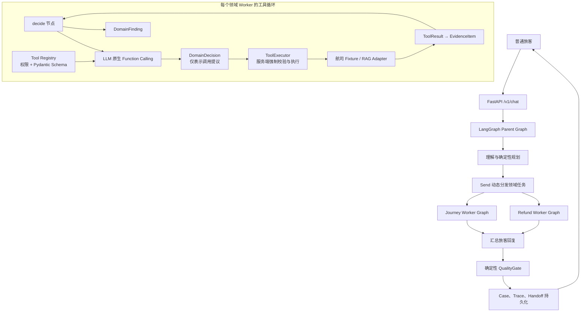
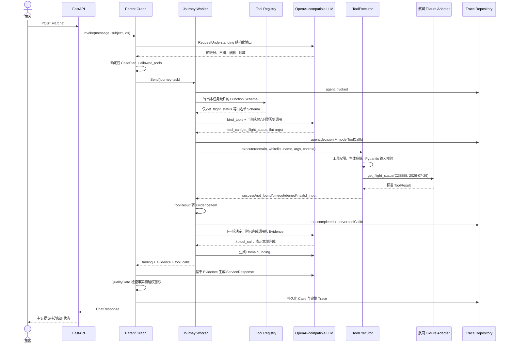
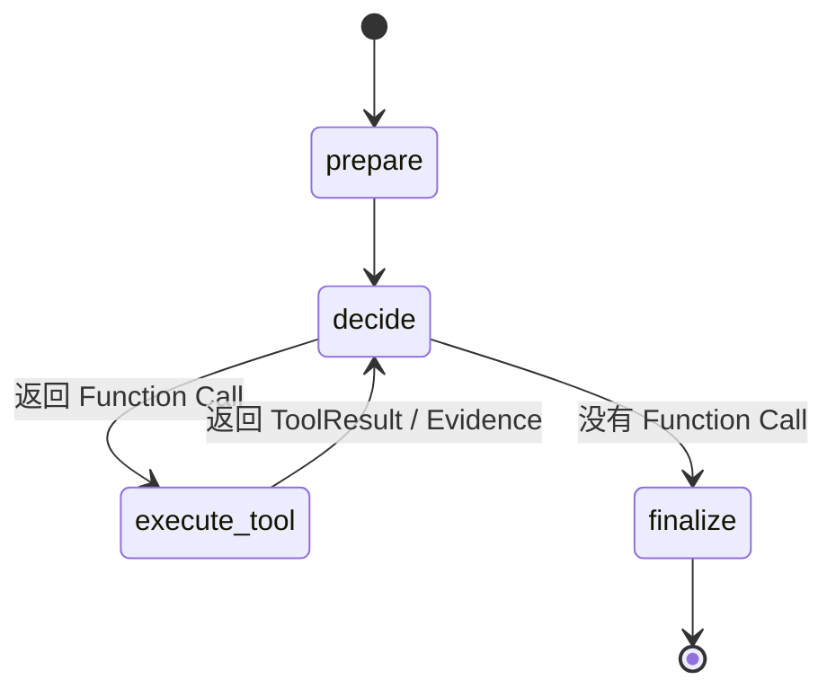

# EchoMind Airline MVP：Function Calling 改造与完整调用链路

## 1. 先回答两个核心问题

### Function Calling 一定要使用 LangChain 吗？

不一定。Function Calling 是模型 API 与应用之间的一种结构化协议：应用把
函数名、说明和 JSON Schema 发给模型，模型返回“建议调用哪个函数以及参数”。
应用可以直接使用 OpenAI-compatible SDK 实现这套协议，不需要 LangChain。

### Function Calling 能和 LangGraph 一起使用吗？

可以，而且二者负责的层次不同：

- **LangGraph**：负责节点、状态、条件路由、循环、并行、Checkpoint 和终止条件；
- **Function Calling**：只负责某个模型节点内的“工具选择和参数生成”；
- **ToolExecutor**：负责服务端权限校验、参数复验、真实调用和结果标准化。

本项目的实现选择是：**LangGraph 继续作为系统控制平面，使用 LangChain
`ChatOpenAI.bind_tools()` 作为 OpenAI-compatible Function Calling 的薄适配层。**
这不等于使用 LangChain Agent，也没有把编排权交给 LangChain。

如果将来不想依赖 LangChain，可以在 LangGraph 的 `decide` 节点里直接调用模型
SDK 的 `chat.completions.create(..., tools=[...])`，再把响应转换成同一个
`DomainDecision`。Parent Graph、Worker Graph、Tool Registry 和 ToolExecutor
都无需改变。

## 2. 为什么要做这次改造

改造前，领域 Worker 要求模型生成一个自定义结构：

```json
{
  "action": "call_tool",
  "tool_name": "get_flight_status",
  "arguments": {
    "flight_no": "CZ8888",
    "date": "2026-07-29"
  },
  "reason": "查询航班状态"
}
```

它本质上是“结构化业务决策”，并不是原生 Function Calling。真实模型曾错误地
把另一层工具协议塞进 `arguments`：

```json
{
  "tool_name": "get_flight_status",
  "arguments": {
    "tool_name": "get_flight_status",
    "parameters": {
      "flight_no": "CZ8888",
      "date": "2026-07-29"
    }
  }
}
```

`ToolExecutor` 最终校验的是 `FlightInput(flight_no, date)`，所以包装后的参数会
得到 `INPUT_SCHEMA_INVALID`。这不是航班 API 失败，而是模型输出协议与工具输入
协议之间发生了二次包装。

改造后，模型直接看到工具自身的 JSON Schema，并通过 API 的 `tool_calls` 字段
返回标准调用：

```json
{
  "name": "get_flight_status",
  "args": {
    "flight_no": "CZ8888",
    "date": "2026-07-29"
  },
  "id": "provider_tool_call_id"
}
```

业务参数不再经过自定义 `parameters` 包装。

## 3. 改造后的总体架构



这里最重要的边界是：**模型返回 Function Call，不代表函数已经执行。**
Function Call 只是一个不可信的调用提议；只有 ToolExecutor 返回 `success`，
业务结果才可以进入 Evidence，并被最终回复引用。

## 4. 一次航班查询的完整时序

以“请查询 CZ8888 航班 2026-07-29 的状态”为例：



## 5. 代码中的数据流

### 5.1 Tool Registry 是唯一 Schema 真相源

文件：`src/airline_mvp/tools.py`

每个 `ToolDefinition` 同时保存：

- `name`：函数名；
- `description`：给模型看的用途说明；
- `input_model`：Pydantic 参数模型；
- `risk`：`public_read` 或 `sensitive_read`；
- `allowed_domains`：允许使用它的业务域；
- `evidence_type`：成功后形成的证据类型；
- `handler`：真正的服务端实现。

`ToolDefinition.as_function_call_schema()` 直接从 `input_model` 生成 JSON Schema，
避免“Prompt 参数说明”和“运行时校验模型”各维护一份而逐渐漂移。

例如 `FlightInput` 会生成近似以下协议：

```json
{
  "type": "function",
  "function": {
    "name": "get_flight_status",
    "description": "查询指定日期航班的计划与实际状态",
    "parameters": {
      "type": "object",
      "properties": {
        "flight_no": {
          "type": "string",
          "description": "航班号，例如 CZ3101"
        },
        "date": {
          "type": "string",
          "description": "航班日期，格式为 YYYY-MM-DD"
        }
      },
      "required": ["flight_no", "date"],
      "additionalProperties": false
    }
  }
}
```

所有工具输入继承 `StrictToolInput`，`extra="forbid"` 同时约束发送给模型的
Schema 和服务端 Pydantic 复验。旧式 `tool_name + parameters` 包装因此会被明确
拒绝，而不会被悄悄修正成一次可能有歧义的业务调用。

### 5.2 服务端决定模型能看到哪些函数

`ToolRegistry.function_call_schemas(domain, allowed_tools)` 只导出当前 CasePlan
白名单和当前 Domain 交集内的函数。如果计划引用未注册工具，或者试图把 Journey
工具暴露给 Refund Agent，系统会在请求模型前失败。

这形成两层权限：

1. **暴露层权限**：没有授权的函数根本不发送给模型；
2. **执行层权限**：即使模型或供应商返回伪造函数名，ToolExecutor 仍重新检查。

### 5.3 ModelGateway 解析原生 Function Call

文件：`src/airline_mvp/model_gateway.py`

真实模式中的职责划分如下：

| 调用位置 | 输出契约 | 实现方式 |
|---|---|---|
| 请求理解 | `RequestUnderstanding` | `with_structured_output` |
| 领域工具决策 | `AIMessage.tool_calls` → `DomainDecision` | `bind_tools` Function Calling |
| 领域结论 | `DomainFinding` | `with_structured_output` |
| 旅客回复 | `ServiceResponse` | `with_structured_output` |

工具决策之所以单独改成 Function Calling，是因为它表达的是“选择应用函数”；
其余三个位置表达的是普通业务数据合同，继续使用结构化输出更清晰。

`StructuredLLMGateway.decide_domain_step()` 每轮执行以下操作：

1. 从 Registry 获取当前任务的精确 Function Schema；
2. 调用 `chat_model.bind_tools(..., tool_choice="auto")`；
3. 把实体、Evidence 和已完成 ToolCall 作为不可信业务数据发送；
4. 若模型返回一个 `tool_call`，解析函数名和扁平参数；
5. 若模型不返回 `tool_call`，转换成 `action="finish"`；
6. 若同轮返回多个调用，只处理第一个，维持 Worker 的单动作状态机语义；
7. 这里只生成 `DomainDecision`，绝不直接调用 Python Handler。

### 5.4 LangGraph Worker 执行受控循环

文件：`src/airline_mvp/worker_graph.py`



Worker Graph 还保留了确定性防护：

- `CasePlan.max_tool_calls` 与领域配置共同限制调用次数；
- 对 `tool_name + canonical arguments` 计算签名，阻止完全相同的重复调用；
- 每轮只允许一个动作；
- ToolResult 被标准化后才转换成 Evidence；
- 达到预算、重复调用或模型主动结束时进入 `finalize`。

因此，Function Calling 没有取代 LangGraph。它只替换了 `decide` 节点内部原来
生成自定义 `DomainDecision` 的那一步。

## 6. 两类 Tool Call ID 为什么要分开

改造后 Trace 中存在两个不同含义的 ID：

- `modelToolCallId`：模型供应商返回的调用提议 ID，用于定位模型响应；
- `toolCallId`：本服务在准备真实执行时生成的可信审计 ID。

不能把模型生成的 ID 当作业务执行凭证。攻击者、故障供应商或回放请求都有可能
重复提供同一个模型 ID，而服务端 ID 关联真正的 Invocation、ToolResult 和 Evidence。

`agent.decision` 事件现在会记录：

```json
{
  "action": "call_tool",
  "toolName": "get_flight_status",
  "decisionSource": "function_call",
  "modelToolCallId": "provider_tool_call_id",
  "argumentKeys": ["date", "flight_no"]
}
```

`tool.completed` 事件记录服务端 `toolCallId`、状态、耗时、尝试次数和 Evidence ID。
Trace 默认只保留参数键，不记录 PNR、票号等参数值。

## 7. 权限和安全边界

Function Calling 提升了参数协议稳定性，但它本身不是安全机制。当前执行边界仍由
确定性代码建立：

1. CasePlan 由服务端生成工具白名单；
2. Registry 只向模型暴露本域白名单函数；
3. ToolExecutor 再检查注册状态、CasePlan 白名单和 Domain 权限；
4. `sensitive_read` 工具要求 `verified_subject_id`；
5. Fixture Adapter 检查记录是否属于已验证主体；
6. Pydantic 对参数做严格校验，禁止额外包装字段；
7. 当前 Registry 不存在退款、改签等写工具；
8. 只有成功 ToolResult 能转换为 Evidence；
9. 最终 QualityGate 阻止无证据事实和“操作已成功”等宣称。

因此模型即使遭遇 Prompt Injection，也只能在已暴露函数中提出请求，无法绕过
执行器直接访问 Python 函数、数据库或航司 Adapter。

## 8. Function Calling、普通 Tool Call 和 MCP 的关系

| 概念 | 解决的问题 | 本项目现状 |
|---|---|---|
| Function Calling / Tool Calling | 模型如何结构化地表达“想调用哪个函数及参数” | 已使用，二者在主流模型 API 中通常指同类能力 |
| ToolExecutor | 应用如何授权、校验、执行、重试和审计调用 | 已使用，是可信执行边界 |
| MCP | 应用如何通过标准协议发现并连接外部工具/资源服务器 | 当前未使用 |
| LangGraph | 多节点状态、路由、循环、并行和恢复如何编排 | 已使用，是主控制平面 |
| LangChain Agent | 预制 Agent 循环和工具执行框架 | 当前未使用，也不是必需依赖 |

当前系统可以准确描述为：

> **LangGraph 多智能体工作流 + OpenAI-compatible 原生 Function Calling +
> 本地 Tool Registry/ToolExecutor。**

以后接入 MCP 时，可以让某些 `ToolDefinition.handler` 转发到 MCP Server；模型
仍通过同样的 Function Calling 选择工具，LangGraph 和权限层无需被替换。

## 9. Mock 与真实模式

`DeterministicModelGateway` 继续保留，用于：

- 不需要 API Key 的本地学习；
- 稳定、低成本的单元测试和离线 Eval；
- 构造工具失败、重复调用和 QualityGate 等回归场景。

`StructuredLLMGateway` 用于真实模型。两者实现相同 `ModelGateway` 协议，所以
Parent/Worker Graph 不关心底层是规则 Mock 还是远程模型。两种模式都必须通过
相同的 ToolExecutor 和 Evidence 链路。

真实模式要求模型服务同时支持：

- Function/Tool Calling：用于领域工具决策；
- 结构化输出或兼容 JSON Schema 的能力：用于理解、Finding 和最终回复。

只支持纯文本 Chat Completion 的“OpenAI-compatible”服务仍不能直接运行完整链路。

## 10. 失败和降级行为

| 情况 | 当前行为 |
|---|---|
| 模型没有返回 Function Call | 本领域进入 `finalize` |
| 模型返回无法解析的 Function Call | 抛出模型边界错误，不静默伪装为 Mock 成功 |
| 模型返回未授权函数 | ToolExecutor 返回 `TOOL_NOT_ALLOWED` |
| 参数缺失或额外包装 | ToolExecutor 返回 `INPUT_SCHEMA_INVALID` |
| 敏感查询未验证主体 | 返回 `SUBJECT_NOT_VERIFIED` |
| Adapter 超时/不可用 | 标准化为 ToolStatus，并进入 Evidence/缺口处理 |
| 完全相同的调用再次出现 | 重复签名防护终止循环 |
| 达到工具调用预算 | Worker 终止循环并形成有缺口的 Finding |
| 最终回复越权或缺证据 | QualityGate 阻断或转人工 |

设计上不对真实模型错误静默降级到 Mock，因为那会产生“看似调用真实模型、实际
返回规则答案”的错误可观测性。离线 Mock 应由配置显式选择。

## 11. 关键文件索引

| 文件 | Function Calling 改造后的职责 |
|---|---|
| `src/airline_mvp/tools.py` | 严格输入模型、Function Schema、工具注册和真实执行权限 |
| `src/airline_mvp/model_gateway.py` | `bind_tools`、解析 `AIMessage.tool_calls`、统一 ModelGateway |
| `src/airline_mvp/models.py` | `DomainDecision` 及模型提议 ID 字段 |
| `src/airline_mvp/worker_graph.py` | FC 提议 → 服务端执行 → Evidence → 下一轮的 LangGraph 循环 |
| `src/airline_mvp/parent_graph.py` | 理解、规划、并行分发、汇总、质检和持久化 |
| `src/airline_mvp/service.py` | 将同一 Tool Registry 注入 ModelGateway 和 ToolExecutor |
| `tests/test_runtime_backends.py` | 原生 FC 解析、扁平参数和无调用结束测试 |
| `tests/test_tools_and_rag.py` | Schema、跨域暴露和旧式包装参数回归测试 |

## 12. 如何验证

离线测试和 Eval 使用 Mock，不消耗模型额度：

```powershell
.\.venv\Scripts\python.exe -m pytest
.\.venv\Scripts\airline-mvp-eval
```

真实模式需要先在 `.env` 填写模型配置，再**重启 API 进程**使代码与配置生效：

```powershell
.\.venv\Scripts\airline-mvp-api
```

调用 `/v1/chat` 后查询：

```text
GET /v1/cases/{case_id}/trace
```

检查标准：

1. `agent.decision.decisionSource` 是 `function_call`；
2. `toolName` 是 `get_flight_status`；
3. `argumentKeys` 是 `date` 和 `flight_no`，不包含 `parameters`；
4. 后续出现 `tool.completed`，且有独立的服务端 `toolCallId`；
5. 成功时产生 Evidence，最终回复只引用 Evidence 支持的事实。

## 13. 面试时可以怎么讲

可以用下面这句话概括本次设计：

> 我没有使用一个黑盒 Agent Executor 接管系统，而是让 LangGraph 管状态机和
> 调用循环，让原生 Function Calling 只负责结构化工具选择，再由独立
> ToolExecutor 做双重授权、Pydantic 复验、身份隔离和审计。这样真实模型可以
> 替换，工具协议不漂移，执行权也不会落到 LLM 手里。

它展示的重点不是“用了多少框架”，而是三个可独立测试、可独立替换的层次：
**模型决策层、LangGraph 编排层、确定性执行与治理层。**
