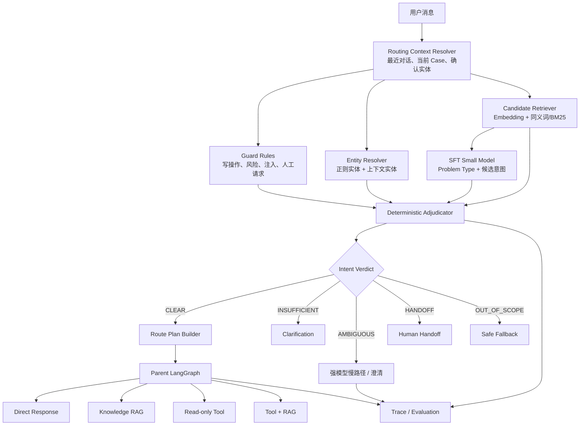
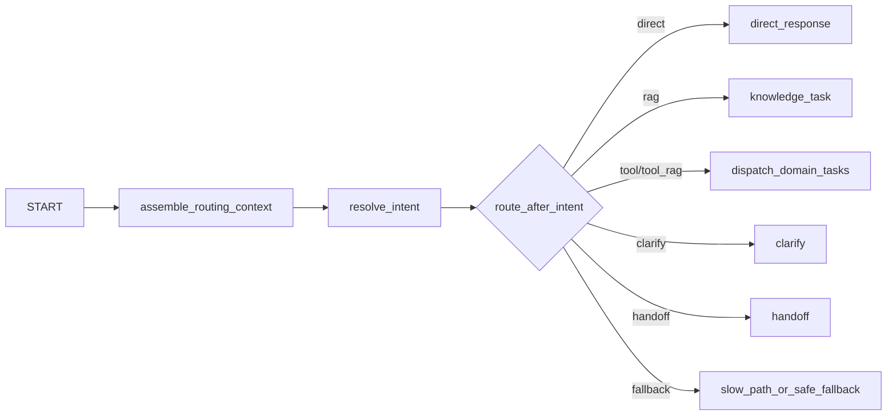

# EchoMind Airline MVP：生产级意图识别架构设计

> 文档状态：拟实施（Proposed）
>
> 适用项目：EchoMind Airline MVP
>
> 本轮范围：只定义架构，不代表代码已经实现
>
> 后续用途：作为意图识别改造、SFT 数据建设、离线评测和推理优化的统一设计基线

## 1. 执行摘要

当前项目的意图识别只覆盖 `journey_support`、`refund_status` 和
`unsupported` 等少量粗粒度意图，适合验证 LangGraph 主流程，但不能完整区分：

- 不需要外部信息、可以直接回答的普通对话；
- 需要查询航司政策知识库的通用咨询；
- 需要结合航班、订单、客票、支付或退款数据的个性化查询；
- 同时需要业务数据和政策证据的组合问题；
- 用户要求退票、改签、赔付等当前系统无权执行的写操作；
- 投诉、监管、安全威胁、Prompt Injection 和超出服务范围的问题；
- 依赖上一轮对话、当前 Case 或长期记忆才能消歧的问题。

目标架构不是增加一个拥有自由决策权的“意图 Agent”，也不是让大模型一次性自由生成
`topics`、`user_act`、`information_needs`、`requested_action` 等互相重叠的字段。
本设计采用生产系统中更容易控制和评测的分层方式：

> 上下文服务负责补齐语境，规则负责安全边界，检索负责召回候选，SFT 小模型负责语义理解，
> 确定性裁决器负责最终判定，Intent Catalog 负责把意图映射为 LangGraph 路由。

正常请求只调用一次本地小模型；只有歧义、低置信度、分布外或复杂多意图请求才进入
强模型慢路径。模型不直接决定工具权限，也不能把写操作路由为已执行。

## 2. 设计目标与非目标

### 2.1 设计目标

1. 覆盖 Direct、RAG、Tool、Tool + RAG、Clarify、Handoff 六类执行模式。
2. 支持单意图、有限多意图、缺参、歧义、分布外和跨轮指代。
3. 支持将 Prompt 大模型分类器平滑替换为 SFT 小模型。
4. 将模型理解与业务路由解耦，意图模型不能直接扩大 Agent 或工具权限。
5. 所有意图判断都有候选、分数、原因码和版本，可被 Trace、回放和评测。
6. 快速路径追求 100ms 级模型延迟，同时单独统计端到端延迟。
7. 保持 LangGraph 作为唯一业务控制平面，不额外引入不可控的自由 Agent 循环。

### 2.2 非目标

- 第一阶段不追求覆盖航司所有业务域和数百个意图。
- 第一阶段不进行真实退票、改签、赔付或通知等写操作。
- 不允许仅凭模型置信度直接执行工具或确认业务结果。
- 不将全部历史会话、用户画像或长期记忆无差别塞入分类 Prompt。
- 不在缺少独立测试集和稳定奖励函数时直接引入强化学习。
- 不承诺任意硬件、任意上下文长度下都能达到端到端 100ms。

## 3. 当前项目现状与改造边界

### 3.1 已有能力

当前项目已经具备以下可复用基础：

- FastAPI 对话入口和 Case 生命周期；
- Parent LangGraph 与领域 Worker Graph；
- `ModelGateway` 抽象，以及 Mock/真实 OpenAI-compatible 实现；
- Journey、Refund 只读业务工具和 Tool Executor；
- PostgreSQL 业务存储、Checkpoint、Trace；
- PostgreSQL FTS + pgvector + RRF 知识检索；
- Quality Gate、人工接管和离线评测脚本。

对应代码证据：

- [`RequestUnderstanding`](../src/airline_mvp/models.py)
- [`ModelGateway`](../src/airline_mvp/model_gateway.py)
- [`build_parent_graph`](../src/airline_mvp/parent_graph.py)
- [`build_domain_worker_graph`](../src/airline_mvp/worker_graph.py)
- [`KnowledgeService`](../src/airline_mvp/knowledge.py)
- [`ToolExecutor`](../src/airline_mvp/tools.py)
- [`EvaluationRunner`](../src/airline_mvp/evaluation.py)

### 3.2 当前不足

1. 意图集合过粗，知识咨询、业务查询和动作请求容易被合并。
2. 真实模型当前只被提示识别少量固定 Intent。
3. 分类输入以当前消息为主，跨轮指代和当前 Case Anchor 不充分。
4. 缺少 Intent Catalog，业务域、执行模式、工具权限散落在规划代码和 Prompt 中。
5. 缺少候选召回、硬负例、分布外拒识和可校准裁决。
6. 现有评测集规模不足以训练 SFT 或证明分类器泛化能力。

### 3.3 改造边界

后续实现时，意图识别作为 Parent Graph 前置的“受控解析模块”，而不是新增一个拥有工具的
业务 Agent。该模块只生成 `IntentResolution`，实际 Agent 分发仍由 LangGraph 条件边完成。

## 4. 核心设计原则

### 4.1 模型理解，代码裁决

模型可以判断语义相似性、隐含诉求和口语表达，但以下内容必须由代码决定：

- 最终执行模式；
- 是否允许调用工具；
- 允许调用哪些工具；
- 是否需要 RAG；
- 是否缺少强制槽位；
- 是否必须转人工；
- 是否允许向用户声称操作成功。

### 4.2 意图和路由分离

“用户想做什么”与“系统接下来怎么做”不是同一件事。例如：

- `refund_policy` 表示咨询退款规则，路由为 RAG；
- `refund_status_query` 表示查询本人退款状态，路由为只读 Tool；
- `refund_eligibility_for_booking` 表示结合订单判断能否退款，路由为 Tool + RAG；
- `refund_action_request` 表示要求执行退款，当前只读系统必须 Handoff。

### 4.3 权限不能来自模型输出

模型输出的 Intent 只能作为候选事实。最终工具白名单来自版本化的 Intent Catalog、
Domain Agent 配置、已验证主体和服务端权限策略的交集。

### 4.4 置信度不是唯一真相

不把模型自己声明的 `confidence=0.99` 作为硬路由条件。最终裁决综合：

- 候选检索相似度；
- SFT 模型排序或分类 Logit；
- 必填槽位覆盖；
- 航班号、PNR、票号等实体格式；
- 动作词和风险规则；
- 上下文一致性；
- 相邻候选分差；
- 分布外检测结果。

所有融合权重和阈值都必须由项目自己的开发集校准，不能照搬外部文章中的数值。

### 4.5 快慢路径分离

- 快速路径：规则 + 候选召回 + SFT 小模型 + 确定性裁决。
- 慢速路径：强模型消歧、向用户澄清或人工接管。
- 强模型是兜底，不是所有请求的默认分类器。

## 5. 总体架构



## 6. 六层业务漏斗

### 6.1 L0：Routing Context Resolver

#### 职责

在分类前生成一个小而可信的路由上下文，解决以下表达：

- “那我现在可以退吗？”
- “第二张票呢？”
- “刚才那个航班还能值机吗？”
- “按照上面那条规则，我有几件？”

#### 输入

- 当前用户消息；
- 最近 2～4 轮对话；
- 当前 Case Summary；
- 已确认实体；
- 上一轮选中意图；
- 当前等待补充的槽位；
- 必要且经过验证的长期 Anchor。

#### 不应注入

- 全部历史 Transcript；
- 与当前 Case 无关的历史订单；
- 未确认的用户画像；
- 模型静默推断的敏感属性；
- 大段原始政策正文。

#### 实体优先级

```text
当前消息明确实体
> 当前 Case 已确认实体
> 最近 2～4 轮对话实体
> 当前未结束工单 Anchor
> 更早的长期记忆
```

来源较旧或相互冲突时，不自动覆盖，应标记为待澄清。

### 6.2 L1：Guard Rules

这是确定性安全层，可与实体解析、候选召回并行执行。

优先识别：

- 退票、改签、升舱、赔付、补偿等写操作请求；
- 明确要求人工服务；
- 人身安全、威胁、监管投诉等高风险内容；
- Prompt Injection、越权请求和伪造系统指令；
- 空消息、纯问候和明显超域请求；
- 身份未验证却要求查询私人订单的请求。

Guard 命中写操作时，不代表完全跳过意图识别。系统仍可识别具体动作类型，以便人工接管时
携带正确主题；但 Guard 可以覆盖最终 Route Plan，确保不会进入只读工具之外的执行路径。

### 6.3 L2：Problem Type

Problem Type 描述用户请求对系统能力的需求，而不是宽泛的语言学行为。

```python
class ProblemType(str, Enum):
    CHAT = "chat"
    POLICY_QA = "policy_qa"
    PUBLIC_QUERY = "public_query"
    PRIVATE_QUERY = "private_query"
    ACTION_REQUEST = "action_request"
    COMPLAINT_OR_RISK = "complaint_or_risk"
    UNKNOWN = "unknown"
```

含义：

| 类型 | 示例 | 通常执行模式 |
|---|---|---|
| `CHAT` | 你能做什么？谢谢 | Direct |
| `POLICY_QA` | 经济舱能托运多少公斤？ | RAG |
| `PUBLIC_QUERY` | CZ8888 今天是否延误？ | Tool |
| `PRIVATE_QUERY` | 我的退款到哪里了？ | Tool，且要求身份/订单 Anchor |
| `ACTION_REQUEST` | 帮我退掉这张票 | Handoff |
| `COMPLAINT_OR_RISK` | 我要向监管部门投诉 | Handoff |
| `UNKNOWN` | 无法确定或超出范围 | Clarify/Fallback |

Problem Type 可以由 SFT 小模型与具体意图在同一次推理中输出，不应为它额外调用一次模型。

### 6.4 L3：Candidate Retriever

#### 目标

从 Intent Catalog 中召回 Top-K 候选，缩小小模型需要比较的范围，并提供独立于生成模型的
第二路语义信号。

#### 召回通道

1. Embedding 语义召回；
2. 同义词、航司术语和高精度正则；
3. 可选的 PostgreSQL FTS/BM25 关键词召回；
4. 多通道结果使用 RRF 或可校准加权融合。

#### 与知识库 RAG 的区别

Intent Retriever 检索的是几十条“意图定义”，目的是决定用户想做什么；Knowledge RAG
检索的是政策、FAQ 和产品文档，目的是回答问题。两者必须使用不同的索引、数据模型和指标。

#### 输出

```python
class IntentCandidate(BaseModel):
    intent_id: str
    retrieval_score: float
    matched_signals: list[str]
    catalog_version: str
```

MVP 默认 `top_k=5`。如果意图数只有十几个，也可保留全量候选作为对照实验；引入 Retriever
的主要目的不是炫技，而是支持未来扩展、硬负例构造和双通道评测。

### 6.5 L4：SFT Small Model

#### 单一职责

根据 Routing Context 和 Top-K Intent Definition，输出紧凑的语义假设，不调用工具、不查询
知识库、不决定 Agent、不生成面向旅客的答案。

#### 推荐输出

```python
class IntentHypothesis(BaseModel):
    problem_type: ProblemType
    intent_candidates: list[str]       # 推荐 0～2 个，硬上限 3 个
    semantic_entities: dict[str, str]
    abstain_reason: str | None = None
```

模型不输出以下字段：

- `topics[]`：由 Intent Catalog 的 `domain` 推导；
- `information_needs[]`：由 `execution_mode` 推导；
- `requested_action`：由 Problem Type、具体 Intent 和 Guard Rule 推导；
- `allowed_tools`：只能由服务端配置提供；
- 最终 Route Plan：只能由裁决器和 Catalog 构建。

#### 模型策略

- 首选 Qwen3-0.6B 或 1.7B non-thinking 作为生成式 SFT 基线；
- 同时评测 LoRA/QLoRA 和全参 SFT，不预设全参一定更好；
- 若 100ms 是硬性要求，同时建立 Encoder/SetFit 分类基线；
- 输出使用 JSON Schema 或 Grammar 约束；
- 最大输出长度保持在 10～30 Token 量级；
- 解析失败只允许重试一次，之后进入确定性降级或慢路径。

### 6.6 L5：Deterministic Adjudicator

裁决器把模型假设转换为系统可执行的 `IntentResolution`。

#### 输入信号

- Guard 命中结果；
- Candidate Retriever 分数和排名；
- SFT 模型候选排名或 Logit；
- 必填槽位覆盖率；
- 航班号、PNR、票号、订单号等实体格式有效性；
- Problem Type 与 Intent 的兼容关系；
- 当前意图和上一轮 Case 的一致性；
- Top-1 与 Top-2 的分差；
- OOD/拒识信号。

#### 裁决状态

```python
class IntentVerdict(str, Enum):
    CLEAR = "clear"
    AMBIGUOUS = "ambiguous"
    INSUFFICIENT = "insufficient"
    OUT_OF_SCOPE = "out_of_scope"
    HANDOFF = "handoff"
```

#### 结构化结果

```python
class IntentResolution(BaseModel):
    verdict: IntentVerdict
    problem_type: ProblemType
    selected_intents: list[str]
    alternative_intents: list[str]
    resolved_entities: dict[str, str]
    missing_slots: list[str]
    decision_reason_codes: list[str]
    score_breakdown: dict[str, float]
    catalog_version: str
    classifier_version: str
```

`decision_reason_codes` 使用枚举值，例如：

```text
WRITE_ACTION_GUARD
PRIVATE_QUERY_WITHOUT_SUBJECT
REQUIRED_SLOT_MISSING
TOP_CANDIDATE_MARGIN_LOW
MODEL_RETRIEVER_DISAGREE
CONTEXT_ENTITY_RESOLVED
OUT_OF_DOMAIN
PROMPT_INJECTION_DETECTED
```

#### 初始打分框架

以下只表示信号构成，不预先固定权重：

```text
final_score =
    w1 * retrieval_score
  + w2 * model_score
  + w3 * required_slot_coverage
  + w4 * entity_pattern_score
  + w5 * problem_type_compatibility
  + w6 * context_consistency
  - risk_penalties
```

权重、CLEAR 阈值和 Top-1/Top-2 分差必须在开发集上搜索，并记录配置版本。

## 7. Intent Catalog

### 7.1 目录模型

```python
class IntentDefinition(BaseModel):
    id: str
    display_name: str
    domain: str
    supported_problem_types: list[ProblemType]
    execution_mode: str
    knowledge_domains: list[str]
    allowed_tools: list[str]
    required_slots: list[str]
    optional_slots: list[str]
    risk_level: str
    embed_text: str
    reason_text: str
    positive_examples: list[str]
    counterexamples: list[str]
    enabled: bool
    version: str
```

### 7.2 为什么拆分 `embed_text` 和 `reason_text`

- `embed_text` 面向向量召回，包含口语、缩写、错别字和同义表达；
- `reason_text` 面向小模型判断，重点说明定义、边界和与相邻意图的差异；
- `counterexamples` 专门描述“看起来相似但不属于本意图”的问题。

例如 `refund_policy` 和 `refund_action_request` 都包含“退票”，只靠关键词很难区分：

```yaml
id: refund_policy
embed_text: 退票规则 能不能退 退票手续费 退款政策
reason_text: 用户咨询规则、资格或费用，但没有要求当前系统立即提交退票。
counterexamples:
  - 现在就帮我把票退掉
  - 确认退票，马上执行
```

### 7.3 建议的首版意图集合

首版控制在 14～18 个，不应一开始照搬外部系统的 57 个意图。

| 意图 | 业务域 | 执行模式 | 说明 |
|---|---|---|---|
| `general_chat` | common | Direct | 问候、感谢、普通闲聊 |
| `capability_question` | common | Direct | 询问客服能力范围 |
| `human_service_request` | common | Handoff | 明确要求人工 |
| `baggage_policy` | baggage | RAG | 随身/托运行李规则 |
| `checkin_policy` | journey | RAG | 值机时间、证件和渠道规则 |
| `transfer_policy` | journey | RAG | 中转、联程和行李直挂规则 |
| `ticketing_policy` | ticket | RAG | 客票有效期、舱位和票务规则 |
| `refund_policy` | refund | RAG | 通用退票资格和费用规则 |
| `disruption_policy` | journey | RAG | 航变、延误和取消规则 |
| `special_passenger_policy` | service | RAG | 婴儿、孕妇、轮椅等服务规则 |
| `flight_status_query` | journey | Tool | 查询指定航班状态 |
| `booking_query` | journey | Tool | 查询已验证用户的预订 |
| `ticket_status_query` | journey | Tool | 查询票联或客票状态 |
| `refund_status_query` | refund | Tool | 查询退款处理状态 |
| `payment_status_query` | refund | Tool | 查询支付或退款到账链路 |
| `refund_eligibility_for_booking` | refund | Tool + RAG | 订单事实与政策联合判断 |
| `refund_action_request` | refund | Handoff | 要求执行退票 |
| `change_booking_action_request` | journey | Handoff | 要求执行改签 |
| `compensation_action_request` | service | Handoff | 要求执行赔付或补偿 |
| `complaint_or_regulatory_risk` | common | Handoff | 投诉、监管或安全风险 |

实际首版数量以数据是否能稳定区分为准。两个意图如果在执行模式、权限、槽位和用户回复上都
没有差别，就没有必要强行拆开。

## 8. Route Plan Builder

Route Plan 不由模型直接生成，而是从 `IntentResolution + Intent Catalog + 权限策略` 推导。

```python
class RoutePlan(BaseModel):
    execution_mode: str
    domain_tasks: list[str]
    knowledge_domains: list[str]
    allowed_tools: list[str]
    clarification_fields: list[str]
    handoff_required: bool
    handoff_reason: str | None
```

### 8.1 执行模式

| 模式 | 条件 | LangGraph 目标 |
|---|---|---|
| Direct | 普通对话或能力说明 | Service Response |
| RAG | 通用政策咨询 | Knowledge Worker/受控 RAG 节点 |
| Tool | 个性化或实时业务查询 | 对应领域 Worker |
| Tool + RAG | 需要业务事实和政策共同支持 | 并行或分阶段 Worker |
| Clarify | 缺少关键参数或候选难区分 | Clarification Node |
| Handoff | 写操作、投诉、安全风险、超权限 | Handoff Node |

### 8.2 动态路由示例

#### 只查询知识库

```text
用户：国际经济舱可以免费托运几件行李？
Problem Type：POLICY_QA
Intent：baggage_policy
Route：RAG
```

#### 只查询工具

```text
用户：请查询 CZ8888 在 2026-07-29 是否延误。
Problem Type：PUBLIC_QUERY
Intent：flight_status_query
Route：Journey Tool
```

#### Tool + RAG

```text
用户：我的 CZ8888 延误了，这个订单可以免费退吗？
Problem Type：PRIVATE_QUERY
Intent：refund_eligibility_for_booking
Route：查询航班/订单 + 检索适用政策 + Quality Gate
```

#### 写操作转人工

```text
用户：确认退票，直接帮我办理。
Problem Type：ACTION_REQUEST
Intent：refund_action_request
Route：Handoff
禁止：调用查询工具后向用户声称已经退票
```

## 9. 多意图、歧义和缺参

### 9.1 多意图

允许一次请求选中最多两个可独立执行的意图。例如：

```text
“CZ8888 是否延误？我的退款又到哪里了？”
→ flight_status_query + refund_status_query
```

裁决器将其拆成两个 Domain Task，由 Parent Graph 使用 `Send` 并行分发。超过两个意图或
存在强依赖关系时，优先澄清或按依赖顺序执行，不允许无限拆分。

### 9.2 歧义

`AMBIGUOUS` 表示信息足够，但两个候选语义过于接近。例如“我想退票”可能表示咨询政策，
也可能要求立即执行。处理顺序：

1. 动作词硬规则；
2. 上下文判断；
3. 候选分差；
4. 仍不确定则询问“您想了解退票规则，还是需要人工协助办理退票？”；
5. 不以猜测替代用户确认。

### 9.3 缺参

`INSUFFICIENT` 表示意图已明确但缺少执行所需槽位。例如航班状态查询缺少日期。
Clarification Node 只询问缺失字段，不重新询问已经确认的信息。

## 10. 长期记忆与意图识别

### 10.1 记忆的角色

长期记忆用于提供消歧 Anchor，而不是直接决定意图。例如：

```text
上一轮：请查一下 CZ8888 2026-07-29 的状态。
当前轮：那我现在能退吗？
```

当前轮应继承航班和日期，并识别出退款资格/动作相关意图。

### 10.2 可使用的记忆

- 当前未结束 Case 的已确认实体；
- 上一轮选中意图和等待槽位；
- 已验证主体关联的当前订单 Anchor；
- 语言偏好等稳定且非敏感设置；
- 有来源、时间和可见范围的历史事实。

### 10.3 不可使用的记忆

- 未经用户确认的敏感属性推断；
- 与当前请求无关的历史投诉；
- 已过期、被纠正或来源不明的摘要；
- 其他用户或租户的数据；
- 仅由模型生成、无法回到原始记录的“事实”。

### 10.4 冲突处理

当前消息与记忆冲突时，以当前消息为优先，但标记冲突并在高风险情况下要求用户确认。
任何用于路由的记忆都应在 Trace 中记录 `memory_record_id`、来源和版本。

## 11. SFT 训练方案

### 11.1 训练目标

SFT 只训练模型生成 `IntentHypothesis`，不训练它自由生成工具调用或最终旅客回复。

示例训练输出：

```json
{
  "problem_type": "policy_qa",
  "intent_candidates": ["baggage_policy"],
  "semantic_entities": {
    "cabin_class": "economy",
    "route_type": "international"
  },
  "abstain_reason": null
}
```

### 11.2 数据类型

每个核心意图至少包含：

- 标准表达；
- 中文口语、简称、错别字和语序变化；
- 与相邻意图的硬负例；
- 缺少关键参数的样本；
- 多轮指代和省略；
- 用户反复修改需求；
- 最多两个意图的组合请求；
- 分布外请求；
- Prompt Injection 和越权请求；
- 明确写操作与仅咨询规则的对比；
- 私人查询但身份或订单 Anchor 不足的样本。

### 11.3 数据规模建议

以下是启动建议，不是固定标准：

- 首个可靠评测集：300～500 条人工审核样本；
- SFT 起步训练集：1,500～3,000 条高质量样本；
- 每个常见意图至少覆盖 100～200 条有效变化；
- 混淆对、风险类和 OOD 应按错误率主动补充，而不是平均分配。

可以使用强模型生成同义改写和硬负例，但必须人工抽查。合成数据不能直接同时进入训练集和
测试集。

### 11.4 数据集切分

不能只随机切分相似改写，否则会产生数据泄漏。应按以下维度分组切分：

- 原始语义模板；
- 对话线程；
- 客户旅程；
- 政策主题；
- 合成数据生成批次。

测试集在模型、Prompt、融合阈值和 RL Reward 确定前冻结。

### 11.5 训练路线

```text
Prompt 大模型基线
→ Embedding-only 基线
→ Qwen3-0.6B/1.7B LoRA 或 QLoRA
→ 全参 SFT 对照
→ 融合裁决
→ 可选 RLVR/GRPO
```

采用全参 SFT 的前提是：在冻结测试集上相对 LoRA 有稳定增益，并且训练、部署和回滚成本
可以接受。全参训练不是面试展示的强制项。

## 12. 强化学习的使用边界

### 12.1 为什么不在第一阶段使用

意图识别主要是闭集分类和结构化抽取问题，标签明确，SFT 的监督信号通常已经足够直接。
如果数据集、拒识标准和评测集尚不稳定，RL 容易放大奖励缺陷。

### 12.2 何时考虑

- SFT 在稳定数据上已经进入平台期；
- 错误集中在可定义奖励的拒识、硬混淆或格式问题；
- 有不会参与训练的冻结测试集；
- Reward 可以由规则验证，而不是只依赖一个 LLM Judge 总分。

### 12.3 可验证奖励示例

```text
Intent Exact Match                    +1.0
Problem Type 正确                     +0.3
JSON Schema 合法                      +0.1
关键实体正确                          +0.3
OOD 正确拒识                          +0.5
写操作未被错误路由至工具               +2.0
多输出无关意图                        -0.5
输出 Schema 外文本                    -0.3
```

高风险写操作安全应设置成硬约束和独立规则，不应只依赖奖励优化。

## 13. 推理部署与 100ms 目标

### 13.1 延迟口径

必须分别报告：

- `retrieval_latency_ms`；
- `classifier_ttft_ms`；
- `classifier_total_ms`；
- `adjudication_latency_ms`；
- `intent_pipeline_total_ms`；
- HTTP 到 LangGraph 完成路由的端到端延迟；
- 慢路径强模型延迟。

### 13.2 初始目标

| 指标 | 建议初始目标 |
|---|---:|
| 候选召回 p50 | 5～20ms |
| 规则与裁决 p50 | 1～5ms |
| 小模型分类 p50 | 小于 100ms，依赖实际 GPU |
| 小模型分类 p95 | 小于 200～300ms |
| 快速路径端到端 p50 | 120～250ms |
| 快速路径覆盖率 | 不低于 85% |
| 强模型回退率 | 5%～15%，由准确率共同约束 |

这些是压测目标，不是无条件承诺。CPU、GPU、量化、上下文长度、并发量和部署方式都会影响结果。

### 13.3 优化手段

- 使用 non-thinking 模式；
- 缩短 Routing Context；
- 将输出限制为短 JSON；
- JSON Schema/Grammar 约束解码；
- INT8、AWQ、FP8 等适配硬件的量化；
- 静态前缀和 Prefix Cache；
- 连续批处理；
- 让实体正则、Guard 和候选召回并行；
- 只在慢路径调用大模型；
- 同时比较生成式小模型与 Encoder 分类器。

训练环境优先考虑 WSL2/Linux 或 Linux Docker；Windows 可以作为开发入口和客户端，推理服务
可在容器中独立运行。

## 14. 评测体系

### 14.1 分类质量

- Problem Type Macro-F1；
- Intent Macro-F1 / Micro-F1；
- 单意图准确率；
- 多意图 Exact Match；
- Top-K Recall；
- 各业务域混淆矩阵；
- 硬混淆对准确率；
- 实体 Exact Match 和关键槽位 Recall。

### 14.2 拒识与校准

- OOD AUROC；
- 指定召回率下的 OOD FPR；
- CLEAR 覆盖率与准确率曲线；
- AMBIGUOUS/INSUFFICIENT 判定准确率；
- Expected Calibration Error；
- Top-1/Top-2 Margin 分布；
- 大模型慢路径回退率。

### 14.3 路由与安全

- 最终 Route Plan 准确率；
- 不必要 RAG 调用率；
- 不必要工具调用率；
- 正确工具域选择率；
- 写操作错误进入 Tool 路径的比例，目标为 0；
- 私人查询未验证主体时的拦截率；
- Prompt Injection 逃逸率；
- 人工接管准确率。

### 14.4 延迟与成本

- 各阶段 p50/p95/p99；
- 快速路径覆盖率；
- 每请求模型 Token；
- 每 1,000 请求 GPU 时间和推理成本；
- 超时、Schema 失败和重试率。

### 14.5 必须比较的实验组

| 实验 | 说明 |
|---|---|
| A | 当前 Prompt 大模型分类 |
| B | Embedding-only |
| C | 小模型 LoRA/QLoRA SFT |
| D | 小模型全参 SFT |
| E | Retriever + SFT + 裁决器双通道 |
| F | E + 大模型慢路径级联 |

只有实验数据能决定是否需要全参 SFT、RL 和复杂融合。

## 15. Trace 与可观测性

每次意图解析至少记录：

```json
{
  "request_id": "...",
  "conversation_id": "...",
  "case_id": "...",
  "routing_context_version": "...",
  "guard_hits": [],
  "retrieved_candidates": [],
  "classifier_backend": "qwen_sft_1_7b",
  "classifier_version": "...",
  "raw_hypothesis": {},
  "adjudication_scores": {},
  "verdict": "clear",
  "selected_intents": [],
  "route_plan": {},
  "fallback_used": false,
  "latency_breakdown_ms": {},
  "catalog_version": "..."
}
```

生产环境不得在普通日志中保存完整 PII、票号、证件号或原始模型密钥。用于训练回流的 Trace
必须先脱敏、授权并人工审核。

## 16. 失败与降级策略

| 失败 | 降级行为 |
|---|---|
| Intent Retriever 不可用 | 小意图集使用全量 Catalog；否则进入 Prompt/慢路径 |
| SFT 服务超时 | 高精度规则命中则继续，否则强模型慢路径 |
| SFT 输出 Schema 非法 | 约束解析或重试一次，仍失败则慢路径 |
| 模型与检索严重冲突 | 标记 `AMBIGUOUS`，不强行执行工具 |
| 关键槽位缺失 | `INSUFFICIENT`，只询问缺失字段 |
| OOD 分数过高 | `OUT_OF_SCOPE` 或 Handoff |
| Guard 命中写操作 | 覆盖普通 Tool Route，强制 Handoff |
| 上下文实体冲突 | 请求用户确认，不静默选择旧记忆 |
| 大模型慢路径也失败 | 安全兜底回复并创建人工接管记录 |

所有降级路径都必须有全局超时和重试上限，不能形成 Router 与 Agent 之间的循环。

## 17. 安全与权限

1. 分类模型无工具权限。
2. Candidate Retriever 只能读取 Intent Catalog，不能读取业务数据库。
3. Context Resolver 只能读取当前主体和当前 Case 可见的数据。
4. Route Plan 的工具白名单来自 Catalog、Domain Config 和主体权限的交集。
5. 写操作 Guard 优先级高于分类器和模型计划。
6. 用户文本、知识文档和工具输出均是不可信数据，不能覆盖系统规则。
7. Intent Catalog 和模型版本必须只读加载并可回滚。
8. 所有人工修正、数据标注和线上回流必须记录审计信息。

## 18. LangGraph 集成方案

后续实现时，Parent Graph 的前半段建议演进为：



`resolve_intent` 内部可以调用普通 Python Service，不需要将每层都建成 LangGraph Node。
建议只为需要独立 Trace、重试或条件跳转的阶段建节点，防止图被过度拆碎。

多意图分发继续使用 `Send`；最终 Domain Worker 的工具权限机制保持不变。

## 19. 建议的后续代码结构

> 本节只是未来目录建议，本轮不创建这些代码。

```text
src/airline_mvp/intent/
├── __init__.py
├── schemas.py               # ProblemType、Hypothesis、Resolution
├── catalog.py               # Intent Catalog 加载、校验和版本
├── context_resolver.py      # Routing Context
├── guards.py                # 写操作、风险和注入规则
├── entity_resolver.py       # 正则与上下文实体解析
├── candidate_retriever.py   # Embedding/FTS 候选召回
├── classifier.py            # Prompt/SFT/Mock 分类接口
├── adjudicator.py           # 确定性裁决
├── route_builder.py         # Catalog 到 RoutePlan
└── metrics.py               # 分类与延迟指标

data/intent/
├── catalog.yaml
├── synonyms.yaml
└── model_versions.json

evals/intent/
├── train.jsonl
├── dev.jsonl
├── test.jsonl
├── ood.jsonl
└── confusion_sets.jsonl
```

推荐稳定接口：

```python
class IntentClassifier(Protocol):
    def classify(
        self,
        *,
        context: RoutingContext,
        candidates: list[IntentDefinition],
    ) -> IntentHypothesis:
        ...


class IntentResolver(Protocol):
    def resolve(
        self,
        *,
        message: str,
        case_id: str,
        conversation_id: str,
    ) -> IntentResolution:
        ...
```

可替换分类后端：

```text
DeterministicMockIntentClassifier
PromptIntentClassifier
QwenSFTIntentClassifier
EncoderIntentClassifier
```

## 20. 分阶段实施计划

### Phase 1：受控意图解析基线

目标：先建立正确的软件边界，不依赖 SFT 才能运行。

- 建立 Intent Catalog；
- 增加 Routing Context；
- 增加 Guard、实体解析和确定性裁决；
- 使用现有真实大模型作为 Prompt 分类基线；
- 增加 Direct、RAG、Tool、Tool + RAG、Handoff 路由；
- 建立 300～500 条冻结评测集；
- Intent Trace 可完整回放。

验收：写操作不会进入只读工具；RAG 咨询不查询私人订单；工具查询不被误当成纯知识问题。

### Phase 2：SFT 小模型

- 建设 1,500～3,000 条训练数据；
- 完成 Qwen 小模型 LoRA/QLoRA 基线；
- 增加本地/容器化 Intent Model Server；
- 分类后端可在环境配置中切换；
- 与 Prompt、Embedding-only 进行固定评测；
- 校准候选融合和拒识阈值。

验收：在冻结测试集上达到约定 Macro-F1、写操作安全和 p95 延迟目标，并且可一键回退
Prompt 分类器。

### Phase 3：全参 SFT 与推理优化

- 进行全参 SFT 对照；
- 选择量化格式和推理引擎；
- Prefix Cache、约束输出、批处理；
- 压测并发和 p99；
- 建立模型版本灰度和回滚机制。

验收：相对 LoRA 有可重复收益，且部署成本符合预期；没有收益则保留 LoRA。

### Phase 4：可选 RL 与线上闭环

- 只对可验证目标进行 RLVR/GRPO；
- 线上低置信度和人工修正样本进入待审核池；
- 数据脱敏、去重和版本管理；
- 周期性回归，不自动把生产 Trace 直接加入训练。

验收：RL 相对最佳 SFT 基线有稳定收益，且 OOD、校准和安全指标不退化。

## 21. 实施验收清单

### 功能

- [ ] 普通闲聊不调用 RAG 或业务工具。
- [ ] 行李、中转、值机、客票等通用规则只查询知识库。
- [ ] 航班、订单、客票、支付和退款状态查询调用正确只读工具。
- [ ] 个性化资格问题同时取得业务事实和政策证据。
- [ ] 退票、改签和赔付动作请求不执行写操作并正确转人工。
- [ ] 跨轮指代能使用当前 Case Anchor。
- [ ] 多意图最多拆成两个受控任务。
- [ ] 缺参、歧义和超域具有不同处理方式。

### 可控性

- [ ] 模型不能生成或扩大工具权限。
- [ ] Catalog、分类器、阈值和 Prompt 均有版本。
- [ ] 每次路由可解释、可回放、可回退。
- [ ] 所有模型和检索失败都有确定性降级。
- [ ] Prompt Injection 不会覆盖系统路由和权限。

### 评测

- [ ] 冻结测试集不参与训练或阈值选择。
- [ ] 分别报告分类、拒识、路由、安全和延迟指标。
- [ ] 比较 Prompt、Embedding、LoRA、全参和级联方案。
- [ ] 按业务域和混淆对报告错误，不只报告一个总准确率。

## 22. 关键设计决策

| 决策 | 结论 | 原因 |
|---|---|---|
| 是否创建 Intent Agent | 否 | 它是受控平台服务，不需要工具和 A2A |
| 是否只输出一个 `route` | 否 | 无法支持训练、消歧和可解释裁决 |
| 是否保留四套分类字段 | 否 | 信息重叠，路由信息应从 Catalog 推导 |
| 模型最小输出 | Problem Type + Intent Candidates + Semantic Entities | 足够表达语义，又不侵入执行权限 |
| 是否使用候选召回 | 是 | 支持扩展、双通道和硬负例，但保留全量对照 |
| 是否直接相信模型置信度 | 否 | 使用多信号裁决和开发集校准 |
| 是否使用 SFT | 是 | 航司闭集意图非常适合领域微调 |
| 是否先做全参 SFT | 否 | 先用 LoRA/QLoRA 和 Prompt 建立基线 |
| 是否立即使用 RL | 否 | 等 SFT、数据和可验证 Reward 稳定后再评估 |
| 是否承诺端到端 100ms | 否 | 以实际硬件压测，区分模型与系统延迟 |
| 是否保留大模型 | 是 | 只处理歧义、OOD 和复杂多意图慢路径 |
| LangGraph 的角色 | 唯一业务控制平面 | 条件边显式、可回放、可测试 |

## 23. 风险与缓解措施

| 风险 | 影响 | 缓解 |
|---|---|---|
| 意图拆分过细 | 数据不足、混淆增加 | 只有执行或权限不同才拆分 |
| 合成数据污染测试 | 指标虚高 | 按模板/线程分组切分，冻结测试集 |
| 小模型过拟合 | OOD 拒识退化 | 硬负例、独立 OOD 集、校准和慢路径 |
| 全参训练成本过高 | 项目无法复现 | LoRA 优先，全参只做对照 |
| RL 奖励投机 | 安全和泛化下降 | 规则型 Reward、人工抽检、独立测试 |
| 长期记忆引入偏见 | 错误路由、隐私风险 | 只注入当前 Case 可信 Anchor |
| 100ms 目标脱离硬件 | 无法验收 | 固定硬件、输入长度、并发和统计口径 |
| 模型误判写操作 | 越权风险 | Guard 和服务端权限覆盖模型结果 |

## 24. 参考资料

- 知乎工程案例：我是如何把生产环境的意图识别准确率从 86% 优化到 97% 的
  <https://zhuanlan.zhihu.com/p/2027702398529939100>
- LangGraph Graph API：
  <https://docs.langchain.com/oss/python/langgraph/graph-api>
- LangChain Router：
  <https://docs.langchain.com/oss/python/langchain/multi-agent/router>
- SetFit：Prompt-Free Few-Shot Text Classification：
  <https://arxiv.org/abs/2209.11055>
- RouteLLM：Learning to Route LLMs with Preference Data：
  <https://arxiv.org/abs/2406.18665>
- FrugalGPT：How to Use Large Language Models While Reducing Cost：
  <https://arxiv.org/abs/2305.05176>
- Qwen3 模型与训练文档：
  <https://qwenlm.github.io/blog/qwen3/>
  <https://qwen.readthedocs.io/en/latest/training/unsloth.html>
- vLLM V1 User Guide：
  <https://docs.vllm.ai/en/v0.18.2/usage/v1_guide/>

## 25. 最终结论

EchoMind Airline MVP 的目标意图架构应当是“分层解析流水线”，而不是单个 Prompt Router，
也不是新增一个自由调用工具的 Intent Agent。

最终职责边界如下：

```text
Context Resolver：提供必要语境
Guard Rules：保护安全和权限边界
Candidate Retriever：召回可能意图
SFT Small Model：完成领域语义理解
Adjudicator：确定 CLEAR/歧义/缺参/拒识/接管
Intent Catalog：把意图映射为执行能力
LangGraph：执行最终受控路由
Trace + Eval：证明系统为什么这样判断，以及判断得是否正确
```

该架构允许项目先使用 Prompt 大模型完成 Phase 1，再逐步替换为 SFT 小模型，而不改变
业务 Agent、工具合同和 LangGraph 主流程；也为后续全参 SFT、推理加速和可选强化学习保留
清晰且可评测的扩展点。
