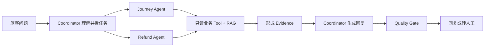
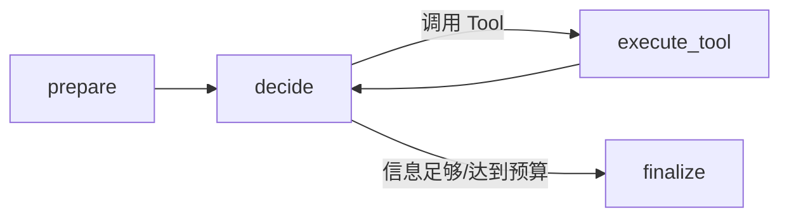

# EchoMind Airline MVP 项目阅读与学习指南

不要从完整设计文档第一页开始硬读。设计文档更像一份“架构说明书”，
不适合作为第一次接触项目时的入门教程。

最容易理解这个项目的方法是：只追踪一个复杂请求，看它如何从输入走到输出。

## 一、先记住唯一的主线



整个系统做的事情可以概括为：

```text
接收旅客问题
→ 理解问题
→ 拆分业务域任务
→ 查询真实或模拟业务数据
→ 查询政策知识
→ 形成带来源的 Evidence
→ 汇总成旅客回答
→ 检查事实与权限
→ 回复或转人工
```

## 二、第一阶段：先把项目跑起来

进入项目目录：

```powershell
cd "C:\Users\Yi Jiang\Desktop\AI\猫猫agent\clowder-ai\echomind-airline-mvp"
python -B scripts/run_demo.py
```

Demo 使用的问题是：

> EK302 航班 2026-08-15 取消了，PNR EK7D3M。
> 请查询 TKT3001 的退款进度，并说明 TKT3002 可以如何退款或改签。

运行后第一遍只观察三个内容：

1. 最终回复说了什么。
2. 系统调用了哪些 Tool。
3. Trace 中 Journey 和 Refund 两个 Agent 是否都运行了。

暂时不要研究：

- PostgreSQL 表结构；
- Checkpoint 内部格式；
- pgvector/FTS 索引内部实现；
- 所有 Pydantic Model；
- 完整 Eval 指标。

第一遍的目标只是知道：

> 一条旅客消息是怎样经过多个节点，最后变成一个带证据的回答的。

## 三、第二阶段：按照六个步骤阅读代码

### 1. 从程序入口开始：`service.py`

文件：

```text
src/airline_mvp/service.py
```

重点只看：

- `build_service()`：整个系统使用了哪些组件；
- `AirlineMVPService.chat()`：一个请求怎样进入 LangGraph。

可以把 `build_service()` 理解为组装系统：

```text
Fixture 数据
+ Knowledge Service
+ Tool Registry
+ Tool Executor
+ Model Gateway
+ SQLite
+ WorkerGraph
+ ParentGraph
= 完整客服系统
```

`build_service()` 本身不处理旅客问题，只负责创建和连接各个组件。

真正处理请求的是：

```python
service.chat(request)
```

第一遍不要深入每个组件，只需要知道它们在哪里完成装配。

### 2. 看总调度流程：`parent_graph.py`

文件：

```text
src/airline_mvp/parent_graph.py
```

这是整个项目最重要的文件。

先顺着文件末尾的节点连接关系阅读：

```text
validate_and_load
→ understand_and_plan
→ clarify / dispatch
→ run_domain_worker
→ synthesize
→ quality_check
→ queue_handoff
→ persist
```

每个节点可以这样理解：

| 节点 | 人话解释 |
|---|---|
| `validate_and_load` | 创建或更新 Case，记录请求 |
| `understand_and_plan` | 识别意图、实体并拆分任务 |
| `clarify` | 信息不足时询问 PNR、航班号等 |
| `dispatch` | 把任务派给 Journey/Refund Agent |
| `run_domain_worker` | 执行领域调查 |
| `synthesize` | 汇总两个 Agent 的调查结果 |
| `quality_check` | 检查有没有胡说、无证据引用或越权 |
| `queue_handoff` | 需要退票、改签等写操作时转人工 |
| `persist` | 保存 Case、Evidence、ToolCall 和 Trace |

第一遍只看节点之间如何连接，不要逐行研究每个函数。

### 3. 看 Agent 到底是什么：`worker_graph.py`

文件：

```text
src/airline_mvp/worker_graph.py
```

这个项目不是手工创建很多完全不同的 Agent 类，而是：

```text
通用 DomainWorkerGraph
+ Journey 配置
= JourneyServiceAgent

通用 DomainWorkerGraph
+ Refund 配置
= RefundServiceAgent
```

Worker 内部只有一个主要循环：



因此，这里的 Agent 可以理解为：

> 一个受到 Tool 权限、调用预算、循环终止条件和输出 Schema 约束的
> LangGraph 子图实例。

对应的 Agent 配置位于：

```text
src/airline_mvp/domain_config.py
```

先比较 Journey 和 Refund 的 `allowed_tools`：

```python
JourneyServiceAgent.allowed_tools
RefundServiceAgent.allowed_tools
```

你会发现：

- Journey Agent 能查询航班、PNR 和客票；
- Refund Agent 能查询退款和支付；
- Refund Agent 不能调用航班 Tool；
- Journey Agent 不能调用退款 Tool。

这就是业务域级最小权限。

### 4. 理解“模型选择 Tool”和“真正执行 Tool”的区别

文件：

```text
src/airline_mvp/model_gateway.py
```

重点看四个方法：

- `understand()`：识别意图、PNR、航班号和日期；
- `plan()`：创建 Journey/Refund 任务；
- `decide_domain_step()`：决定下一步调用什么 Tool；
- `synthesize()`：根据 Finding 和 Evidence 生成旅客回复。

当前默认使用：

```python
DeterministicModelGateway
```

因此没有模型 Key 也能运行。

它的作用类似 LLM，但当前决策由固定规则实现，方便本地学习和测试。

真实模型接入示例是：

```python
StructuredLLMGateway
```

最关键的区别是：

```text
ModelGateway：
提出“我想调用 get_booking，参数是 AB12CD”

ToolExecutor：
检查该 Agent 是否有权限、参数是否合法、
当前用户是否有权查询 AB12CD
```

因此：

```text
LLM 选择了 Tool
≠
LLM 一定能够执行 Tool
```

模型只是提出执行提议，ToolExecutor 才是权限边界。

### 5. 看 Tool 权限与执行：`tools.py`

文件：

```text
src/airline_mvp/tools.py
```

不要一开始逐个看 Tool Handler，先看：

```python
ToolExecutor.execute()
```

它的执行顺序是：

```text
Tool 是否存在
→ 是否允许当前业务域调用
→ 是否在当前 DomainTask 白名单中
→ 敏感数据是否有 verified_subject_id
→ 参数是否符合 Pydantic Schema
→ 执行 Adapter
→ 返回统一 ToolResult
```

然后再看项目中的八个只读 Tool：

1. `get_flight_status`
2. `get_booking`
3. `get_ticket_status`
4. `get_disruption_info`
5. `get_payment_status`
6. `get_refund_status`
7. `search_airline_knowledge`
8. `get_policy_clause`

这些 Tool 全部是只读操作。

系统中没有：

```text
execute_refund
change_booking
execute_compensation
```

因此 Agent 不可能真正执行退款、改签或赔付。

旅客要求办理这些业务时，系统只能：

```text
调查
→ 解释
→ 创建人工接管记录
```

### 6. 最后理解 Evidence 和 Quality Gate

文件：

```text
src/airline_mvp/evidence.py
src/airline_mvp/quality.py
```

Tool 结果不会直接变成最终回复，而是经过以下过程：

```text
ToolResult
→ EvidenceItem
→ DomainFinding
→ ServiceResponse
```

每条重要结论都带有：

```text
evidence_id
```

例如：

```text
航班 CZ3101 已取消
→ 来源于 get_flight_status 的 ToolResult
→ 转换成 EvidenceItem
→ 最终回答引用对应 evidence_id
```

Quality Gate 会检查：

- Evidence 是否真实存在；
- Evidence 是否属于当前 Case；
- 是否引用了不存在的 `evidence_id`；
- 是否声称“退款成功”；
- 是否声称“已经改签”；
- 未执行方案是否仍标记为 `not_executed`；
- 人工接管是否有原因码。

这是该项目区别于普通 Agent Demo 的关键部分。

## 四、第三阶段：再看 RAG

等主流程理解后，再阅读：

```text
src/airline_mvp/knowledge.py
```

RAG 只需要先理解两步：

```text
search_airline_knowledge
→ 找到相关政策候选

get_policy_clause
→ 根据 documentId + version + section 获取原始条款
```

为什么要分成两步？

因为向量检索结果只是“可能相关”，不能直接当成最终事实。

系统必须再次读取确切的：

- `documentId`
- `version`
- `section`
- 政策原文

最终回复才能引用该政策。

也就是说：

```text
向量召回摘要
≠
最终事实
```

真正可以进入最终回答的是下钻后的政策原文 Evidence。

## 五、第一轮可以跳过的内容

第一次阅读可以暂时跳过：

- `checkpointing.py`
- `persistence.py` 中的 SQL Schema 细节
- pgvector、HNSW 和 FTS 查询细节
- `evaluation.py` 的具体指标计算
- Baggage 扩展配置
- FastAPI 依赖注入细节
- 所有 Pydantic Model 的每个字段

这些内容属于第二遍阅读。

## 六、推荐学习计划

### 第一天：理解主流程

1. 运行 Demo；
2. 看 `service.py`；
3. 看 `parent_graph.py`；
4. 手画一次请求流程；
5. 说清楚每个 Parent Graph 节点负责什么。

完成标准：

> 能够从旅客消息开始，口头说明请求怎样走到最终回复。

### 第二天：理解 Agent 和 Tool

1. 看 `worker_graph.py`；
2. 看 Journey/Refund 配置差异；
3. 看 `ModelGateway` 如何选择 Tool；
4. 看 `ToolExecutor` 如何检查权限；
5. 修改一个 Demo 问题，观察路由变化。

完成标准：

> 能解释 Agent 为什么不能随意调用其他业务域的 Tool。

### 第三天：理解 Evidence、RAG 和质量控制

1. 看 `evidence.py`；
2. 看 `quality.py`；
3. 看 `knowledge.py`；
4. 运行越权、缺参和 Tool 超时测试；
5. 观察失败如何进入 DomainFinding 的 `gaps`。

完成标准：

> 能解释为什么 Tool 超时不能形成 Evidence，以及为什么 RAG 摘要
> 不能直接成为最终事实。

### 第四天以后：理解工程能力

1. SQLite 持久化；
2. LangGraph Checkpoint；
3. 完整 Trace；
4. Offline Evaluation；
5. FastAPI；
6. 尝试把确定性 ModelGateway 替换成真实 LLM。

## 七、最核心的三个文件

如果时间很少，只看：

1. `src/airline_mvp/parent_graph.py`
2. `src/airline_mvp/worker_graph.py`
3. `src/airline_mvp/tools.py`

三者的关系是：

```text
ParentGraph
负责整体流程、路由和汇总

WorkerGraph
负责单个业务域内的调查循环

ToolExecutor
负责真正执行、校验权限和标准化结果
```

把这三个文件串起来，整个项目大概就理解了 60%。

## 八、正确使用设计文档的方法

不要把完整设计文档当作教材从头背到尾。

正确顺序是：

```text
先运行 Demo
→ 理解 ParentGraph
→ 理解 WorkerGraph
→ 理解 ToolExecutor
→ 遇到具体问题时再查设计文档对应章节
```

例如：

| 想理解的问题 | 查设计文档 |
|---|---|
| 为什么分 Journey/Refund Agent | §4、§12 |
| State 为什么需要 Reducer | §10 |
| Worker 为什么会循环调用 Tool | §13 |
| 如何防止无限循环 | §14 |
| Tool 权限在哪里校验 | §15 |
| RAG 为什么需要原文下钻 | §16 |
| Checkpoint 有什么作用 | §17 |
| Evidence 和 Quality 如何工作 | §19 |
| 为什么要转人工 | §20 |
| Trace 记录什么 | §23 |
| 如何进行离线评测 | §24 |

设计文档应该作为“查阅手册”，而不是第一次阅读项目时的入口。
