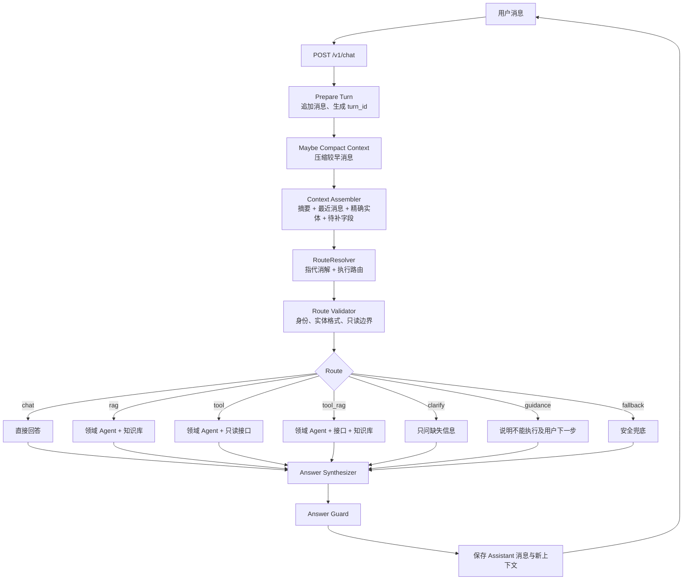
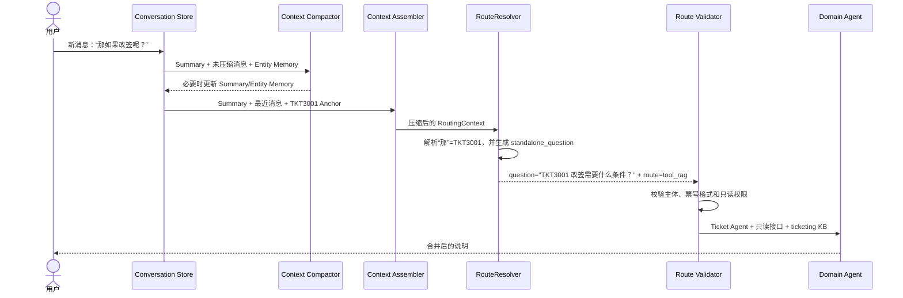
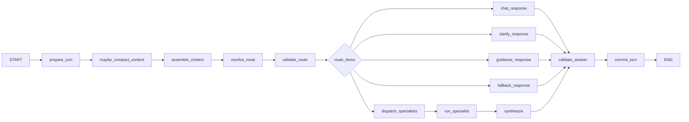
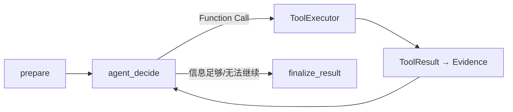

# EchoMind Airline：多轮问答多 Agent 精简架构

> 文档状态：目标架构（Target）
>
> 产品边界：只回答问题；不执行退票、改签、赔付或通知；不创建 Case、工单或人工队列

## 1. 设计结论

这个系统只需要解决三件事：

1. 把当前消息和必要的历史对话组合成一个可以独立理解的问题；
2. 判断每个问题应该走 `chat`、`rag`、`tool`、`tool_rag`、`clarify`、`guidance` 或
   `fallback`；
3. 调用相应领域 Agent，合并只读接口和知识库结果，生成一个统一答案。

不再建立 `private_query`、`policy_qa` 等中间分类，也不需要庞大的 Intent Catalog。它们没有给
当前执行链路增加实际价值，反而让“意图识别”和“路由选择”变成了两套重叠概念。

新的原则是：

> 路由模型直接判断为了回答这个问题需要哪些信息源；服务端只负责校验、收紧权限和执行。

目标链路：

```text
Conversation Context
→ 上下文压缩与装配
→ RouteResolver（指代消解 + 路由）
→ chat / rag / tool / tool_rag / clarify / guidance / fallback
→ 0～2 个领域 Agent
→ 证据汇总
→ 最终回答
```

## 2. 产品边界

系统允许：

- 回答问候、感谢和能力范围问题；
- 检索航空政策、FAQ 和办理说明；
- 查询只读航班、预订、客票、退款和支付数据；
- 结合当前业务数据与政策说明“是否大致符合条件、需要准备什么、下一步怎么做”；
- 在信息不足时询问必要字段；
- 告诉用户系统无法执行操作，并建议用户自行使用官方渠道。

系统不允许：

- 修改预订、提交退票、执行改签或申请赔付；
- 创建工单、Case、Handoff 或人工队列；
- 声称“已办理、已提交、已转接、已排队”；
- 把模型建议的 Function Call 当成已经执行；
- 使用其他用户或不属于当前主体的数据；
- 把历史摘要中的旧状态当成当前事实。

## 3. 总体架构



## 4. RouteResolver：精简后的“意图识别”

### 4.1 它到底判断什么

RouteResolver 不需要判断抽象的语言学类别，只需要回答：

> 为了正确回答当前问题，系统需要直接聊天、查知识库、查接口、同时查两者，还是先向用户
> 补充提问？

每个独立问题只允许选择一个路由：

```python
class RouteKind(str, Enum):
    CHAT = "chat"
    RAG = "rag"
    TOOL = "tool"
    TOOL_RAG = "tool_rag"
    CLARIFY = "clarify"
    GUIDANCE = "guidance"
    FALLBACK = "fallback"
```

### 4.2 每个路由的精确定义

| Route | 什么时候选 | 典型示例 | 外部访问 |
|---|---|---|---|
| `chat` | 不需要外部事实也能回答 | “你好”“你能做什么” | 无 |
| `rag` | 只需要通用政策、流程或 FAQ | “改签一般需要准备什么” | 仅知识库 |
| `tool` | 只需要实时或个人业务状态 | “MU5101 今天延误吗”“退款到哪一步了” | 仅只读接口 |
| `tool_rag` | 需要当前订单/客票事实，再结合规则回答 | “我这张票能否免费改签” | 只读接口 + 知识库 |
| `clarify` | 已知道该查什么，但缺少不可推断的字段或指代不清 | “帮我查航班”但没有航班号/日期 | 无，先提问 |
| `guidance` | 用户要求系统执行写操作或询问官方办理渠道 | “直接帮我改到明天” | 无写操作，只解释 |
| `fallback` | 超出范围、无法理解或没有可靠能力 | “帮我写股票交易程序” | 无 |

这里没有 `private_query`。是否涉及个人数据只是 ToolExecutor 的身份与可见范围校验条件，不是
单独的路由类别。

### 4.3 RouteResolver 输入

路由模型不直接接收完整 Transcript，而是接收 `RoutingContext`：

```python
class RoutingContext(BaseModel):
    current_message: str
    recent_messages: list[ContextMessage]
    conversation_summary: ConversationSummary | None
    relevant_entities: list[EntityAnchor]
    pending_clarification: PendingClarification | None
    verified_subject_available: bool
    locale: str
```

RouteResolver 会在同一次结构化调用中先把当前消息改写成 `standalone_question`，再给它选择
Route。例如：

```text
上一轮：帮我查一下 TKT3001 的状态。
当前轮：那如果改签呢？

standalone_question：
“用户询问客票 TKT3001 如果改签需要满足什么条件、准备什么资料。”
```

这样不需要额外调用一个“上下文理解模型”。压缩后的 Context 是输入，`standalone_question +
route` 是同一次 RouteResolver 调用的输出。

### 4.4 RouteResolver 输出

```python
class RouteItem(BaseModel):
    route: RouteKind
    domain: Literal[
        "common",
        "journey",
        "ticket",
        "refund",
        "baggage",
        "service",
    ]
    standalone_question: str
    entities: dict[str, str | list[str]]
    missing_fields: list[str]
    reason_code: str


class RouteDecision(BaseModel):
    items: list[RouteItem]       # 1～2 个
    context_message_ids: list[str]
    confidence: float
```

模型不输出：

- `allowed_tools`；
- 具体数据库权限；
- Function Calling Schema；
- 工具是否已经执行；
- 最终用户答案。

领域、Route 和问题文本足以让服务端选择对应 Agent。Agent 再在自己固定的只读工具集合中通过
Function Calling 选择具体函数。

### 4.5 一次路由模型调用

MVP 不需要候选召回器、Intent Catalog 和第二套意图标签。使用一次结构化 LLM 调用即可：

```text
System Prompt：
你是航空问答路由器。你不回答用户问题，只判断回答问题需要什么信息源。

规则：
1. 无需外部事实 → chat
2. 只需通用政策/流程 → rag
3. 只需实时或个人业务数据 → tool
4. 同时需要业务数据和政策 → tool_rag
5. 缺少必要字段或指代不唯一 → clarify
6. 要求执行退票/改签/赔付等操作 → guidance
7. 超出范围或无法判断 → fallback
8. 最多拆成两个问题
9. 不得输出工具名或声称操作成功

Input：RoutingContext JSON
Output：RouteDecision JSON，其中每个 RouteItem 同时包含 standalone_question 和 route
```

如果未来要用本地小模型或 SFT，只替换这个 RouteResolver 的后端，保持 RouteDecision Schema
不变，不再引入一套更复杂的意图系统。

### 4.6 确定性 Route Validator

模型输出后由代码做少量硬校验：

1. 明确要求执行退票、改签、赔付时，强制覆盖为 `guidance`；
2. `tool` 或 `tool_rag` 涉及个人数据但没有服务端认证主体时，覆盖为 `clarify` 或能力说明；
3. 航班号、日期、PNR、票号和退款号格式非法时，不进入 Tool；
4. `missing_fields` 非空时，覆盖为 `clarify`；
5. Domain 只能来自服务端枚举；
6. RouteItem 最多两个；
7. `tool` 和 `tool_rag` 最终只能看到对应领域预先注册的只读工具；
8. Prompt Injection 命中时忽略越权指令，只保留其中正常的航空问题；没有正常问题则 `fallback`。

Validator 不重新做一遍语义分类，只负责安全边界和明显不一致。

## 5. 如何区分 rag、tool 和 tool_rag

这是路由中最重要的判断。

### 5.1 RAG：问一般规则

问题不依赖某个具体航班、订单、客票或退款记录：

```text
机票改签一般需要什么？                   → rag
经济舱可以托运多少行李？                 → rag
航班取消后通常有哪些选择？               → rag
退款一般多久到账？                       → rag
```

即使用户说“我想了解怎么改签”，只要他问的是一般流程，也不应强迫提供 PNR 或票号。

### 5.2 TOOL：问当前状态

答案主要来自业务系统，不需要解释政策：

```text
MU5101 今天几点起飞？                    → tool
TKT3001 当前是什么状态？                 → tool
退款 REF9001 到哪一步了？                → tool
我的订单里有几张票？                     → tool
```

### 5.3 TOOL_RAG：问“我的这个是否符合规则”

需要先知道具体业务事实，再将事实与政策匹配：

```text
我的 TKT3001 能不能免费改签？             → tool_rag
这个订单因为航班取消可以全额退吗？         → tool_rag
我这张票改签需要做什么、可能有哪些限制？   → tool_rag
```

判断口诀：

```text
只问规则                   → rag
只问状态                   → tool
拿自己的状态去套规则       → tool_rag
```

### 5.4 CLARIFY：不是一种业务意图

`clarify` 表示当前无法安全进入前三种路由：

```text
“查一下航班”
缺：航班号、日期
→ clarify

“那第二张呢？”
上下文里存在三张票，无法确定“第二张”的排序
→ clarify

“我的退款到哪了？”
没有退款号、票号、PNR，也没有可用上下文 Anchor
→ clarify
```

Clarify 只询问缺失字段，不重新询问已经确认的信息。

## 6. 上下文压缩设计

### 6.1 为什么不能只保留聊天摘要

如果把所有历史直接总结成一句话，会产生两个问题：

1. PNR、票号、航班日期等精确字段容易被摘要模型改错；
2. “航班已取消”“退款处理中”是有时效的业务事实，不能因为曾经出现在摘要里就一直当成
   当前事实。

因此上下文分成四层，每层职责不同：

```text
完整 Transcript        数据库长期保存，不全部塞给模型
Recent Messages         最近若干轮原文，用于语气、指代和短期目标
Rolling Summary         更早对话的压缩语义，不保存实时业务状态
Entity Memory           PNR/票号/航班号等精确 Anchor，独立结构化保存
```

另外保存 `PendingClarification`，表示上一轮正在等待用户补充什么。

### 6.2 持久状态

```python
class EntityAnchor(BaseModel):
    entity_type: Literal[
        "flight_no",
        "travel_date",
        "pnr_ref",
        "order_ref",
        "ticket_ref",
        "refund_ref",
    ]
    value: str
    source_message_id: str
    source_turn_id: str
    last_referenced_turn_id: str
    confirmed: bool
    subject_id: str | None


class ConversationSummary(BaseModel):
    version: int
    through_message_id: str
    user_goals: list[str]
    discussed_topics: list[str]
    unresolved_questions: list[str]
    user_corrections: list[str]
    stable_preferences: dict[str, str]


class PendingClarification(BaseModel):
    source_turn_id: str
    target_route: RouteKind
    domain: str
    standalone_question: str
    missing_fields: list[str]
    known_entities: dict[str, str]
```

`ConversationSummary` 不保存：

- 当前航班状态；
- 当前退款状态；
- 当前票联状态；
- 政策正文；
- Tool Result；
- 模型猜测的个人信息。

这些内容需要时重新查询。

### 6.3 何时触发压缩

同时使用消息数量和 Token 两个阈值：

```python
should_compact = (
    unsummarized_message_count > MAX_RECENT_MESSAGES
    or estimated_history_tokens > HISTORY_TOKEN_BUDGET
)
```

建议 MVP 初始值：

```text
MAX_RECENT_MESSAGES = 8～12 条
保留最近消息          = 6 条左右
Routing Context 总预算 = 1,500～2,500 tokens
Summary 预算           = 400～700 tokens
```

这些是起始参数，应通过实际对话和模型上下文窗口调优，不是固定标准。

### 6.4 压缩算法

假设当前有 14 条未压缩消息，需要保留最后 6 条：

```text
第 1～8 条   → 本次待压缩 Chunk
第 9～14 条  → Recent Messages，保留原文
```

执行顺序：

1. 从数据库读取现有 Summary 和待压缩消息；
2. 用确定性正则/解析器提取 PNR、票号、航班号、日期等精确实体；
3. 将精确实体写入或更新 Entity Memory；
4. 把“旧 Summary + 待压缩消息”交给 Summary 模型；
5. Summary 模型只更新目标、主题、未解决问题、纠正和稳定偏好；
6. 保存新 Summary、`through_message_id` 和版本号；
7. 数据库继续保留所有原始消息；
8. LangGraph Checkpoint 中删除已被摘要覆盖的旧 Message，只留下 Summary 所覆盖范围和最近消息。

LangGraph `messages` 使用 `add_messages` reducer。压缩后可以通过 Message 删除/替换语义清理
Checkpoint 中的旧消息；完整 Transcript 的真相源始终是数据库，而不是 Checkpoint。

### 6.5 Summary Prompt

```text
你是对话上下文压缩器，不回答用户问题。

只保留：
- 用户仍然有效的目标
- 已讨论主题
- 尚未解决的问题
- 用户明确纠正的信息
- 稳定且非敏感的偏好

禁止：
- 修改或补全业务标识
- 把航班/客票/退款旧状态当作长期事实
- 复制政策正文
- 推断敏感属性
- 生成新的办理结论

精确业务实体由独立 Entity Memory 提供，不要在摘要中改写。
```

输出必须符合 `ConversationSummary` Schema。

### 6.6 路由上下文的 Token 优先级

装配 `RoutingContext` 时按以下顺序保证内容：

```text
1. 当前用户消息                       永不截断
2. 上一轮 PendingClarification         优先保留
3. 与当前消息有关的精确 Entity Anchor  优先保留
4. 最近 2～3 轮原文                   尽量保留
5. Rolling Summary                    受预算限制
6. 更早的 Recent Messages             最先裁剪
```

不要把 RAG 文档或 Tool Result 放进路由上下文。它们是在路由完成后才获取的回答证据。

### 6.7 压缩执行时机

MVP 推荐在下一轮开始时执行 `maybe_compact_context`：

```text
收到新消息
→ 检查上一轮后的历史是否超预算
→ 必要时压缩
→ 构建本轮 RoutingContext
→ 路由
```

这样实现简单，Summary 一定在路由前可用。缺点是达到阈值的那一轮会增加一次摘要模型延迟。

生产优化可以在上一轮提交答案后异步压缩，但必须使用 Conversation Version/CAS，防止后台摘要
覆盖随后到达的新消息。异步结果没及时完成时，下一轮仍可临时使用最近消息裁剪策略。

## 7. 上下文压缩如何与路由结合

### 7.1 完整流程



压缩负责保存“之前谈过什么”和精确 Entity Anchor；RouteResolver 在一次调用中完成“当前指代
哪个对象”与“需要哪些信息源”。压缩器与路由器仍是两个职责：压缩不是每轮执行，路由每轮
执行；但不再额外增加一个 standalone-question 模型调用。

### 7.2 示例一：从 Tool 变成 Tool + RAG

```text
第 1 轮：查询 TKT3001 当前状态。
→ tool

第 2 轮：那如果改签需要什么？
```

Context Assembler：

```json
{
  "current_message": "那如果改签需要什么？",
  "standalone_question": "客票 TKT3001 如果改签，需要满足什么条件和准备什么资料？",
  "relevant_entities": [
    {"entity_type": "ticket_ref", "value": "TKT3001", "confirmed": true}
  ]
}
```

RouteResolver：

```json
{
  "items": [
    {
      "route": "tool_rag",
      "domain": "ticket",
      "standalone_question": "客票 TKT3001 如果改签，需要满足什么条件和准备什么资料？",
      "entities": {"ticket_ref": "TKT3001"},
      "missing_fields": [],
      "reason_code": "PERSONAL_RECORD_PLUS_POLICY"
    }
  ]
}
```

### 7.3 示例二：没有个人 Anchor 时走 RAG

```text
用户第一次进入对话：机票改签需要什么？
```

没有“我的、这张、这个订单”等个性化指向，也没有可关联的客票 Anchor：

```json
{
  "route": "rag",
  "domain": "ticket",
  "standalone_question": "机票改签的一般条件、材料和办理流程是什么？"
}
```

不能因为“改签”可能涉及订单，就自动索要 PNR。

### 7.4 示例三：有个性化指向但缺少 Anchor

```text
用户：我这张票能免费改吗？
```

Conversation 中没有票号、PNR 或订单信息：

```json
{
  "route": "clarify",
  "domain": "ticket",
  "missing_fields": ["ticket_ref_or_pnr"],
  "reason_code": "PERSONALIZED_QUESTION_WITHOUT_ANCHOR"
}
```

系统只问：“请提供票号或 PNR，我可以结合票面状态和政策帮您判断。”

### 7.5 示例四：要求系统执行

```text
用户：那直接帮我改到明天。
```

即使上下文中已有票号，仍然是：

```json
{
  "route": "guidance",
  "domain": "ticket",
  "reason_code": "WRITE_ACTION_REQUESTED"
}
```

系统不调用写工具，不创建记录，只说明无法代办、可能需要的材料和官方办理渠道。

## 8. Conversation State

```python
class ConversationState(TypedDict, total=False):
    # 跨轮状态
    conversation_id: str
    messages: Annotated[list[BaseMessage], add_messages]
    summary: ConversationSummary | None
    entity_memory: dict[str, list[EntityAnchor]]
    pending_clarification: PendingClarification | None
    context_version: int

    # 本轮状态，每轮覆盖
    turn_id: str
    current_message: str
    routing_context: RoutingContext | None
    route_decision: RouteDecision | None
    final_response: ChatResponse | None

    # 本轮并行输出
    specialist_results: Annotated[list[SpecialistResult], merge_results]
    evidence: Annotated[list[EvidenceItem], merge_evidence]
    tool_calls: Annotated[list[ToolCallRecord], merge_tool_calls]
```

所有 SpecialistResult、Evidence 和 ToolCall 都包含 `turn_id`。Synthesizer 只读取当前 turn_id；
提交答案后清理本轮 Buffer。否则同一 `conversation_id` 复用 Checkpoint 时，上轮结果会污染下一轮。

调用关系：

```text
conversation_id = LangGraph thread_id
turn_id         = 当前 HTTP 请求与 Trace 标识
message_id      = User/Assistant 消息标识
```

后续请求只提交本轮增量，不能重新初始化 Summary、Entity Memory 和 PendingClarification。

## 9. LangGraph

### 9.1 Parent Graph



`resolve_route` 内部只有一次结构化模型调用。Context 提取、路由校验和权限控制由普通 Python
代码完成，不需要把每个小步骤都做成 LangGraph Node。

### 9.2 多问题

RouteDecision 最多包含两个 RouteItem：

```text
“MU5101 延误吗？我的退款 REF9001 到哪了？”

items:
1. tool / journey
2. tool / refund
```

Parent Graph 使用 `Send` 并行执行两个 Agent，再由 Synthesizer 合并。超过两个问题时请用户先
选择重点，避免一条消息无限拆分。

如果问题之间有依赖，例如“航班取消后这张票能否免费退”，不要拆成两个独立回答；生成一个
`tool_rag` RouteItem，让领域 Agent 按顺序获取业务事实和政策。

## 10. 领域 Agent

### 10.1 配置

```python
class SpecialistConfig(BaseModel):
    domain: str
    system_prompt: str
    allowed_read_tools: list[str]
    knowledge_domains: list[str]
    max_tool_calls: int = 3
```

建议首版：

| Agent | 负责内容 |
|---|---|
| Journey/Ticket Agent | 航班、PNR、预订、客票、航变、值机、改签政策 |
| Refund/Payment Agent | 退款申请、支付链路、到账状态、退款政策 |
| Baggage/Service Agent | 行李和特殊旅客政策；有真实只读接口时再增加 Tool |

Agent 由 `route + domain` 配置能力：

```text
rag       → 只暴露该领域 Knowledge Search
tool      → 只暴露该领域只读业务 Tool
tool_rag  → 同时暴露两类能力
```

### 10.2 Worker 子图



Function Calling 只是模型的工具调用建议。ToolExecutor 仍负责：

- 工具白名单；
- Domain 校验；
- Pydantic 参数校验；
- 已验证主体和数据可见范围；
- 超时与有限重试；
- 结果标准化；
- Evidence 转换。

模型不接触任何写工具，因为生产 Registry 中根本不注册写工具。

## 11. 最终汇总与回答检查

### 11.1 SpecialistResult

```python
class SpecialistResult(BaseModel):
    turn_id: str
    domain: str
    status: Literal["completed", "degraded", "failed"]
    facts: list[SupportedStatement]
    policy_conclusions: list[SupportedStatement]
    gaps: list[str]
    evidence_ids: list[str]
```

领域 Agent 不直接给用户回复，只返回带证据的局部结论。

### 11.2 ChatResponse

```python
class ChatResponse(BaseModel):
    status: Literal["answered", "needs_clarification", "degraded"]
    answer: str
    citations: list[Citation]
    missing_information: list[str]
    suggested_steps: list[str]
    recommend_official_customer_service: bool = False
    recommendation_reason: str | None = None
```

`recommend_official_customer_service` 只是回复提示，不触发系统动作。

### 11.3 Answer Guard

确定性检查：

- 所有已核验事实引用当前 turn_id 的 Evidence；
- 不出现“已退、已改、已提交、已转接”等宣称；
- Tool 超时、不可用和拒绝只能表示未知；
- RAG 无权威结果时不编造政策；
- 历史 Summary 不能作为实时状态证据；
- 费用、资格和到账日期没有证据时不做承诺；
- Suggested Steps 必须表述为用户可以自行采取的动作。

失败只允许一次受控改写，之后返回安全模板，不形成 Reviewer 循环。

## 12. API 与持久化

### 12.1 API

请求：

```json
{
  "conversation_id": "conv_123",
  "client_message_id": "client_msg_456",
  "message": "那这张票如果改签需要什么？",
  "locale": "zh-CN"
}
```

响应：

```json
{
  "conversation_id": "conv_123",
  "turn_id": "turn_789",
  "message_id": "msg_assistant_790",
  "response": {
    "status": "answered",
    "answer": "……",
    "citations": [],
    "missing_information": [],
    "suggested_steps": [],
    "recommend_official_customer_service": true,
    "recommendation_reason": "系统只提供只读咨询"
  }
}
```

生产中的 verified subject 必须来自认证上下文，不能相信客户端随意传入。

### 12.2 数据表

```text
conversations
messages                    # 完整 User/Assistant Transcript
conversation_memory         # Summary、Entity Memory、Pending Clarification、version
turn_traces                 # 路由、节点、延迟与错误
tool_calls                  # 按 turn_id
evidence_items              # 按 turn_id
```

删除：

```text
cases
handoffs
case_status
case_id 外键
```

同一 `(conversation_id, client_message_id)` 只处理一次。同一 Conversation 的并发写入通过版本号
或锁串行提交，避免两个请求同时覆盖 Summary 和 Entity Memory。

## 13. 失败与降级

| 失败 | 行为 |
|---|---|
| Context Summary 失败 | 使用最近消息 + Entity Memory，不阻断路由 |
| 指代无法唯一消解 | `clarify` |
| RouteResolver 超时/Schema 非法 | 重试一次，仍失败则规则路由或 `fallback` |
| Route 需要个人数据但无认证主体 | `clarify` 或能力说明 |
| Tool 超时/不可用 | 说明无法确认；有 RAG 时只给一般政策 |
| RAG 无权威结果 | 不猜测，返回 `degraded` |
| 上下文实体冲突 | `clarify`，不静默选择旧实体 |
| Answer Guard 失败 | 一次改写，之后安全模板 |

所有模型、工具和检索调用均有超时、有限重试和总调用预算。

## 14. 评测

### 14.1 路由评测

- `chat/rag/tool/tool_rag/clarify/guidance/fallback` Macro-F1；
- Route Exact Match；
- Domain 准确率；
- 多问题 RouteItem Exact Match；
- 不必要 RAG 调用率；
- 不必要 Tool 调用率；
- 写操作错误进入 Tool 的比例，目标为 0。

重点混淆集：

```text
一般规则 vs 个性化资格          rag vs tool_rag
当前状态 vs 资格判断            tool vs tool_rag
缺少 Anchor vs 通用咨询         clarify vs rag
咨询改签 vs 要求立即改签        rag/tool_rag vs guidance
短期指代 vs 新主题              复用实体 vs 不复用实体
```

### 14.2 上下文评测

- 跨轮指代解析准确率；
- Standalone Question 重写准确率；
- 精确实体保真率，目标接近 100%；
- 已确认实体复用率；
- 实体冲突正确澄清率；
- 摘要遗漏未解决问题的比例；
- 旧 Tool Result 被错误复用的比例，目标为 0；
- Routing Context Token 数和压缩率。

### 14.3 回答评测

- 领域 Agent 选择率；
- Tool 参数正确率；
- Evidence 引用有效率；
- 无证据事实率；
- 越权执行宣称率，目标为 0；
- 回答正确性、有用性与简洁度；
- p50/p95/p99 延迟和每轮模型调用数。

## 15. 当前项目改造

### 15.1 保留

- `tools.py`：只读 Tool Registry、Pydantic Schema 和 ToolExecutor；
- `knowledge.py`：知识库检索；
- `evidence.py`：证据来源和引用；
- `worker_graph.py`：复用领域工具循环；
- `domain_config.py`：改成领域 Agent 配置；
- `checkpointing.py`：Thread 改成 Conversation；
- Trace 和离线评测基础。

### 15.2 重写

- `service.py`：`thread_id=conversation_id`，每轮生成 turn_id；
- `state.py`：ConversationState、Summary、Entity Memory、PendingClarification；
- `parent_graph.py`：按本文精简图重写；
- `model_gateway.py`：增加 `compress_context` 和 `resolve_route`；`resolve_route` 同时输出
  standalone_question；
- `quality.py`：只保留 Evidence 和只读回答检查；
- `persistence.py`：Conversation、Messages、Memory 和 Turn Trace；
- `api.py`：删除 Case API，改为 Conversation API。

### 15.3 删除

- `CaseStatus`、`CasePlan`、Case 生命周期；
- `CaseRepository`；
- `HandoffPacket`、`HandoffRepository`；
- `queue_handoff`；
- `/v1/cases/*`；
- `cases`、`handoffs` 表；
- 复杂 Intent Catalog、Candidate Retriever 和 ProblemType；
- 工单和人工队列相关测试。

## 16. 实施顺序

### Phase 1：路由最小闭环

- 定义 RouteKind、RouteItem、RouteDecision；
- 使用一次结构化 LLM 调用实现 RouteResolver；
- 实现 Validator 硬规则；
- 建立七类路由评测集；
- 动作请求全部进入 Guidance。

### Phase 2：真正的多轮上下文

- `conversation_id=thread_id`；
- 保存完整 User/Assistant Transcript；
- 实现 Entity Memory 和 PendingClarification；
- 实现 Standalone Question；
- 增加最近消息裁剪和 Rolling Summary；
- 当前轮 Evidence 与跨轮状态隔离。

### Phase 3：领域 Agent

- 配置 Journey/Ticket、Refund/Payment 和可选 Baggage/Service；
- 根据 Route 控制 Agent 只看到 RAG、Tool 或两者；
- 多问题最多两个 RouteItem，使用 Send；
- 统一 SpecialistResult 和 Synthesizer。

### Phase 4：稳定性与优化

- Answer Guard；
- 幂等、并发版本和 Trace；
- 上下文压缩、路由、工具和回答评测；
- 根据真实错误决定是否训练小路由模型；
- 没有评测证据时不增加 Retriever、全参 SFT 或强化学习。

## 17. 最终结论

上下文压缩和路由识别的职责边界是：

```text
上下文压缩与装配：
“路由模型需要看到哪些历史、精确实体和待补字段？”

RouteResolver：
“用户这句话在当前 Conversation 中指什么，以及需要 chat、rag、tool、tool_rag、clarify、
guidance 还是 fallback？”
```

因此，Context Assembler 必须先于 RouteResolver。精确业务标识保存在 Entity Memory，较早语义
保存在 Rolling Summary，最近消息保留原文。RouteResolver 只消费压缩后的 RoutingContext，
在同一次调用中输出独立问题与 Route，不直接读取无限增长的 Transcript，也不输出工具权限。

这套设计比 `ProblemType + Intent Catalog + Candidate Retriever + Intent Verdict` 更适合当前
MVP：概念更少、路由更直接、容易评测，也不会影响后续把 RouteResolver 从大模型替换成本地
小模型。
